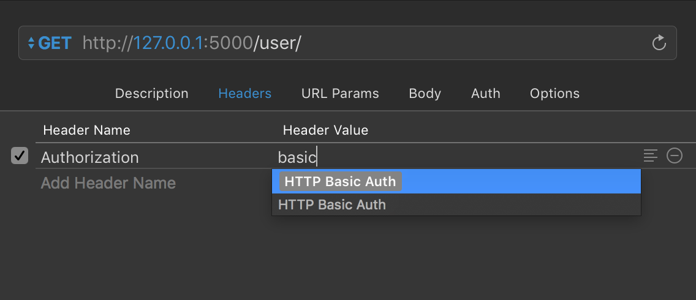
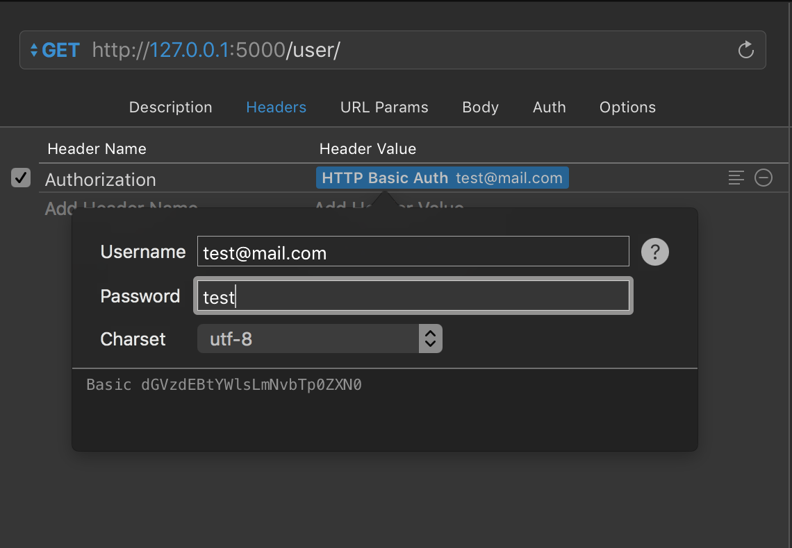

# Authentication and Security

## Objectives

- Learn about password hashing
- Integrate login to your API
- Learn about different ways provisioning authentication in your web app
- Learn the difference between authentication and authorization

## Vocabulary

- Authentication
- Authorization
- Tokens
- Hashing
- Salt


## Authentication

Before we allow a user to access their account, we need a way to ensure that the user has permission to access their account.

1. We need to provide them with a way to provide credentials describing who they are(login)
2. Give them access to their resources, but

## Authentication Options

- JSON Web Tokens
- HTTP Basic Auth
- OAuth
- Authentication Tokens


## HTTP Basic Auth

We talked about headers and how they carry extra information about a request. Headers are used to carry authentication information for a request. 
We will use headers (Authenticaiton headers) to pass authentication information from a client(iOS, paw) to our server.

HTTP Basic Auth:

### Client Side: Sending credentials in Basic Auth format

The Authorization header is generated by:

- Combining the username and password with a single colon.
    - test@mail.com:testpassword

- Encoding the resulting string into an octet sequence (Character Encoding - UTF-8). 
    
- Encoding the resulting string into a variant of Base64.
    - dGVzdEBtYWlsLmNvbTp0ZXN0cGFzc3dvcmQ=

- Prepend the authorization method and a space (e.g. "Basic ") to the encoded string, separated with a space.
    - Basic dGVzdEBtYWlsLmNvbTp0ZXN0cGFzc3dvcmQ=

#### Test Encode & Decoding to Base64:

- https://www.base64encode.org

#### Test UTF-8 Encoding & Decoding

- https://mothereff.in/utf-8

https://developer.mozilla.org/en-US/docs/Web/HTTP/Authentication


#### Setting up Basic Auth with Paw

Paw makes it easy to create basic auth client side:






#### Setting up Basic Auth in iOS

```swift
// Thanks to Nate Cook: http://stackoverflow.com/questions/24379601/how-to-make-an-http-request-basic-auth-in-swift

struct BasicAuth {
    static func generateBasicAuthHeader(username: String, password: String) -> String {
        let loginString = String(format: "%@:%@", username, password)
        let loginData: Data = loginString.data(using: String.Encoding.utf8)!
        let base64LoginString = loginData.base64EncodedString(options: .init(rawValue: 0))
        let authHeaderString = "Basic \(base64LoginString)"
        
        return authHeaderString
    }
}

```
## General account creation and login 

1. The user makes a request to create an account.
2. Their password is hashed and stored in the database. At no point is the plain-text (unencrypted) password ever written to the hard drive.
3. When the user attempts to login, the hash of the password they entered from the request is checked against the hash of their real password (retrieved from the database).
4. If the hashes match, the user is granted access. If not, the user is told they entered invalid login credentials.
5. Steps 3 and 4 repeat every time someone tries to login to their account.

*Note*: Do not let the user know if they username or password was invalid. If they can narrow it down to just passwords or username, they can keep guessing till they figure it out.

## #1 Signing up a user

To sign up a user, we need to store their password in the database. But we should never store passwords in plain text! Instead we are going to hash the password and store the hash in the database instead

## #2 Hashing passwords with BCrypt

We will be using the BCrypt library to hash our passwords.
Link to brcypt library and docs: https://pypi.python.org/pypi/bcrypt/3.1.0

Hashing refers to the process of passing our plain text password to a hashing algorithm. Hashing algorithms are one way functions that turn our plain text passwords into a fixed lenght string that cannot be reversed.
If the input of the hash function is changed in any way, the output changes.

We generally store the hashed version of our passwords in the database. When we login a user,
we check the hashed password in our database and compare it with the login password sent from a client to verify that they are the same.


### Salt

Salt is added to the hash function to make it harder for hash collisions and brute force attacks.


### Hashing passwords in python and flask
The salt for our hash function is referred to as the bcrypt_rounds. This makes it harder to guess the password, but takes longer for bcrypt to hash the password.


#### Getting HTTP Basic Auth parameters

You can grab decoded HTTP Basic Auth information by accessing:

```python
auth_info = request.authorization

#username
auth_info.username

#password
auth_info.password
```

#### Test hashing passwords 

Use this link to test hashing passwords online:

[Test password hashing online](https://www.dailycred.com/article/bcrypt-calculator)


*Hashing passwords in python:*

```python
...

app.bcrypt_rounds = 12

# Convert password to utf-8 string
encodedPassword = password.encode('utf-8')

hashed = bcrypt.hashpw(
    encodedPassword, bcrypt.gensalt(app.bcrypt_rounds)
)
                
```


## #3 Login(Sign in) in a user

To authenticate a user, we need to find out if hash of the the password they pass in matches the hashed password in the database.

```python
...


# Find user by email 
database_user = user_collection.find_one({'email': email})

# Encode password
jsonEncodedPassword = request.json['password'].encode('utf-8')

## Check if client password from login matches database password
# Method 1: Use hashpw to compare passwords
if bcrypt.hashpw(jsonEncodedPassword, database_user['password']) == database_user['password']:
    ## Let them in
else:
    ## Tell user they have invalid credentials
        
# Method 2: Use checkpw
if bcrypt.checkpw(jsonEncodedPassword, database_user['password']) == True:
    ## Let them in
else:
    ## Send 401 - Unauthorized
```


## Decorator Pattern in Python

> A decorator is the name used for a software design pattern. Decorators dynamically alter the functionality of a function, method, or class without having to directly use subclasses or change the source code of the function being decorated. - Python docs


Python documentation on decorators:

[Official Python Documentation on Decorators](https://wiki.python.org/moin/PythonDecorators)

[Python Decorators - Examples](https://realpython.com/blog/python/primer-on-python-decorators/)

## Authorization

Authorization is the process of verifying that someone has access to a resource. It is the process of defining scope of permission.

We won't specifically be implementing authorization in this class but its something to keep in mind if you have resources that need a protected scope. eg. Normal users vs admin users.


