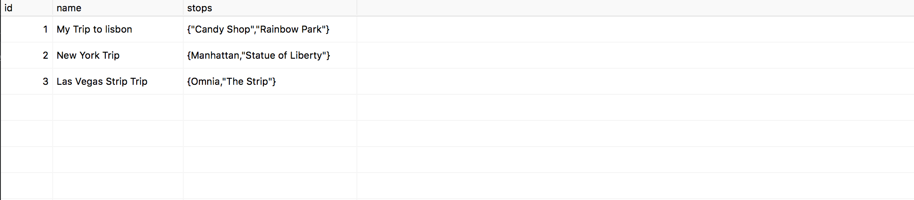

# Databases

## Objectives

- Model Data and learn about relationships
- Learn to diagram your own Schemas

## Vocabulary
- Entities
- Schema
- Queries
- Relational vs Non relational databases
- Primary keys
- foriegn key

### Relational Databases

Relational databases deal with the relational properties of data. In Object Oriented Programming, you think about the properties of your model and model them with a construct such as a class. In relational databases, data is modeled in terms of tables, rows and columns.

Data in relational databases are like spreadsheets. They are organized into tables, rows and columns.

*Tables* hold collections of data. eg. Users table, Trips table.
*Columns* are the properties of our data. eg. username, email etc.
*Rows* are entries in a table. eg. an user.

Take for example we have the following entities and relationships from our trip planner API:

*Entities:*

Trips
Users

*Relationships:*

A User can have many trips.
A Trip can only belong to one User.

## ORM's and Data Models
## Why do we need to model data?

A data model is a collection of properties that describe a piece of data.

The relational representation of data is one of the most widely used models today, and hence we have Relational Databases like mySQL, PostgreSQL etc.

We also have other representations of data that are **document based** like MongoDB and graph based like **neo4j**

All these representations have pros and cons, and perform differently for different use cases.

## The Schema

A schema is a formal description of a particular piece of data.
Schemas describe the properties of an Entity, and they types of data those properties hold.

The schema of a table is the table name, its attributes, and types:
 
Eg. Entity: User
    Property: username
    Type: String

## Database Tables

Tables are generated from Schemas.

Example of what a table of Trips might look like

Trips in this example have 3 properties:

1. An id to prevent duplicates and identify a trip
2. A stops property of type "array of string(text)" that holds a list of stops in a given trip.

### Primary key

Primary keys is a term used to refer to the primary identifier of a entry(row) in a table. Because they are used to distinguish between entries in a table, they have to be unique.
This will usually be th "id" field but can be set to another unique property.

## Relationships

There are 3 main types of relationships in databases.

**One-to-one** -: Both tables can have only one record of each other.
Eg. A user can only have one social security number, and social security number can belong to only one user.

**One-to-many** -: One table holds a foriegn key.
Eg. A single order can have many products

**Many-to-many** -: A entry can have and belong to many instances.

Eg. Take for instance you have books and authors. Books can have many authors an authors can have many published books. 

### Foreign key

To make relationships work, we need to be able to "point to" or reference another table. In relational databases, the way we achieve that is with something called a foriegn key. It is a key in one table that is used to identify a row in another table.

Eg: 

What is the foreign key in this picture and what is its purpose?

## Postgres

Postgres is a relational database(PostgreSQL) that we will be using in the later portion of this class.

### Using Postico 

We will be using the Postico as a visual tool for our database.

Click this to download:

[Postico Dowload Link](https://eggerapps.at/postico/download)

## What makes a relational database?

Relational databases are very structured. We cannot insert an entry into a table that does not follow the table's exact schema. Eg. if we define a table with 3 rows, we cannnot insert an entry to that table with 4 rows for instance.

Document based databases are much more flexible in that they allow arbirary data shapes.

## Challenges

### Creating tables and entries

1. 

    a. Create a *products* table that has the following columns:
        - name
        - type

    b. Create an *orders* table. Orders can have many products and every product belongs to an order
  

