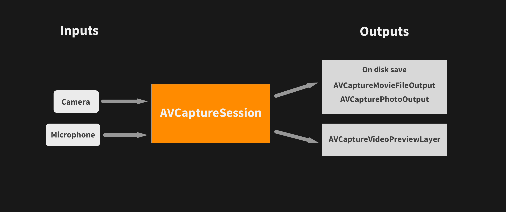

# Working with AVFoundation - Recording & Saving Video & Audio

### Objectives

- Record and save assets(video, audio, images) with AVFoundation
- Export recorded assets

## AVCaptureSession

Coordinates the flow of data between inputs and outputs.
A single session of AVCaptureSession can handle multiple inputs and outputs (you do not need to create multiple sessions)




### Creating a capture session

```swift
var captureSession = AVCaptureSession()
```

### Starting and Stopping a session

Starting an AVCaptureSessions allows data to flow between the input and output connections

```swift
// Starting a session
captureSession.startRunning()

// Stopping a session
captureSession.stopRunning()
```

You can use a **AVCaptureVideoPreviewLayer** to display the output video from the AVCaptureSession

**AVCaptureConnection**

It represents a connection between an input and an output to an AVCaptureSession


### AVCaptureDevice

This represents the physical hardware devices (camera, microphone) that you can use as input to an AVCaptureSession.

You can list the available capture devices(eg. front vs rear camera), their abilities (wide angle format camera, slo motion)

## Coordinating Inputs and Outputs

**Note:** When capturing video, the camera and microphone are separate hardware, you will need to set both up as inputs to AVCaptureSession

To capture audio/visual data, we need to add inputs from the camera and the microphone. 

#### Adding the camera as input to the capture session

**(1) Start with creating a session.**

```swift
let session = AVCaptureSession()
```

**(2) Then create your device for capture**


```swift
let frontCamera = AVCaptureDevice.defaultDevice(
    withDeviceType: AVCaptureDeviceType.builtInWideAngleCamera,
    mediaType: AVMediaTypeVideo,
    position: AVCaptureDevicePosition.front
)
```

**(3) Create an input from the capture device**


```swift
let cameraInput = try AVCaptureDeviceInput(device: frontCamera)
```

**(4) Try adding the camera input to the capture session**

```swift
if captureSession.canAddInput(input) {
    captureSession.addInput(input)
}
```


#### Setting up outputs for the camera

Outputing to a playable file format (eg .mov)

```swift
let movieFileOutput = AVCaptureMovieFileOutput()

if captureSession.canAddOutput(movieFileOutput) {
    captureSession.addOutput(movieFileOutput)
}
```

## Recording & Saving to Disk

To start recording to a file format we can use (eg .mov), we first need a place to store our video files

```swift
let tempVideoURL = FileManager.default.temporaryDirectory
let outputFileName = NSUUID().uuidString
let tempFileURL = tempVideoURL.appendingPathComponent(outputFileName).appendingPathExtension("mov")
```

The **AVCaptureMovieFileOutput** provides some handy methods to start and stop recording

```swift
movieFileOutput.startRecording(toOutputFileURL: tempFileURL, recordingDelegate: self)
```

**Note:** This also sets the delegate for the recording to self

The AVCaptureFileOutputRecordingDelegate tells you when a recording session is finished, with a url link to the location on disk where the video file is stored

All of the recording can be done on a background queue

#### Cleaning up temporary resources after capture session

After we are done using our temporary resources don't forget to cleanup else our app will take up a ton of space!

```swift
func cleanUpTempResources() {
    do {
        let tempURL = FileManager.default.temporaryDirectory
        try FileManager.default.removeItem(at: tempURL)
        try FileManager.default.createDirectory(at: tempURL, withIntermediateDirectories: false, attributes: nil)
    }catch let error {
        print(error.localizedDescription)
    }
}

deinit {
    cleanUpTempResources()
}
```

## Discussion

1. What are the inputs and outputs for capturing and saving audio & video?
2. How will we achieve recording video segments?
3. How can we show a thumbnail preview of each video segment?


## Requesting Persmission before recording
Before you can record audio/video, you need to set the permissions in your info.plist file and request for permission to use the camera and the microphone.