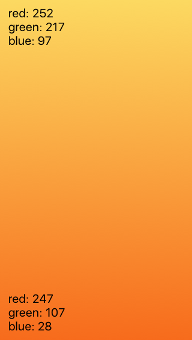
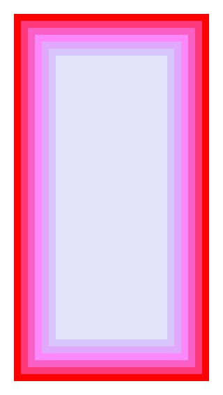
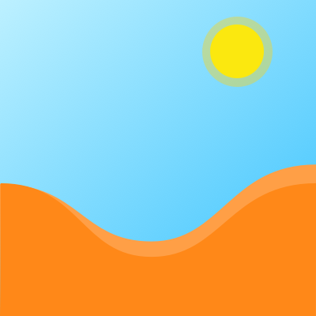
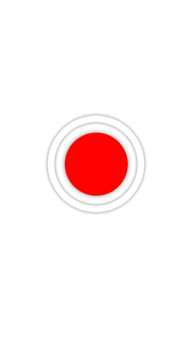
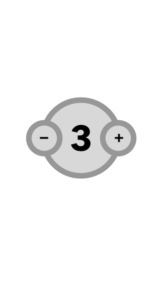
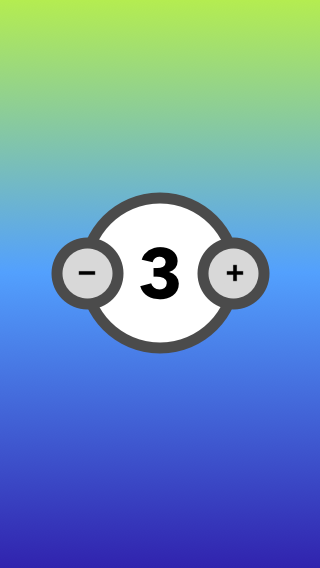
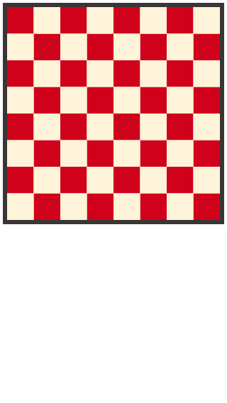
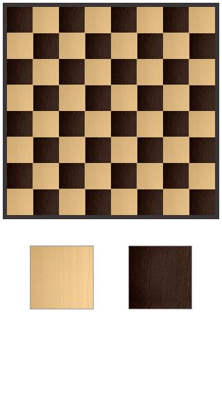

# Layers & Beziers

## Class Materials

Slides:

[Layers & Beziers](layers-beziers.key)

Beziers:

[How computers draw bezier curves](https://vimeo.com/106757336)

## Layers
As we have learned in the previous lessons a UIView draw itself to the screen. This is only half
the story. Every UIView has a layer property which is type CALayer. **A UIView doesn't actually
draw itself to the screen, it draws itself into it's layer.** It's the layer that really
represents the pixels that we see on the screen. Every view has one layer but, Layers can have
any number of subLayers.

> Any view you create can be made up of multiple layers on which is drawn various pieces of the element.
> All of the built in UI widgets (UILabel, UIButton, UISwitch etc.) are created this way!

While this might sounds more complicated. Layers can make drawing easier by allowing you to place
of the View drawing on different layers. Layers can be animated.

You can think of layers like views within a view. You can size and draw them very similarly to the
way you create and drew UIViews in the previous example.

> When building your own UI component, you should make use of CALayers to draw visual elements onto a UIView!

## Layers properties

Layers have properties that similar to UIView, and a few more! Here are a few notable properties:

- frame
- bounds
- position
- zPosition
- anchorPoint
- contentScale
- transform
- borderWidth
- borderColor
- cornerRadius

A big advantage to using layers is that now that you have created a custom view with layers you
can size, position, and transform the View and all of the layers draw themselves within the view.

Spend a few minutes reading the Apple docs for CALayer

- https://developer.apple.com/reference/quartzcore/calayer

CALayer also has a few specialized subclasses.

## UIBezierPath

UIBezierPath lets you create paths that can be used to draw images and animate objects. A path
consists of straight and curved line segments and is exactly the same as lines you might draw
with Sketch. The only difference between the two is lines drawn with UIBezierPath
need to be described in code.

UIBezier path only defines the "geometry" of the path. The path is itself `not` the drawing or
stroke and fill you might create from the path.

`CAShapeLayer` is a layer specialized for rendering a path. Attach a path to a cashapelayer's `path`
property. Then set these properties to render the path into the layer.

See the videos here for a short tutorial on UIBezierPath:

- https://www.youtube.com/watch?v=9UfcBudmrGI&index=17&list=PLoN_ejT35AEhGkIbBFjn6ACfNfIyQa4Od

### Types of Layers

#### CAShapeLayer

Properties of CAShapeLayer:

- lineWidth
- strokeColor
- strokeStart
- strokeEnd
- fillColor

#### CAGradientLayer

CAGradientLayer is a subclass of CALayer that is specialized to draw a gradient with it's area.
Anytime you want a gradient this is probably your best choice.

Take a few minutes to read the Apple docs:

- https://developer.apple.com/reference/quartzcore/cagradientlayer

#### CATextLayer

CATextLayer is used to draw a layer that contains text. Use this to add text to a UI element or
custom control. This is probably at the heart of UILabel, and UITextField. If you are making your
own control with text you might compose your control with a Text Layer if your text needs are simple
or require close control over how text is drawn. Alternatively, you might add a UILayer or UITextField
as a sub view.

Take a minute to read what Apple has to say about CATextLayer.

- https://developer.apple.com/reference/quartzcore/catextlayer

## Challenges

Use the ideas from the last lesson to build some views that are made of layers.

| Create a layer with a gradient | Concentric rectangles change the hue and saturation. |
| :------------- | :------------- |
|  |  |

| Recreate this skyline | Make a couple circle and add a shadow. |
| :------------- | :------------- |
|  |  |

| Imagine this as a UI element that let's us select a number. Note: Probably best to use UILabel for the text elements. | Add a gradient background.|
| :------------- | :------------- |
|  |  |

| Create chessboard with an outer border. | Create chessboard with image pattern fill. |
| :------------- | :------------- |
|  |  |

## More information

- https://www.raywenderlich.com/90488/calayer-in-ios-with-swift-10-examples

## Resources

### UIBezierPath

https://developer.apple.com/reference/uikit/uibezierpath
- https://developer.apple.com/reference/quartzcore/cashapelayer
- https://developer.apple.com/reference/quartzcore/cagradientlayer
