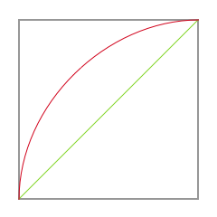
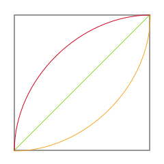

# Micorinteractions 

CSS can animate things. This is a powerful feature with many
possibilities.

Motion is an important feature that improves the user experience of 
any product. Motion not only creates a more interesting experience 
it also can direct and help users understand how a product functions. 

Do not underestimate the power of adding motion. Motion can 
be:

- Fun 
- Instructive
- Engaging

Look at products you use every day. Think about the motion that 
happen at various interactions ask youself how these effect your 
experience. 

## Competencies 

Completing the course material and challenges presented here students
should develop the following competencies: 

- Create Motion with CSS transitions 
- Identify easing types and apply easing
- Construct interesting animated interactions
- Build engaging intractions and animations 

## What is a micro interaction?

In a nutshell micorinteraction are those short animations
you see when you interact with something on the screen. 

Looking deeper it's all about feedback. When you interact with
something on the screen if that element doesn't provide some feedback
it can leave you wondering if the software is working or not. 
On the other hand if you interact with something on the screen
and there is some visual feedback you feel more confident in 
the software and your interaction. 

**It's a lot like talking to someone. If they don't answer, or nod 
their head you start to wonder whether they are listening or not?**

Software has the same experience and expectations. Have you ever 
tapped a button and when nothing happened tapped it again because 
you weren't sure if it was working? _This is the experience you 
are trying to avoid!_

> Microinteractions are based on accomplishing a single moment or 
> task through the provision of a delightful experience and useful 
> feedback for the users. These micro-moments are what ultimately 
> guides a user through a flow in an intuitive and effective way.
> 
> [What are Microinteractions](https://blog.proto.io/secret-killer-ux-design-microinteractions/)

- [A complete beginners guide to microinteractions](https://uxplanet.org/micro-interactions-a-complete-beginners-guide-b446d90215ec)

Here is what Apple says in their Human Interface Guidelines

> **Animation**
>
> Beautiful, subtle animation throughout iOS builds a visual sense of 
> connection between people and content onscreen. When used 
> appropriately, animation can convey status, provide feedback, 
> enhance the sense of direct manipulation, and help users visualize 
> the results of their actions.
> 
> [Apple HIG](https://developer.apple.com/ios/human-interface-guidelines/visual-design/animation/)

(This article has a lot of good advice for motion and interaction.) 

## What is animation?

Animation in the context of this discussion will be the change of 
element's appearance over time, and is applied by changing 
property values over time. 

In most cases properties will be numeric values. 

Putting the two together, animation is the change of numeric 
properties over time. 

### Changes over time

Changes over time are applied mathematically. For example
imagine this formula applied periodically: 

`x += 1`

This creates a linear change. The change at each update is is the 
same amount. e.g. 0, 1, 2, 3, 4, ...

Now imagine the formula is this: 

`x -= (x - dx) * 0.5`

Creates an exponential change. In the example above at each update 
the value for x would be: 

- 50
- 75
- 87.5
- 93.75
- 96.875
- 98.4375
- 99.21875
- 99.609375
- 99.8046875
- 99.90234375

You could graph the two of these. 

In animation the different types of mathematical changes are called
**easing**. Math can get pretty clever and there are many different
functions that can create different types of easing curves.

- https://matthewlein.com/tools/ceaser

#### Why use Easing? 

**Easing imparts character to motion.** 

Disney wrote a book on their animation process called "The Illusion 
of Life". While the book doesn't talk about math it does talk about 
easing! And underneath the discussion there is some underlyng math. 

**Terms**

Here are some simple terms to describe all forms of easing. 

- linear - constant rate of change
- ease out - starts fast, and slows at the end
- ease in - starts slow is fast at the end

In this image the green line is a linear easing. The red line
shows ease in and the orange line show ease out. 

Easing gives objects a realistic quality to their motion, the
"illusion of life" so to speak. A good way to picture this is 
to think about a car. 

When a car is driving on the road it is moving at a linear pace. 
Imagine a car driving on from the left and off the right of the 
screen. This is linear the rate is constant. 

Now imagine the car comes to a stop sign. It slows down until 
it comes to a stop. It doesn't stop abruptly from 30mph to 0. 
Instead the car slows 30, 15, 7, 3, 1, 0mph. This is ease
out. 

Next imagine the car starts from the stop sign. It slowly 
begins from 0, 1, 3, 7, 15, up to 30mph. This is ease in. 

If you are trying to communicate an idea and can relate it to 
things people are familiar with they will understand what you 
are trying to say. 

## Tools 

Microinteractions can be handled with a combination of CSS tools, and 
a minimal amount of JavaScript, in most cases. In many cases you 
won't need any JavaScript at all!

### CSS Tools

CSS provides a robust array of tools for creating motion. Note that 
motion in this case covers position, size or scale, rotation, changes 
in color, filter effects like: blur and saturation, and more. Any 
aspeact of an element that changes is motion for this discussion. 

- transition 
- key-frame 
- Easing
- timing
- Triggering animation 
  - hover
  - active
  - adding and removing classes
- CSS Filters

### JavaScript Tools 

JavaScript can handle motion in one of two ways. 

Apply CSS styles directly to an element. Changing the property values 
over time. **Note:** these are applied through inline styles!

Or, Adding a class to an element. Where the class applies the change 
of properties. 

The second option is the best choice and should be your go to option
unless there is a good reason to use the first option. 

The second method has a few advantages that should be mentioned. 

1. Adding classes to elements also has the side effect of being declarative. 
Adding a class applies a descriptive keyword to the element. This 
is good practice and makes your code easier to understand. 
2. Keeping all of your presentational code in your CSS is a good 
separation of concerns. This keeps code organized and makes it easier 
to understand and edit in the future. 

## Challenge: Micro interactions 

Design 5 micro interactions. Make your animations fun and informative. 

Use hover and active to activate motion. Use CSS transition to create 
motion. 

### Challenge: User Testing your work

Bring your project to UX testing at Make School: Wed, Jan 17. 

This is perfect for: 

- Your current project before you have made any improvements
- Your current project after you have made improvements 
- Your core project before you have put any time into coding

### Stretch Challenges 

- Create 7 animations
- Create a key frame animation
- Use JavaScript to trigger an interaction
- Create an onboarding animation. 
  - https://cdn-images-1.medium.com/max/1600/1*RBAB3gII3BmxwSkjWgfDYg.gif
  
### Animation ideas

Try making any of these if need an idea. 

- Progress bar
- Loading spinner
- Animated button
- Sunrise/Sunset
- Tabbar icon
- Animated hamburger menu
- Onboarding

### Examples 

Examples of CSS web interaction...

- https://dribbble.com/tags/micro-interaction
- https://www.pinterest.com/search/pins/?q=micro%20interactions
- https://www.behance.net/gallery/42185273/Micro-Interactions

- https://medium.com/ux-in-motion/5-mistakes-to-avoid-when-designing-micro-interactions-a6f638ee6a86

## Lesson 

1. Intro
2. Micro Interaction examples 
3. Pair and share search some micro interactions
4. CSS Transitions - transition and time
5. CSS interactions - :hover and :active
6. I do we do - make a simple UI element
7. In class challenges - Recreate the examples
  - Hover effect
  - Button active effect
  - Progress or loading effect

