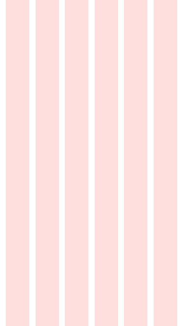

# CSS Grid

CSS Grid is a new module for creating two dimensional 
arrangements. 

## Competencies 

Completing the course material and challenges presented here students
should develop the following competencies: 

- Create layouts using CSS grid
- Visualize and apply grid systems
- Design pages using a grid system
- Differentiate 1 dimensional and 2 dimensional layout

## What is a grid? 

> A grid is a structure of rows and columns

Rows are stacked vertically

Columns are arranged horizontally. 

Grid allows you to arrange children on the grid

- Example...

Grid allows you to place elements within the grid. 

- Example... 

## Designing on a Grid 

Use a grid to design everything looks better on a grid. 

Grid terminology...

12 column and 16 column grids... 

Some examples...

What about rows...

## CSS Grid

CSS Grid creates a 2 dimensional arrangement of child objects. 
Declaring a container as display: grid tells that container 
that it's children should be arranged in rows and columns. 

### Getting started with CSS Grid

The size of the rows and columns is determined by other grid 
properties. 

template columns 

template rows 

### Spreading elements across the grid

template areas 

column start and end

## Challenges 

Look at some web sites you think have good design. Identify the
grid that is used. Try and recreate this grid by mocking up
the site with some colored boxes. Do the same with one of your 
projects. 

You should create 5 mock ups. The mock ups should be made of colored 
boxes in HTML that display the general grid layout of two sites
that you think show good design and one for a site you created. 

You only need to mock these up. Give each section a color and 
label so it can be identified. 

1. Create one mock up each day of the week for 5 days. 

### Stretch Challenges 

1. Create 7 instead of 5. 

## Lesson 

1. Introduction why use a grid?
2. What is a grid?
3.  
4. CSS Grid

