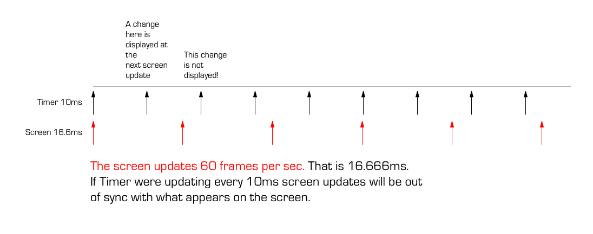

# JavaScript and the DOM

Manipulating the DOM is important. It's the key to being able to 
create rich, innovative, and engaging frontends. 

In the browser the frontend is divided between: 

- HTML - Document structure
- CSS - Appearance/Presentation
- JavaScript - Logic and interaction

JavaScript in the browser has the ability to manipulate the DOM, 
and set and define styles on elements. Whole pages complete with 
style and logic can be created with JavaScript. 

## Selecting Elements

To manipulate elements in the DOM you'll need a reference to
those elements. The DOM is a tree structure where elements 
has a parent and children. 

JavaScript provides many methods for traversing the DOM and 
finding elements. 

Get a reference to a DOM element with: 

```
document.getElementById()
document.getElementsByClassName() // Nodelist Collection
document.getElementsByTagName() 
document.querySelector()          // 
document.querySelectorAll()       // HTML Collection (magic)
document.getElementsByTagName()
...

// document.querySelectorAll('.box')
```

Really all you ever need to use is: 

`document.querySelector()`

or 

`document.querySelectorAll()`

or 

`document.getElementById()`

Why these three? 

`getElementById()` finds a single element by it's id name. 
You'll want to do this for named elements. It's quick easy 
and accurate. 

`querySelector()` finds an element using a CSS selector. 
Use this for finding anything that doesn't have an id
(though you can use it for elements with an id also!)

Note: `querySelector()` returns the first element matching
the selector! 

In cases where you want to return a collection of elements 
use: `querySelectorAll()`.

- Notes - 

Some of these methods return "array like" objects. These
are similar to arrays but act differently and provide 
different methods in some cases. 

Some of the collections returned are "live" collections.
These are collections that update automatically when the 
DOM changes. 

Two examples:

`Node.childNodes` - returns a live collection of child nodes
`Element.getElementsByTagName()` - method returns a live 
HTMLCollection of elements with the given tag name

## Creating elements

In some cases you may want to create an element dynamically. 
That is create elements from nothing. This is easily 
accomplished but, keep in mind creating an element doesn't 
mean you'll see it int he borwser! Elements are not visible 
until they are children of another element that is a child 
of the body. 

`document.createElement()`

Use `createElement()` to create an element. Include the 
tag name as an argument: `createElement("div")`. 

`Node.appendChild()`

Add the element as a child of another element with 
`Node.appendChild(child)` where Node is the parent node and 
child is the new child node you are adding to the DOM. 


### Working with the DOM elements and JS

DOM elements can hold data in CSS variables and attributes.

`node.setAttribute()`

and 

`node.getAttribute()`

This can be awkward if you are getting and setting values
often. 

A better approach is to create a JavaScript Object that 
stores a reference to the DOM element along with properties
that are needed. 

Define a class

```
function Box(x, y, w, h, r, c, el) {
  // Set class properties and assign reasonable defaults
  this.x        = x      || 0
  this.y        = y      || 0
  this.width    = w      || 100
  this.height   = h      || 100
  this.rotation = r      || 0
  this.color    = c      || '#f0f'
  // Make an element 
  this.el = el || document.createElement('div')
  // Set some styles
  this.el.style.backgroundColor = this.color
  this.el.style.position = 'absolute'
  this.el.style.width = this.width
  this.el.style.height = this.height
  this.el.style.opacity = 1
  this.el.style.borderRadius = '5px'
  
  this.el.classList.add('special')
}

// Assign methods to the class via the prototype
Box.prototype.update = function() {
  this.el.style.transform = `
    translateX(${this.x}px) 
    translateY(${this.y}px) 
    rotate(${this.rotation}deg)`
}

// To create an instance of Box 
const box = new Box(120, 200, 60, 40, '#f00')
// The box needs to be added to the DOM
const main = document.getElementById('main')
main.appendChild(box.el)
main.appendChild(box.el)
```

To keep track of a group of objects add them to an array. 

Make 10 boxes with a random x and y, and default other
properties. 

```
const boxes = []

const main = document.getElementById('main')

for (let i = 0; i < 10; i++) {
  const x = Math.random() * 400
  const y = Math.random() * 400
  cosnt box = new Box(x, y)
  boxes.push(box)
  main.appendChild(box)
}
```

If you are creating and removing objects you'll want to 
watch for potential memory leaks. 

DOM elements, and JavaScript Object take up memory. If you
are creating both when removing one you'll have to also
remove the other. 

```
Box.prototype.move = function() {
  this.x += 10
  this.rotation += 2
  if (this.x > 600) {
    this.destroy()
  } else {
    this.update()
  }
}

Box.prototype.destroy = function() {
  // Remove this element from the DOM
  this.el.remove() 
  // Remove this box from boxes
  boxes.splice(boxes.indexOf(this), 1) 
}
```

### Animate things with requestAnimationFrame

The `requestAnimationFrame` method executes a callback on the 
next repaint. A repaint occurs when the browser redraws the 
contents of the window. 

Syncing animation to a repaint optimizes performance. 



In the image you'll notice the repaints happen sometimes
twice. 


```
const box = new Box()
var deltaTime = 0 

function onFrame(time) {
  deltaTime = time - deltaTime 
  
  dx = velocity * deltaTime
  
  if (notEnding) {
    requestAnimationFrame(onFrame)
  } 
}

requestAnimationFrame(onFrame)
```

# Event Listeners


# JavaScript Module Pattern 


## Scope Review 

## Self Executing functions 

## Public and Private in JavaScript


