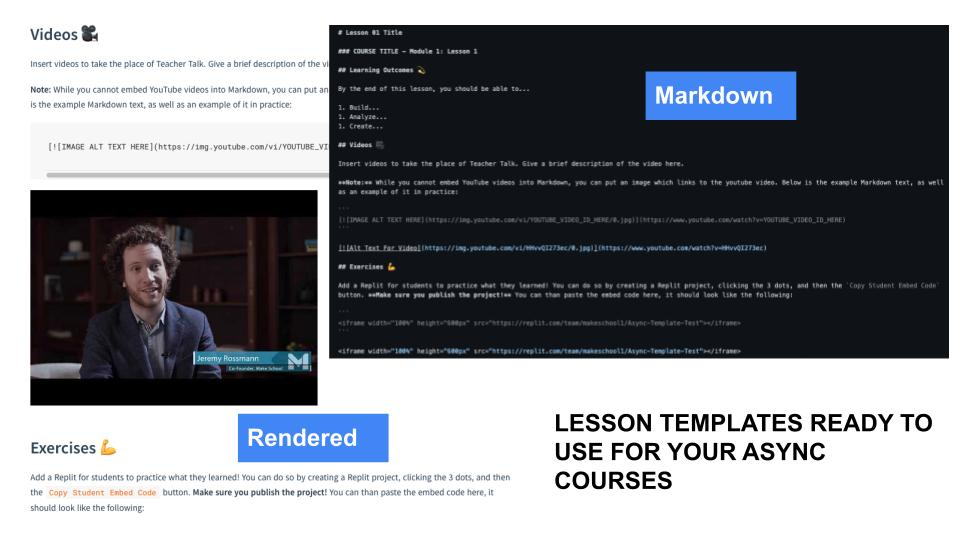

  

**Template for abuilding async learning modules for courses at Make School**

## IMPORTANT NOTES

### (1) Still Use The Syllabus Template

You will still need to have all the necessary components from the Syllabus Template for your repo. The purpose of this template is to just show you how to build async modules within your courses.

**Make sure you are still utilizing the [Syllabus Template](make.sc/syllabus-template) for your courses!**

### (2) Use Docsify

Many of the content items used in the lessons rely on being hosted on Docsify (i.e. embedded Replit, google forms, etc.) and won't be visible if you just open it up on GitHub. If you need a refresher on how to set up your course site with Docsify, check out [make.sc/course-repo-setup](make.sc/course-repo-setup)

## Instructor Note - Getting Started

You'll want to organize your async content into **modules**, each of which have **lessons**

- **Modules** are groups of lessons focused around a topic. Each Module has a README that gives the learning outcomes for the module and links to its lessons. Aim for 3-7 lessons per module. Each module gets its own folder.
- **Lessons** are collections of content such as videos, readings, activities, checks for understanding, and quizzes that help the students achieve the learning objectives of the module. Each lesson should have its own set of learning outcomes as well.

### Example - From [WEB 1.1](http://make.sc/web1.1)

**Module:** Creating scalable web applications and templating

**Lessons**

1. Templating
1. Named Parameters
1. Conditional Rendering with Templates
1. Loops in Templates
1. Creating Reusable Components via Template Inheritance

## Activities

Below is a list of example async activities you could utilize for your lessons. Don't feel limited to this list, this is just a jumping off point, or a source of inspiration! If you come up with more that work, share with the team or with the curriculum developer directly and we can add it to the list!

Note that most options below can be submitted via Gradescope or Google Forms (file upload option). Click on the links to see How-To videos

- [Replit Challenges](https://youtu.be/iovYihXWbhI)
    - Create your own Replit Team for your course. Make sure you are added to this [starter team](https://replit.com/team/makeschool1), and then the curriculum developer can make you an admin so you can make your own team for your course
- Small Coding Projects
- [Google Form Quizzes](https://youtu.be/qJitdOX-0Rs)
    - Be sure you place your quiz in your course folder on Drive, and that students can access it
- [Jamboard group discussions](https://youtu.be/EJSNEr11T1Q)
    - Be sure you place your JamBoard in your course folder on Drive, and that students can access it 
- Worksheets
- Audio/Video recordings explaining a concept
- Drawings
- Written Responses

## Instructor Note - Contact + Non-contact Hours

For any given course, there needs to be 16.5 hours dedicated to it each week split between contact and non-contact hours.

- **Contact hours:** synchronous class time, office hours
- **Non-Contact hours** asynchronous learning modules, homework, tutorials, projects, etc. Anything that does not involve live instruction/office hours.

For a synchronous course, there are 5.5 contact hours (class sessions) and 10.7 hours (tutorials, homework, projects, blog posts, etc.) of non-contact hours. **For the Async courses, those 5.5 contact hours now need to also be non-contact. For Partially  Async, 2 hours will be contact.**

### When building asynchronous learning modules, be sure to keep these hours in mind to make sure you're meeting your credit hours.

For more information on this, read the resources below, or contact the Dean directly:

- [Make School Credit Hour Requirements](https://docs.google.com/document/d/1cP3HyewqxDk3RglFfZA8ju7wSDhBHWpeJi5vWlXK9l8/edit#heading=h.piu5axwv6vej)
- [Calculating Credit Hours](https://annenberg.usc.edu/faculty-and-staff-resources/calculating-contact-hours-online-and-hybrid-classes)

### For a quickview of what you need to accomplish to make an async module, check out the [Partially Asynchronous Checklist](https://docs.google.com/document/d/1rqYg3g-4I7gxfXexRwnMNX7pFv8p6dahydVB1yPi-P4/edit)

## Below is a template for putting modules into your syllabus. Note the following:

- Each module title links to the appropriate module README
- Each lesson title links to the appropriate lesson within the module
- Each of the lessons below gives a unique example structure based on the collections of content as described above.

## Async Learning Modules

### [Module 1: MODULE-1-TITLE](Module-01/README.md)

1. [Lesson 1 Title](Module-01/Lesson-01.md)
1. [Lesson 2 Title](Module-01/Lesson-02.md)
1. [Lesson 3 Title](Module-01/Lesson-03.md)
1. [Lesson 4 Title](Module-01/Lesson-04.md)
1. [Lesson 5 Title](Module-01/Lesson-05.md)

### [Module 2: MODULE-2-TITLE](Module-02/README.md)

1. [Lesson 1 Title](Module-02/Lesson-01.md)
1. [Lesson 2 Title](Module-02/Lesson-02.md)
1. [Lesson 3 Title](Module-02/Lesson-03.md)