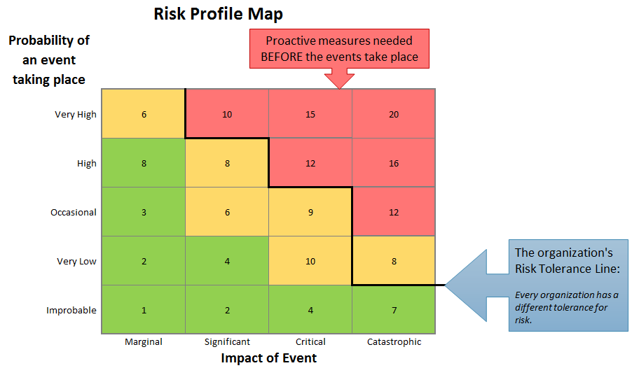

# 📜 Day 2: Historic Hacks / Ethical Hacking

### ⏱ Agenda

1. [🏆 [**5m**] Learning Objectives](#%f0%9f%8f%86-5m-learning-objectives)
2. [💭 [**15m**] Activity: Questions to the Class](#%f0%9f%92%ad-15m-activity-questions-to-the-class)
3. [💻 [**40m**] Activity: Historical Hacks Research](#%f0%9f%92%bb-40m-activity-historical-hacks-research)
4. [🌴 [**10m**] BREAK](#%f0%9f%8c%b4-10m-break)
5. [📖 [**20m**] TT / Overview](#%f0%9f%93%96-20m-tt--overview)
6. [📚 [**15m**] Activity: Defining Vocabulary](#%f0%9f%93%9a-15m-activity-defining-vocabulary)

## 🏆 [**5m**] Learning Objectives

**By the end of this lesson, you should be able to...**

- Describe some of the most famous hacks and how they were overcome (or not)
- Understand some standard security models
- Understand how ethical hacking differs from traditional hacking

## 💭 [**15m**] Activity: Questions to the Class

### Think, Pair, Share

1. What do you _currently_ know about web security?
2. What do you _want_ to know about web security?
3. What do you think is the **biggest problem** with web security today?

**Submit your answers [HERE](https://PollEv.com/droxey) so we can discuss them live!**

## 💻 [**40m**] Activity: Historical Hacks Research

### [**20m**] Research a Hack

**Form groups of four, and research one of the following historical hacks**:

- Equifax Exploit
- Anthem Medical Data Breach
- Mongo Lock
- Stuxnet
- WhatsApp Spyware Installation

The instructor will assign each group a hack. Use this time to **prepare a short, three minute lesson** to teach back to the class about your assigned topics.

### [**20m**] Present the Hack

**Present the following to the class after you research**:

1. **What happened** during the hack?
2. What **type of attack** was it?
3. **How long did it take** to be released to the public, detected, and finally responded to?

## 🌴 [**10m**] BREAK

## 📖 [**20m**] TT / Overview

### What's a Security Model?

#### Risk Profile Chart

### Security Models

A model gives you a guide to create policies and systems that adhere to fundamental ideas and best practices.

AAA and CIA are two models of web security that guide policies
within an organization.

### CIA

#### Confidentiality

Who can see your data. Rules that limit the access to information.

**Question:** What are some of the problems associated with confidentiality?

- Access restricted to those authorized to view data
- Policies for how data is stored
- Goal: protect data from unauthorized access and misuse.
- "is the property, that information is not made available or disclosed to unauthorized individuals, entities, or processes."

#### Integrity

Who can edit or change your data. Maintaining consistency and trustworthiness of data.

**Question:** What are some of the feature of data integrity?

- Data can not be modified or destroyed.
- Ensure accuracy and authenticity
- Goal: Data can not be modified through accidental or intentional unauthorized actions.
data cannot be modified in an unauthorized or undetected manner

#### Availability

Who and where your data can be accessed. Timely and reliable access to data

**Question:** Why is Availability important?

- Data is available to authorized users.
- Data is available when needed.

### AAA

**Authentication**
Requires proof: Knowledge, hardware, biometric.

**Question:** Why is authentication important?

- Identify users!

Examples: multifactor authentication, Two Factor Authentication

- Are there any problem with two factor authentication?

**Authorization**
Users can only perform tasks they are authorized for.

**Question:** Why is authorization important?

- Determines which actions and resources a user has access to

**Accounting**
Measures the resources a user consumes during access.

**Question:** Why is accounting important?

- Knowing who accessed what, when is important

## 📚 [**15m**] Activity: Defining Vocabulary

In groups of four, research one of the following terms (each group will be assigned a term):

1. **Actors**
2. **White Hat**
3. **Gray Hat**
4. **Black Hat**
5. **Ethical Hacking**

Now mix up the groups so that each group has one member who is knoweldgable on each of the five terms, and present them to each other!

### Resources & Credits

[shodan.io](https://shodan.io): IOT search engine, locate things like insecure MongoDB databases

#### Famous & Historical Hacks

- [Lifewire's list of greatest computer hacks](https://www.lifewire.com/the-greatest-computer-hacks-4060530)
- [10 social engineering hacks that made headlines](https://www.csoonline.com/article/2131745/social-engineering/10-hacks-that-made-headlines.html)

#### Security Models

- [CIA Definition](https://whatis.techtarget.com/definition/Confidentiality-integrity-and-availability-CIA)
- [AAA Definition](https://www.techopedia.com/definition/24130/authentication-authorization-and-accounting-aaa)
