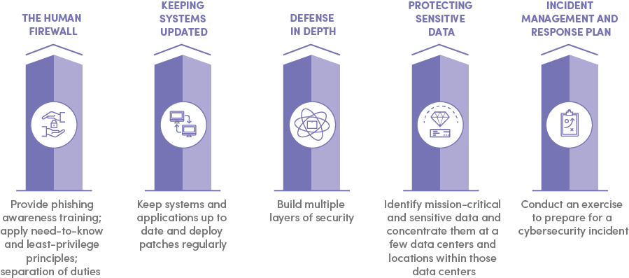

# 📜 Day 6: You've Been Hacked.  What do?

### ⏱ Agenda

1. [🏆 [**5m**] Learning Objectives](#%f0%9f%8f%86-5m-learning-objectives)
2. [📖 [**20m**] Overview](#%f0%9f%93%96-20m-overview)
3. [🌴 [**10m**] BREAK](#%f0%9f%8c%b4-10m-break)
4. [💻 [**60m**] In Class Activity](#%f0%9f%92%bb-60m-in-class-activity)

## 🏆 [**5m**] Learning Objectives

By the end of this lesson, you should be able to...

1. Identify the benefits of incident response
1. Know to properly prepare and respond to cybersecurity/IT attacks

## 📖 [**20m**] Overview

As of 2018, the average cost of a enterprise data breach is an average of $3.86 million in direct cost, and the average recovery to market value is 48 days, causing further financial loss.  **Incident Response**, or how you react to the attack, is a pillar of cybersecurity and critical in minimizing these losses.

### Incident Response

The biggest part of incident response is ironically preparation! Not only should you lock down those ports and sanitize user input, you should also have a plan for the unfortunate event you get hacked.  Your plan should be a cycle, including all the steps between the breach and recovery.  Using industry principles, let's break down how to prepare:

### Before the Attack

Before anything, take a step back and ask some questions.  What are the mission critical parts of your application?  We can further separate this out:

* People - Who needs access to your application?  Are they trustworthy and trained properly?  A single person not having 2 factor authentication is its own vulnerability.  This includes yourself!

* Processes - Are the procedures in place to prevent and react to cyber threats adequate?

* Technology - Considering the threat level your application faces, is your technology adequate to handle it?

How much damage an attack will do depends chiefly on your system. **Need to know and least priviledge principles** can help isolate incidents to only part of your system.  You can do this by considering the **people**, **processes**, and **technology** involved, and taking access they don't need.

A production database, web application, and server will only ever access each other over certain ports from specific IPs, so locking them to those addresses will significantly reduce the attack surface for example.

### During the Attack

🚨 There might not be a giant red flashing notification you've been hacked!  The infamous Equifax breach wasn't detected for *76 days*.

Digital anti-forensics and anti-detection is such a broad topic its considered its own concentration in white hat research.  For now, you can use **Intrusion Prevention and Detection Systems** (IPDSs), although software that does this often provides other services as well. Check out [Suricata](https://suricata-ids.org/docs/) for a popular open-source solution that analyzes user behavior and network patterns when connected to application logs.

### After the Attack

This is where we really answer the question "What do?".  You can compare attacks to forest fires.  Once they exist, they exist in multiple places, and have the chance to spread.  We should approach these problems in a similar manner to fires- **contain and recover**.  That might involve

* isolating malware infected instances
* patching out vulnerabilities
* resetting passwords/credentials for users and systems affected

Recovering is a little bit trickier.  First of all, we need to disclose the breach to the users affected. [Here](https://www.sec.gov/rules/interp/2018/33-10459.pdf) is the SEC's (U.S. Securities and Exchange Commision) disclosure requirements document.  If you open it you'll see 24 pages of legal gibberish, another reason to not get hacked.

After the dust clears, you'll want a security audit to fortify your system, then take stock of inventory, assets, and what was compromised.   The FTC [also has guidelines](https://www.ftc.gov/tips-advice/business-center/guidance/data-breach-response-guide-business) for what to do after a breach that are considered industry standard.

On a personal level, if you're ever hacked, change your passwords, use utilities like haveibeenpwned.com.  Just like your web app, you'll want to audit how safe your accounts are, "take stock", identify whats been compromised, and step up your security.

## 🌴 [**10m**] BREAK

## 💻 [**60m**] In Class Activity

1. Choose a repo to audit.
2. Swap repo links with a partner.
3. Use the following two checklists to audit your partner's repository:
    - [OWASP Secure Coding Practices Checklist](https://www.owasp.org/index.php/OWASP_Secure_Coding_Practices_Checklist)
    - [OWASP Top Incident Response Considerations](https://www.owasp.org/images/9/92/Top10ConsiderationsForIncidentResponse.pdf)
