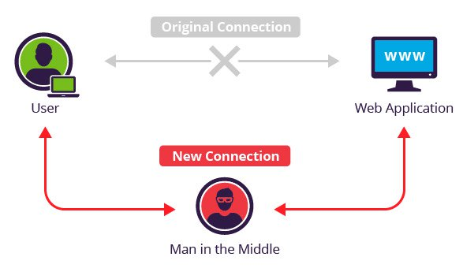
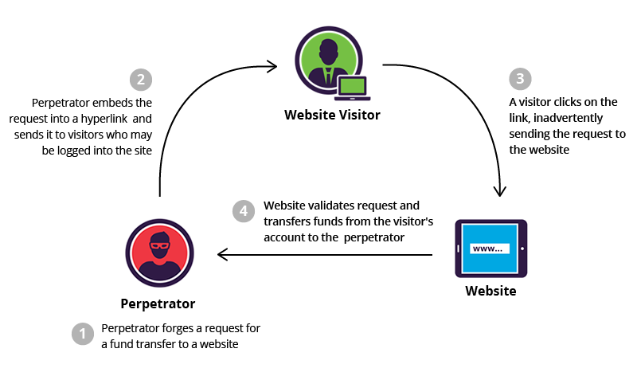

# 📜 Day 3: Server-Side Exploits

### ⏱ Agenda

1. [🏆 [**5m**] Learning Objectives](#%f0%9f%8f%86-5m-learning-objectives)
2. [📖 [**35m**] Overview](#%f0%9f%93%96-35m-overview)
3. [🌴 [**10m**] BREAK](#%f0%9f%8c%b4-10m-break)
4. [💻 [**60m**] In Class Activity: SSTI](#%f0%9f%92%bb-60m-in-class-activity-ssti)
5. [🌃 Homework](#%f0%9f%8c%83-homework)
6. [📚 Resources & Credits](#%f0%9f%93%9a-resources--credits)

## 🏆 [**5m**] Learning Objectives

1. List server-side exploitation techniques found in the wild.
2. Identify critical security issues common in today's web applications.
3. Apply server-side exploitation techniques.

## 📖 [**35m**] Overview

There are numerous vulnerabilities that can exist on the server (where our data is stored) that we need to be aware of. We'll cover some of the bigger, more common ones today, describing what they are and how we can avoid them.

### Server-Side Attack Vectors

- Lack of encryption (plain text passwords)
- Broken authentication workflows
- Session info not expiring or exposing user info
- SQL Injection
- Cross Site Request Forgery

### Broken Authentication

As a Make School student, we know you'd _never_ store sensitive information without using some kind of security. But companies like [Facebook/Instagram](https://newsroom.fb.com/news/2019/03/keeping-passwords-secure/) and [Google](https://cloud.google.com/blog/products/g-suite/notifying-administrators-about-unhashed-password-storage) have _RECENTLY_ experienced these issues!

#### How to Avoid This

- Use SSL
  - **Developers**: Use [Let's Encrypt](https://letsencrypt.org/) to generate free SSL certificates for your deployments.
  - **End Users**: Check out the [HTTPS Everywhere](https://www.eff.org/https-everywhere) extension for your browser to constantly reinforce this!
- **Encrypt credentials** on the server
  - Use [bcrypt]() with high entropy!

### Poor Session Management

Poor session management can be caused by numerous things. Most of the time it involves session token manipulation. Session tokens generally consist of:

1. Cookies
1. URLs
1. Post Data

**QUESTION: Why would a hacker want to take advantage of this data?**

- Session tokens are exposed in the URL
- Session tokens do not timeout
- Session tokens do not expire, and are not rotated

What if your session token information was sent over an unencrypted connection

This opens us up to a **Man In The Middle (MITM)** attack.

This can occur when communication is relayed over open, unsecured channels (like public Wif), or if a malicious person has the password to a secure network.

Instead of communicating with the website directly, the user (and the website) are communicating through the hacker, who could decide to passively let the communication flow through, record the information, manipulate/alter the information, or all of the above!

Let's go through a canonical example on [Wikipedia](https://en.wikipedia.org/wiki/Man-in-the-middle_attack#Example) as a class to get a better understanding of how this operates.

#### How to Avoid This

Actually, it's through the same defense techniques we learned for broken authentication! All of those same techniques apply here as well.

What about MITM attacks though? For those having a trustworthy, reliable way to authenticate someone is the best defense. We need a guaranteed way to know if people are who they say they are.

### Firewalls

A web application firewall (WAF) can validate a URL before it is executed, and therefore protect you from any kind of injection into your URL.

Common firewalls:

- `iptables`
- `ufw`

### Cross-Site Request Forgery (CSRF)

**CSRF** takes advantage of a user visiting some malicious website that generates an _even more malicious_ request to an existing site where the user is already authenticated. In this way, the attacker is getting the victim to unknowingly

#### Activity: Hacksplaining

To see an example of this, go through the [Hacksplaining exercise on CSRF](https://www.hacksplaining.com/exercises/csrf).

#### How To Avoid

**QUESTION: How do you think we can avoid these attacks?**

##### Use Cryptographic Session Tokens

If you generate a cryptographic session token when you initially authenticate to a website, the attacker would need that piece of information in order to succcessfully pull off a CSRF. Without it, now they're left guessing at the value of the token, and you're significantly less likely to get attacked!

##### Terminate Idle Sessions

Notice how your bank or Venmo logs you out after a certain period of inactivity? One of the reasons this happens is to prevent CSRF attacks! If you're no longer logged in, an attacker can't use their malicious URL on you!

## 🌴 [**10m**] BREAK

## 💻 [**60m**] In Class Activity: SSTI

Template engines are widely used by web applications to present dynamic data via web pages and emails. **Unsafely embedding user input in templates enables Server-Side Template Injection, a frequently critical vulnerability that is extremely easy to mistake for Cross-Site Scripting (XSS), or miss entirely**.

Unlike XSS, Template Injection can be **used to directly attack web servers' internals and often obtain Remote Code Execution** (RCE), turning every vulnerable application into a potential pivot point.

Template Injection can arise both through **developer error**, and through the **intentional exposure of templates in an attempt to offer rich functionality**, as commonly done by wikis, blogs, marketing applications and content management systems.

Intentional template injection is such a common use-case that many template engines offer a 'sandboxed' mode for this express purpose.

### Attacking Server-Side Rendered Templates

1. Create a [new GitHub repo](https://github.com/new) and name it `Jinja2-ExploitMe`
2. Clone the [Make-School-Labs/Jinja2-ExploitMe](https://github.com/Make-School-Labs/Jinja2-ExploitMe) repository
3. Run `git remote rm origin` in your local copy
4. Replace it using your new GitHub URL: `git remote add origin https://github.com/YOUR_USERNAME/YOUR_REPO_NAME`
5. Run `export FLASK_ENV=development; flask run` to get started!

## 🌃 Homework

- **Complete**: All exploits and document your findings in your `README`.
- **Deliverable**: GitHub repo link will be turned in at **start of class** on **Thursday**

## 📚 Resources & Credits

### SSTI

- **[Server Side Template Injection](https://portswigger.net/blog/server-side-template-injection)**: An overview of SSTI exploits in multiple frameworks.
- **[Jinja2 Template Injection Filter Bypasses](https://0day.work/jinja2-template-injection-filter-bypasses/)**: Check this out if you need a hand completing today's activity.
- **[Jinja2 Exploits: swisskyrepo/PayloadsAllTheThings](https://github.com/swisskyrepo/PayloadsAllTheThings/tree/master/Server%20Side%20Template%20Injection#jinja2)**: Check this out if you need a hand completing today's activity.

### Other Server-Side Exploits

- [Facebook/Instagram](https://newsroom.fb.com/news/2019/03/keeping-passwords-secure/) and [Google](https://cloud.google.com/blog/products/g-suite/notifying-administrators-about-unhashed-password-storage) insecure passwords
- [What Is SSL?](https://vimeo.com/135666049)
- [HTTPS Everywhere](https://www.eff.org/https-everywhere)
- [Wikipedia SHA](https://en.wikipedia.org/wiki/Secure_Hash_Algorithms)
- [Wikipedia MITM Example](https://en.wikipedia.org/wiki/Man-in-the-middle_attack#Example)
- [Hacksplaining exercise on CSRF](https://www.hacksplaining.com/exercises/csrf)
