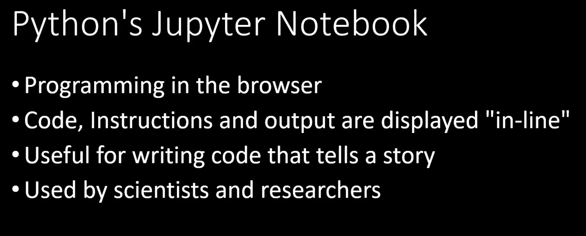

## [Slides](../Notebooks/Data_Analysis_Intro.ipynb)

## Learning Objectives

- What is Data Science?
- What is Data analysis?
- Which software and tools we need for EDA?
- Resources we can pull data and access to data


## What is Data Science?

- Lets watch this good video : https://www.youtube.com/watch?v=DZ7xuZ1-uh8


## Data Science Road Map at Make School

- https://docs.google.com/document/d/1dtMNJRDto5cWPLJv0J4eGxv_rv__20ZKsd9RaXU0ioM/edit

## What is Exploratory Data Analysis (EDA)?

- Refers to the critical process of performing initial investigations on data so as to discover patterns, to spot anomalies, to test hypothesis and to check assumptions with the help of summary statistics and graphical representations

- EDA has three components:

    - Data analysis. Example: the telecom churn dataset is given, we want to obtain what is the percentage of loyal and non-loyal customers, which state has the highest churn customers, What is the maximum length of international calls among loyal users (Churn == 0) who do not have an international plan?

    - Data analysis and visualization. Normally comparison by plotting the result which is easier for human than reading raw numbers

    - Statistical analysis on the data. Example: the titanic dataset is given, at specific "Embark" what is the distribution of male passengers over all age (were they mainly young, middle age or old)

  

## Which software and tools we need for EDA?

- As for now, you’ll only need Anaconda (built with Python 3.6)

- After installing Anaconda, we mainly use:

    - `pandas`, which is a Python library that provides extensive means for data analysis

    - `matplotlib` and seaborn, for data visualization

    - `scipy` and `statsmodels` for statistical data analysis


## What is Jupyter Notebook?



## Who make more money (Salary) for DS in London?

- Scrape Indeed API for all junior/senior positions for Data Engineer, Data Analyst and Data Scientist

- Represent the salaries in Cumulative Density Function (CDF)


- https://dashee87.github.io/data%20science/r/Engineering-Data-Engineers/

### Resources we can pull data and access to data

- Databases, writing SQL queries for example

- CSV files

- Calling API, for example Indeed API

- Crawling (Scrape) websites

## Activity: How many female passengers survived in Titanic?

- Dataset Description: https://www.kaggle.com/andyyang/titanic-survival-project

- The intention of this activity is to show using appropriate data science packages, will accelerate our analysis and modeling

```python
# without using pandas

import csv

with open('titanic.csv') as csv_file:
    csv_reader = csv.reader(csv_file, delimiter=',')
    gender_ls = []
    survive_ls = []
    for row in csv_reader:
        gender_ls.append(row[4])
        survive_ls.append(row[1])

gender_ls = gender_ls[1:]  
survive_ls = survive_ls [1:]

female_index = [i for i, j in enumerate(gender_ls) if j == 'female']
print(female_index)
female_survived_not_survived = [survive_ls[i] for i in female_index]

num_female_survived = len([i for i, j in enumerate(female_survived_not_survived) if j == '1'])
print(num_female_survived)
```
### Using pandas
```Python
# Using pandas

import pandas as pd

df = pd.read_csv('titanic.csv')

len(df[(df['Sex'] == 'female') & (df['Survived'] == 1)])
```
