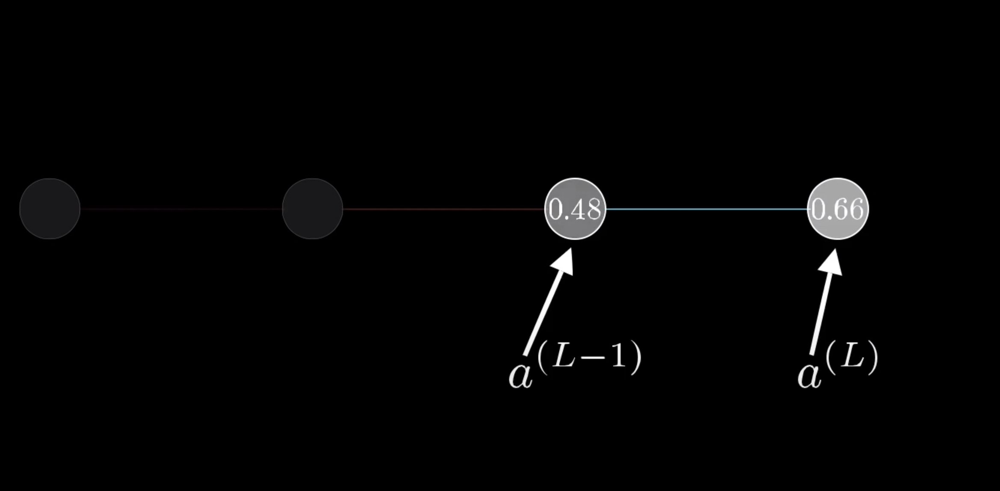
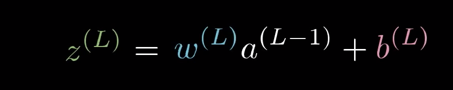
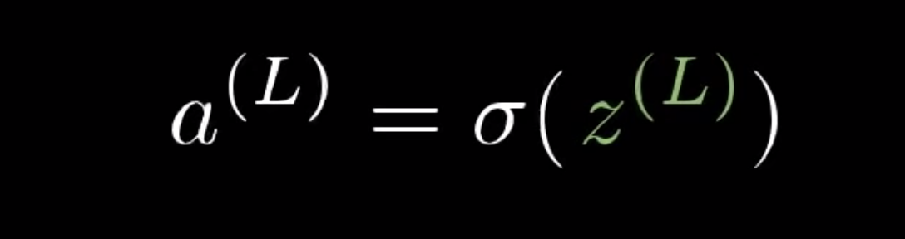

# Back Propagation

# **Why you should know this**

- Back Propagation actually gives us detailed insights into how changing the weights and biases changes the overall behavior of the network.
- It helps to assess the impact that a given input variable has on a network output.
- The knowledge gained from this analysis should be represented in rules.
- Back Propagation is especially useful for deep neural networks working on error-prone projects, such as image or speech recognition.

# **Prerequisites**

- QL 1.1 Quantitative Reasoning
- DS 1.1 Data Analysis & Visualization
- DS 2.1 Machine Learning

# What is Back Propagation?

Back-propagation is just a way of propagating the total loss back into the neural network to know how much of the loss every node is responsible for, and subsequently updating the weights in such a way that minimizes the loss by giving the nodes with higher error rates lower weights and vice versa.

In short, Back Propagation is an algorithm to determine how a single training example would like to nudge the weights and biases. 

When training a network, we repeat the following steps (for *n* epoches):

1. Perform forward pass.
2. Calculate ∆W (the delta to be added to each weight) via backpropagation.
3. Update the weights.

We will be focusing on the second step for this lesson.

# What are the steps of Back Propagation?

The 3 steps of back propagation is as follows:

1. Calculate the cost function, C(w)
2. Calculate the gradient of C(w) with respect to (w.r.t) all the weights, **w**, and biases, **b,** in your neural network (NN)
3. Adjust the **w** and **b** proportional to the size of their gradients.

Here is an [article](https://towardsdatascience.com/the-maths-behind-back-propagation-cf6714736abf) that explains on how to calculate weighted sum and activation layer of a simple 1-1-1 network. 

Watch this [video lesson](https://www.youtube.com/watch?v=Ilg3gGewQ5U) by 3Blue1Brown that explains what backpropagation really is doing.

# Exercises
Before starting on the exercies, watch this [video lesson](https://www.youtube.com/watch?v=tIeHLnjs5U8), to understand the calculations behind weighted sum, activation layer and cost function in Back Propagation. The lesson is a continuation from the previous video linked so make sure to watch that one as well. 📼📝
#

You are given an extremely simple network, one where each layer has a single neuron in it.

Focusing on the last 2 neurons, 

For the last neuron, you are given the weight and bias. You are also given the activation layer of the previous neuron.

## Exercise 1:
Calculate the weighted sum, z(L),  based on the given variables.

w(L) = 0.5

b(L) = 1

a(L-1) = 0.25

## Exercise 2:
Write a python function to calculate the activation layer, a(L), of a neuron. Your function should take the weighted sum z(L) as an input. For the activation function part, use the sigmoid activation function.

Here is the formula for sigmoid function:

## Exercise 3:
Use the python function that you wrote on Exercise 2 to calculate the activation layer of the last neuron. 

You will use the calculated weighted sum, z(L), from Exercise 1 as an input here.

## Exercise 4:
Calculate the cost function of the last neuron based on the result of the activation layer from Exercise 3.

The expected output **(y)** is 1.

# Resources

[How does back propagation work](https://towardsdatascience.com/how-does-back-propagation-in-artificial-neural-networks-work-c7cad873ea7)

[The math behind back propagation](https://towardsdatascience.com/the-maths-behind-back-propagation-cf6714736abf)

[Back Propagation with math](https://towardsdatascience.com/backpropagation-for-people-who-are-afraid-of-math-936a2cbebed7)

[Back Propagation video pt.1](https://www.youtube.com/watch?v=Ilg3gGewQ5U)

[Back Propagation video pt.2](https://www.youtube.com/watch?v=tIeHLnjs5U8)
