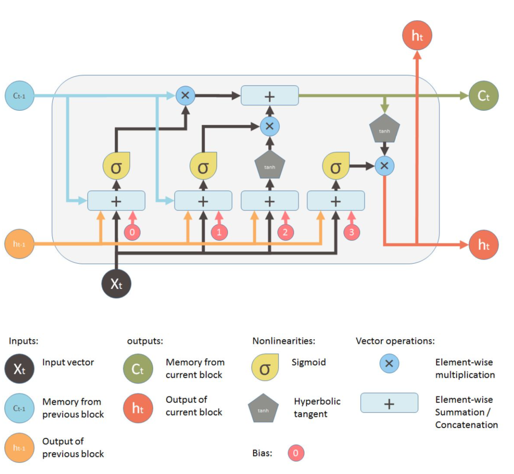

## Learning Objectives (Competencies)
By the end of this lesson, students will be able to:
- What is RNN and what is LSTM
- What are Recurrent Cells in Keras
- How we can obtain the parameters for LSTM

## Recurrent Neural Network (RNN)

- The idea behind RNNs is to make use of sequential information

- In a traditional neural network we assume that all inputs (and outputs) are independent of each other. But for many tasks that’s a very bad idea

- If you want to predict the next word in a sentence you better know which words came before it

- Another way to think about RNNs is that they have a “memory” which captures information about what has been calculated so far


### Recurrent Cells in Keras

- SimpleRNN

- LSTM

- GRU



### The time steps define how many times the LSTM cell state is updated for one sample (one mnist digit for example)

- To use LSTM for image classification we should prepare our data such that it has sequential meaning

- Lets prepare data (image here) for Sequential MNIST Classification

- We use 28 sequence (time step) each with 28 features


## Activity: Train a LSTM model with Keras for MNIST Classification

```Python
from keras.datasets import mnist
import numpy as np
from keras.models import Sequential
from keras.layers import Dense, Dropout, Activation
from keras.layers import LSTM
import keras

(x_train, y_train), (x_test, y_test) = mnist.load_data()
x_train = x_train/np.max(x_train)
x_test = x_test/np.max(x_test)
y_train = keras.utils.to_categorical(y_train, 10)
y_test = keras.utils.to_categorical(y_test, 10)

# print(x_train[1])
x_train = x_train.reshape(x_train.shape[0], 28, 28)
x_test = x_test.reshape(x_test.shape[0], 28, 28)
print(x_train[0])
nb_units = 50

model = Sequential()
# model.add(LSTM(256, input_dim=1, input_length=5))
model.add(LSTM(nb_units, input_shape=(28, 28)))
model.add(Dense(units=10, activation='softmax'))
# 2.5 Compile the model.
model.compile(loss='categorical_crossentropy', optimizer='adam', metrics=['accuracy'])
# 2.6 Print out model.summary
epochs = 3

history = model.fit(x_train,
                    y_train,
                    epochs=epochs,
                    batch_size=128,
                    verbose=1,
                    validation_split=0.2)

scores = model.evaluate(x_test, y_test, verbose=2)
print("%s: %.2f%%" % (model.metrics_names[1], scores[1]*100))
```

### Return Sequence in LSTM

- `model.add(LSTM(nb_units, input_shape=(28, 28), return_sequences = False))`


- `model.add(LSTM(nb_units, input_shape=(28, 28), return_sequences = True))`


### How the LSTM model for MNIST look like?


### How many parameters LSTM has?

- Assume the subscript *t* indexes the time step


- We have four W, four U and four bias

- The number of parameters for LSTM is 4dh + 4 hh  + 4h. The last term is for four bias

## Activity: Verify the number of parameters for LSTM in Keras

```python
from keras.models import Sequential
from keras.layers import Dense, Dropout, Activation
from keras.layers import Embedding
from keras.layers import LSTM
import numpy as np

input_array = np.array([[[0], [1], [2], [3], [4]], [[5], [1], [2], [3], [6]]])
print(input_array.shape)
model = Sequential()
# model.add(LSTM(256, input_dim=1, input_length=5))
model.add(LSTM(10, input_shape=(5, 1), return_sequences=False))
model.summary()
print(input_array)
model.compile('rmsprop', 'mse')
output_array = model.predict(input_array)
print(output_array)
# the number of parameters of a LSTM layer in Keras equals to
# params = 4 * ((size_of_input + 1) * size_of_output + size_of_output^2)
n_params = 4 * ((1 + 1) * 10 + 10**2)
print(n_params)
print(model.summary())
```
