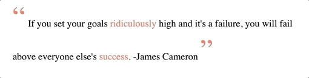
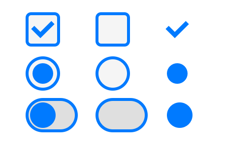

# FEW 2.2 - Advanced CSS - ::before and ::after

Add custom controls with pseudo-elements. 

## Why you should know this?

The default check box and radio button offer very few options for customization. Using pseudo-elements opens up a lot of options. 

## Learning Objectives

1. Describe the relationship between an input and its label
1. Define a label and input that are associated 
1. Use pseudo-classes ::before and ::after
1. Create custom checkboxes and radio buttons
1. Use ridiculously complicated CSS selectors

## Slides

https://docs.google.com/presentation/d/1bVVX2ELbGEPktG6Cv_DiA2I4uxYyEGALr7WUAga0RLw/edit?usp=sharing

## Pseudo Elements

`::before` and `::after` are pseudo-classes. These create new elements via CSS that don't exist in the DOM. 

Imagine you have: 

`<div> * </div>`

With this style:

```CSS
div::before {
	content: "Hello";
}

div::after {
	content: "World";
}
```

Your div would appear as: 

`Hello * World`

The before element goes before the existing content and the after element goes after. 

You can think of DOM like this: 

```HTML
<div>
	<span>Hello</span>
	*
	<span>World</span>
</div>
```

Though the inspector will show: 

```HTML
<div>
	::before
	*
	::after
</div>
```

## What can you do with pseudo-elements?

Using ::before and ::after you can add elements to the DOM that don't exist in your mark up, and you can style these new elements. 

### Fancy Blockquote

Making fancy blockquote styles is a possible application. Imagine you want to add a fancy quotation mark before and after the text in a blockquote. 

```HTML
<style>
	blockquote::before {
		content: open-quote;
		font-size: 3em;
		color: tomato;
	}
	blockquote::after {
		content: close-quote;
		font-size: 3em;
		color: tomato;
	}
	blockquote {
		/* Set the quote style */
		quotes: "\201C""\201D""\2018""\2019";
	}
</style>

<blockquote>
	The way to get started is to quit talking and begin doing. 
</blockquote>
-Walt Disney
```


Here the ::defore and ::after elements have content that is an open and closing quote. They also have styles that set the `font-size` and color of their elements. 

https://css-tricks.com/almanac/properties/q/quotes/

### Fancy Underline

The goal here is to make a line that draws itself under a word. To do this we need another new element to appear. This would be a difficult addiction to existing markup and as a visual effect should not part of that markup, remember the separation of concerns. 

The solution is to generate the extra element with ::after. 

```HTML
<style>
	.add-box {
		display: inline-block;
		color: tomato;
	}
	.add-box::after {
		content: "";
		display: block;
		width: 0;
		height: 3px;
		background-color: tomato;
		transition: 400ms;
	}
	.add-box:hover::after {
		width: 100%;
	}
</style>

<blockquote>
	If you set your goals <span class="add-box">ridiculously</span> high and it's a failure, you will fail above everyone else's <span class="add-box">success</span>. 
</blockquote>
-James Cameron
```



Here the class .add-box adds a new pseudo-element with ::after. That element is styled with a display: block, width, height, and background color. It also has a transition, so changes to these properties will be animated. 

Notice the last rule: .add-box:hover::after. This selector applies to the ::after element when its parent is in the :hover state. Changing the width here starts the animation. 

## Research Pseudo-elements

Read this article. It talks about the uses for ::before and ::after. 

https://css-tricks.com/pseudo-element-roundup/

## Custom Checkboxes and radio buttons

The checkbox and radio button are limited in what the browser allows you to style. With Pseudo-elements we open up the possibility to customize these elements. 

### How are checkboxes and radio buttons marked up?

Usually you will want to markup up checkboxes and radio buttons like this: 

```HTML
<label>
	<input type="checkbox">
	Pickles?
</label>

<label>
	<input type="radio" name="choice" checked>
	Converse
</label>

<label>
	<input type="radio" name="choice">
	Vans
</label>
```

The label is an important element here. Besides providing a label that can be read, the label provides an element that can be interacted with. 

**With the label wrapped around the input clicking the label is the same as clicking the input.**

What are the elements needed for a checkbox or radio button? 



The checkbox or radio button is usually made of two parts a container, a box or circle, and a mark, check, or dot. The mark is sometimes visible and sometimes not. 

This can also be more complicated than what is presented here but these are the basic elements or starting place to create checkboxes and radio buttons. 

To make this possible we need to add a little more markup. The markup presented above doesn't allow us enough to control the checkbox with CSS alone. By adding one extra tag we can do that. 

```HTML
<label>
	<input type="checkbox">
	<span>Pickles?</span>
</label>

<label>
	<input type="radio" name="choice">
	<span>Converse</span>
</label>

<label>
	<input type="radio" name="choice">
	<span>Vans</span>
</label>
```

With the extra span, you can use the + or ~ selectors to connect the span with the input. More on this below. 

Since we are going to include this in our frameworks it's probably best to make it something that is opt-in. Do this by adding a class name: 

```HTML
<label class="frmwrk-checkbox">
	...
</label>

<label class="frmwrk-radio">
	...
</label>

<label class="frmwrk-radio">
	...
</label>
```

By including the class frmwork-checkbox or frmwrk-radio you'll get the fancy checkboxes and radio buttons. Without these classes, you get the standard checkbox and radio buttons. 

You'll need 5 selectors. Here they without their inner styles. Each of these performs a different function. Read the comments below. 

```CSS
/* checkbox button base element */
.frmwrk-checkbox > span {
	...
}
/* Selected "checkmark" styles */
.frmwrk-checkbox > input[type=checkbox] + span::before {
	... 
}
/* Selected "mark" styles */
.frmwrk-checkbox > input[type=checkbox]:checked + span::before {
	...
}
/* Outline */
.frmwrk-checkbox > input[type=checkbox] + span::after {
	...
}
/* Hide the input */
.frmwrk-checkbox input {
	...
}
```

- base element - sets the style of the label and its children
	- .frmwrk-checkbox > span
- Selected "checkmark" - Sets the style for the pseudo-element that appears in the box or circle. The selector here selects the ::before an element of the span that immediately follows the input with type=checkbox
	- .frmwrk-checkbox > input[type=checkbox] + span::before
	- https://www.w3schools.com/cssref/sel_element_pluss.asp
- Selected "mark" - Sets the style for the checkmark when the mark is visible or selected. The selector here says: select the ::before the pseudo-element that belongs to the span that immediately follows an input with type=checkbox. 
	- .frmwrk-checkbox > input[type=checkbox]:checked + span::before
	- https://developer.mozilla.org/en-US/docs/Web/CSS/:checked
- Outline - Styles the box or circle that contains the mark. The selector here says to select an input that has type=checkbox that is a child of an element with class frmwrk-checkbox. 
	- .frmwrk-checkbox > input[type=checkbox] + span::after
	- https://www.w3schools.com/css/css_attribute_selectors.asp

With these selectors, you're ready to make some custom checkboxes or radio buttons. 

You can see the full source code for the examples above here: 

- Fancy Blockquote - [lesson-08-fancy-blockquote.html](lesson-08-fancy-blockquote.html)
- Fancy Underline - [lesson-08-fancy-underline.html](lesson-08-fancy-underline.html)
- Custom Checkboxes and Radio Buttons - [lesson-08-custom-checkboxes-radio-buttons.html](lesson-08-custom-checkboxes-radio-buttons.html)

There are many articles here are a few that I picked out. You can follow these to help guide or inspire and provide direction. 

- https://www.appitventures.com/blog/styling-checkbox-css-tips
- https://www.w3schools.com/howto/howto_css_custom_checkbox.asp
- https://codepen.io/Vestride/pen/dABHx


## Activity 

Create your custom checkboxes and radio buttons. Add these to your CSS framework. 

## After Class 

Use the ideas above and add styles for "fancy" block quotes to your CSS framework.

## Additional Resources

1. https://www.smashingmagazine.com/2011/07/learning-to-use-the-before-and-after-pseudo-elements-in-css/
1. https://codersblock.com/blog/diving-into-the-before-and-after-pseudo-elements/
1. https://dev.to/ruppysuppy/css-decoded-before-and-after-1o56

