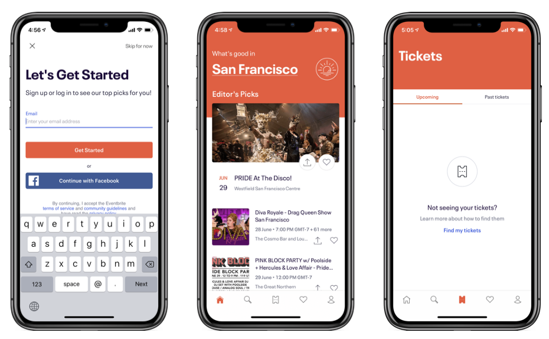

<!-- Run this slideshow via the following command: -->
<!-- reveal-md README.md -w -->

<!-- .slide: class="header" -->
# Introduction to UIKit

## [Slides](https://make-school-courses.github.io/MOB-1.1-Introduction-to-Swift/Slides/11-Intro-to-UIKit/README.html ':ignore')

<!-- > -->

## Agenda

- UIKit
- Scenes, Views and View Controllers
- View's lifecycle
- Wireframes
- Tutorial

<!-- > -->

## Learning Objectives

By the end of this lesson, students should be able to:

- Identify common elements in iOS apps
- Understand the relationship between scenes, views and view controllers
- Describe MVC (Model, View, Controller) pattern
- Use Autolayout to arrange elements in a view

<!-- > -->

## Keeping us updated

[iOS 14](https://www.apple.com/ios/ios-14/)

[Xcode 12](https://developer.apple.com/xcode/)

<aside class="notes">
iOS is the mobile operating system created by Apple Inc. It runs on iPhone, iPad, iPod, Macs, Apple Watch. There’s a new release every year.

Xcode is an Integrated Development Environment (IDE) developed by Apple for developing software for macOS, iOS, tvOS & watchOS.
</aside>

<!-- > -->

## What is UIKit?

- The core framework that helps us build iOS apps.
- Has default core components (buttons, sliders, image views). Same look and feel.
- Provides a base app with functionality to start working with.
- Main components: **Scenes**, **View Controllers** and **Views**.

<!-- v -->

“This framework lets apps achieve a **consistent appearance** across the system, while at the same time offering a high level of **customization**. UIKit elements are **flexible** and **familiar**. They’re adaptable, enabling you to design a single app that looks great on any iOS device, and they **automatically update when the system introduces appearance changes.**”

<!-- > -->

## How an app is made

Every app is made up of scenes and transitions between scenes.

<!-- v -->

The first thing we need to do when creating a new app is to think:

- What can the app do?
- Where are things happening, in what scenes?
- How many scenes do we need?
- What are the possible transitions between scenes?

<!-- > -->

**Scenes**

Scenes consist of *View Controllers* and *Views*.

<!-- > -->

**View Controllers (VC)**

Are the containers for the views.

In most cases: one scene will have one view controller.

- Each view controller has one root view
- We can add more views as *subviews* to the root view of the view controller.
- View controllers are not something we can see, they need a view at least.
- Manage views
- Get informed about different system events (rotating, view appeared/disappeared)

<!-- > -->

**Views**

Anything that displays in the screen is a view.

They all share common properties (size, position, receive user input)

UIKit provides subclasses that represent components:
  - buttons
  - textfields
  - date pickers ...

<!-- v -->

### View lifecycle

Views have different stages: when they are created, shown, disappear and destroyed.

For every one of these stages, the View Controller associated with the view will receive an event that we can handle.

<!-- v -->

`ViewDidLoad`

Called as soon as the view is loaded for the first time.

We can initialize properties here.

<!-- v -->

`ViewWillAppear`/ `ViewDidAppear`

As soon as the view appears on screen.

The importance to differentiate them is if we are using animations to present views.

**Good place to load data.**

<!-- v -->

`ViewWillDisappear`/ `ViewDidDisappear`

Good place to save data, clean up resources,

<!-- > -->

## Interface essentials

[Apple Docs](https://developer.apple.com/design/human-interface-guidelines/ios/overview/interface-essentials/)

<!-- > -->

## Building a wireframe

Let's say we want to turn the "Hotel management" program into a real app.

1. Think about the scenes the app needs.

2. Draw the elements each scene needs.
    - every element must be a native component of UIKit. Refer to the [Interface Essentials](https://developer.apple.com/design/human-interface-guidelines/ios/overview/interface-essentials/) You should be able to name every element in your scenes.

3. Draw the transitions between scenes. How do I get to each scene?

<!-- v -->

Share in pairs your designs.

- Any similar components?
- Major differences?
- Give each other feedback on what might be a better practice.

<!-- v -->

## Demo Building a screen with storyboards

Instructor takes a screen design and replicates it in the storyboard.

<!-- v -->

## MVC

<!-- > -->

## MVC for SwiftUI?

Whiteboard

<!-- > -->

## Autolayout

Auto Layout **dynamically calculates** the size and position of all the views in the view hierarchy, **based on constraints** placed on those views.

This constraint-based approach to design allows you to build user interfaces that dynamically respond to both internal and external changes.

<!-- v -->

### External changes
Occur when the size or shape of your superview changes. And we must update the layout of the view hierarchy to best use the available space.

- The user enters or leaves Split View on an iPad
- The device rotates
- We want to support different orientations
- We want to support different screen sizes

<!-- v -->

### Internal changes

Occur when the size of the views or controls in the user interface change.

- The content displayed by the app changes
- The app supports internationalization
- The app supports Dynamic Type

<!-- v -->

<!-- v -->

## Magic 8 Ball 🎱

Complete [Magic 8 Ball tutorial](https://www.makeschool.com/academy/track/learn-how-to-build-apps--magic-8-ball)

<!-- > -->

## After class - Lab

- You have until Monday to submit the Magic 8 ball tutorial
- Final Project Kick off

<!-- v -->

## Additional Resources

[Human Interface Guidelines](https://developer.apple.com/design/human-interface-guidelines/ios/overview/interface-essentials/)
[UIKit inheritance video](https://www.youtube.com/watch?v=DFsENma-PAk)
