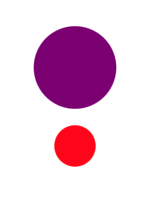

<!-- Run this slideshow via the following command: -->
<!-- reveal-md README.md -w -->

<!-- .slide: class="header" -->

# Creating Custom Views

## [Slides](https://make-school-courses.github.io/MOB-1.2-Introduction-to-iOS-Development/Slides/04-CustomViews/README.html ':ignore')

<!-- > -->

## Agenda

- Review Onboarding assignment
- Creating custom views
- xib files

<!-- > -->

## Learning Objectives

By the end of this lesson, students should be able to:

- Create custom views programmatically
- Implement custom views using xib files

<!-- > -->

## Onboarding assignment

- 👯 Get in pairs or groups of 3.
- 🕵🏻 Review each other's code.
- 🙌🏼 See if you can get unblocked with tips from your classmates.
- 📝 Keep a list of the things you are still missing or would like to change after reviewing your code in groups.

<!-- v -->

### 🤔

Have you noticed that our current solution for the Onboarding has too much going on in the same file?

Facts:
- It works
- It takes time to find where things are
- Can definitely be improved

How?

<!-- > -->

### Creating Custom Views

Creating custom views will help with:

- Making code **reusable**.
- Making code more **readable**.
- Sometimes **reduce** the amount of code.
- **Separation** of concerns.
- Help with the file **structure** in the project.

<!-- > -->

We can create them 2 ways:
- **programmatically**
- **xib** files

<!-- > -->

## Programmatically

We need a new file to get started.

File → New → File → Cocoa Touch Class

Name: `MyCustomView`<br>
Subclass of `UIView`

<!-- v -->

```swift
class MyCustomView: UIView{


}

```

<aside class = "notes">
This is the empty class we get.
</aside>

<!-- v -->

```swift
class MyCustomView: UIView{
    override init(frame: CGRect){
        super.init(frame: frame)
    }
}
```

<aside class = "notes">
We add custom functionality to the view by overriding the init method and still call it in the base class to set the frame.
</aside>

<!-- v -->

```swift
class MyCustomView: UIView{
    override init(frame: CGRect){
        super.init(frame: frame)
    }

    required init?(coder aDecoder: NSCoder){
        super.init(coder: aDecoder)
    }
}
```

<aside class = "notes">
Xcode will ask for this other required init. Which is needed in all subclasses of UIView
</aside>

<!-- v -->

```swift
class MyCustomView: UIView{
    override init(frame: CGRect){
        super.init(frame: frame)
        setup()
    }

    required init?(coder aDecoder: NSCoder){
        super.init(coder: aDecoder)
        setup()
    }

    private func setup(){
        self.backgroundColor = UIColor.purple
        self.translatesAutoresizingMaskIntoConstraints = false
    }
}
```

<aside class = "notes">
Any custom behavior can live in a separate method and make sure to call it in the initializers if applicable.
</aside>

<!-- v -->

```swift
class ViewController: UIViewController {

    let topView: MyCustomView = {
        let view = MyCustomView()
        return view
    }()

    override func viewDidLoad() {
        super.viewDidLoad()

        self.view.addSubview(topView)
        NSLayoutConstraint.activate([
        topView.widthAnchor.constraint(equalToConstant: 100),
        topView.heightAnchor.constraint(equalToConstant: 100),
        topView.centerXAnchor.constraint(equalTo: view.centerXAnchor),
        topView.centerYAnchor.constraint(equalTo: view.centerYAnchor)])
    }
}
```

<!-- > -->

## The true value of reusing

We now have a custom class for a view that's purple. We can create as many as we want in our project.

That's useful, but we are not exploiting the most out of our custom class.

What if I want to make squares of **different colors**?

<!-- v -->

## Custom initializer

```swift
class MyCustomView: UIView {
    var color: UIColor? = .purple

    override init(frame: CGRect) {
        super.init(frame: frame)
        setup()
    }

    required init?(coder aDecoder: NSCoder) {
        super.init(coder: aDecoder)
        setup()
    }

    convenience init(color:UIColor){
        self.init(frame: .zero)
        self.color = color
        setup()
    }

    private func setup(){
        self.translatesAutoresizingMaskIntoConstraints = false
        self.backgroundColor = color
    }
}
```

<!-- v -->

## Usage

```swift
class ViewController: UIViewController {

    let topView: MyCustomView = {
        let view = MyCustomView(color: .systemPink)
        return view
    }()

    override func viewDidLoad() {
        super.viewDidLoad()

        self.view.addSubview(topView)
        NSLayoutConstraint.activate([
        topView.centerXAnchor.constraint(equalTo: view.centerXAnchor),
        topView.centerYAnchor.constraint(equalTo: view.centerYAnchor),
        topView.widthAnchor.constraint(equalToConstant: 100),
        topView.heightAnchor.constraint(equalToConstant: 100)
        ])
    }
}
```

<!-- v -->

A small change but now we can customize the properties of our custom view. 😎

This is useful when we are working with a design that reuses the same elements in more than one screen. Or when we notice that some views are very similar with subtle differences.

[Review on Initializers]()

<!-- > -->

## In Class Activity - 20 min

Recreate the example to make a custom view.

Your custom view should:

- Specify background color
- Include a corner radius property

```swift
self.layer.masksToBounds = true
self.layer.cornerRadius = //value for the corner radius
```

Then create two instances of your custom view in the View Controller.

<!-- v -->



<!-- > -->

## xib files

xib files are a great way to create custom views with some benefits from the storyboard.

We can design in the Interface Builder and then use the view in a storyboard or programmatically.

xib files reduce the need of having storyboards and because of this, reduce the amount of bugs too.

<!-- v -->

## xibs or nibs?

Both terms mean a custom view that you can reuse in your project.

**XIB**  (XML Interface Builder) is a representation before the compiler turns it into **NIB** (NeXTSTEP Interface Builder).

XIBs are easier for us to read while NIBs are easier for the computer to process.

<!-- > -->

## xib files

<iframe src="https://www.youtube.com/embed/ukuwrJmsMB4" data-autoplay  width="700" height="500"></iframe>

[Demo Pt. 2](https://youtu.be/qV_j4RVfrvg)

[Written Tutorial](https://medium.com/better-programming/swift-3-creating-a-custom-view-from-a-xib-ecdfe5b3a960)

<!-- v -->

## Lab

Use Custom Views programmatically to refactor your current Onboarding solution. These will replace the content in the scroll view.

Custom Views should have these properties:
- backgroundColor → UIColor
- imageName → String
- message → String
- isLastPage → Bool

- A possible solution to the onboarding flow and how to use custom views: [video (early 2020)](https://youtu.be/kJQcn06uIiI).

<!-- > -->

## Additional Resources

- [Xcode project without the main storyboard](https://www.google.com/url?sa=t&rct=j&q=&esrc=s&source=web&cd=6&cad=rja&uact=8&ved=2ahUKEwjFgpDr66vnAhX2CzQIHXEDDIoQwqsBMAV6BAgHEAQ&url=https%3A%2F%2Fwww.youtube.com%2Fwatch%3Fv%3DHtn4h51BQsk&usg=AOvVaw0pv5o1FniYa4BdXjKqT8yT)
- [Using xib files](https://medium.com/better-programming/swift-3-creating-a-custom-view-from-a-xib-ecdfe5b3a960)
- [Guide to creating custom views](https://samwize.com/2017/11/01/guide-to-creating-custom-uiview/)
