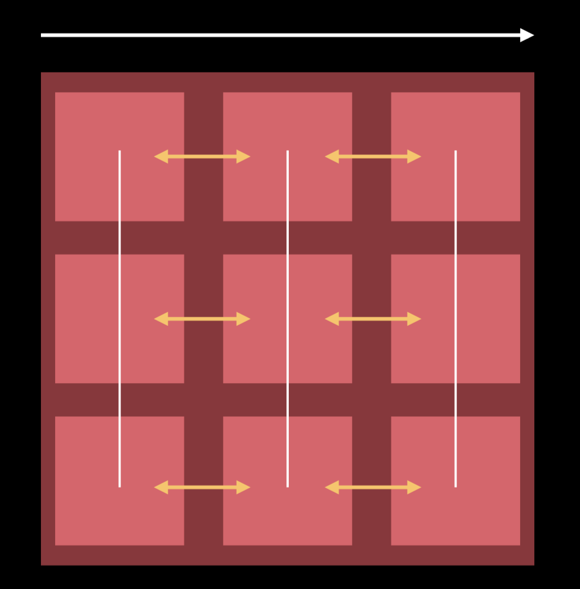

# UICollectionViews

<!-- > -->

## Learning Objectives
By the end of this lesson, students should be able to:

- Implement UICollectionViews in code
- Handle UICollectionView's datasource and delegate
- Manage update animations

<!-- > -->

## UICollectionView

**An object that manages an ordered collection of data items and presents them using customizable layouts.**

We find them in many apps used to display a collection of items.


<!-- > -->

## CollectionViews use Layouts

A layout in a collection view is *how* the content is displayed.

`UICollectionViewLayout` is a class that is meant to be subclassed, to let you customize it.

But just in case, there is one already called **UICollectionViewFlowLayout** that you can use right away.

<!-- > -->

## Line based design

Line based layout systems can adapts to many designs.

**Vertical Scrolling**<br>


<!-- > -->

**Line Spacing**
<br><br>

<!-- > -->

**Inter item spacing**
<br><br>

<!-- > -->

**Horizontal Scrolling**<br>

<br><br>

<!-- > -->

**Line Spacing**
<br><br>

<!-- > -->

**Inter item spacing**
<br><br>

<!-- > -->

## Data Source

Deals with what goes as the content of the `UICollectionView`.

```
func numberOfSections(in collectionView: UICollectionView) -> Int
func collectionView(_ collectionView: UICollectionView, numberOfItemsInSection section: Int) -> Int
func collectionView(_ collectionView: UICollectionView, cellForItemAt indexPath: IndexPath) -> UICollectionViewCell

```

<!-- > -->

## Delegate

Handles user interaction with items in the collection view: highlighting, selecting, dragging, etc.

```swift
func collectionView(UICollectionView, shouldSelectItemAt: IndexPath) -> Bool
func collectionView(UICollectionView, didSelectItemAt: IndexPath)
func collectionView(UICollectionView, shouldDeselectItemAt: IndexPath) -> Bool
func collectionView(UICollectionView, didDeselectItemAt: IndexPath)

```

<!-- > -->

## Setup

1. Instantiate a `UICollectionView` object in a view controller

```swift
var collectionView : UICollectionView!
var emojis: [String] = Array(repeating: "😎", count: 100)
...
collectionView = UICollectionView(frame: .zero, collectionViewLayout: UICollectionViewFlowLayout())
```

<!-- > -->

2. Set dataSource and delegate of the collection view

```swift
collectionView.dataSource = self
collectionView.delegate = self
```

<!-- > -->

3. Create a cell and layout the contents inside

<!-- > -->

4. Register cell & reuse identifier

```swift
collectionView.register(CustomCell.self, forCellWithReuseIdentifier: CustomCell.identifier)
```

<!-- > -->

5. Implement methods needed from data source and delegate.

```swift
func collectionView(_ collectionView: UICollectionView, numberOfItemsInSection section: Int) -> Int {
       return emojis.count
   }

func collectionView(_ collectionView: UICollectionView, cellForItemAt indexPath: IndexPath) -> UICollectionViewCell {
       let cell = collectionView.dequeueReusableCell(withReuseIdentifier: CustomCell.identifier, for: indexPath as IndexPath) as! CustomCell
       cell.label.text = self.emojis[indexPath.item]
       return cell
}

func collectionView(_ collectionView: UICollectionView, didSelectItemAt indexPath: IndexPath) {
       print("You selected item in row \(indexPath.row)")
}
```

<!-- > -->

## In Class activity

[Activity in pairs](https://github.com/Make-School-Courses/MOB-1.2-Introduction-to-iOS-Development/blob/master/Lessons/07-CollectionViews/assignments/assignment.md)

<!-- > -->

## Using performBatchUpdates

A common situation when a collection view needs to update the arrangement of its items. Deleting, adding and moving items can be done using animations instead of calling `reloadData()` this will result in a better user experience.

<!-- > -->

We can use the performBatchUpdates method to trigger several updates on the collectionView at the same time.

```
func performBatchUpdates(_ updates: (() -> Void)?, completion: ((Bool) -> Void)? = nil)
// allows multiple insert/delete/reload/move calls to be animated simultaneously. Nestable.
```

<!-- > -->

When doing this operations we need to be careful with the order of handling the datasource and triggering the animations. <br><br>
The order of *collection view updates* **won't** matter.<br>
The order of the *updates* in the datasource **does** matter<br>

Example: Delete 0 -> Insert 1 vs Insert 1 -> Delete 0

<!-- > -->

### Guidelines for updates
- Decompose Move into Delete and Insert updates
- Combine all Delete and Insert updates
- Process Delete updates first, in descending order
- Process Insert updates last, in ascending order

<!-- > -->

## In Class Activity

The sample project has a nav bar button with the title "update".

When we tap the "Example" option, these are the things that should happen:

- Update the value of the item at position 3
- Move the item at position 3 to position 0

<!-- > -->

## reloadData

- No updates required
- Resync data source to collection view
- Not animated
- The brute force that works

<!-- > -->

### Challenge - more updates
You will be completing the rest of the options in the "Update" menu.
Take into consideration the guidelines to avoid crashing the app.

<!-- > -->

## Lab + After Class

Extend the subscription box app to display a gallery of categories available in the box.

For example:

- Pet box: Grooming, Toys, Treats, Clothing
- Food box: Vegetables, Dairy, Meat, Cereal, Fruits
- Clothing box: Tops, Bottoms, Shoes, Outerwear

Look for the example VC in [the design online](https://zpl.io/bejlAMq). It's the "New box" screen, where users select/deselect what items they would like to receive.

Useful Links:

- [allowsMultipleSelection](https://developer.apple.com/documentation/uikit/uicollectionview/1618024-allowsmultipleselection)
- [cell selection](https://developer.apple.com/documentation/uikit/uicollectionviewdelegate/changing_the_appearance_of_selected_and_highlighted_cells)

<!-- > -->

## Additional Resources
[WWDC Demo on UICollectionView](https://developer.apple.com/videos/play/wwdc2018/225/?time=514)<br>
[UICollectionViews programmatically](https://theswiftdev.com/2018/06/26/uicollectionview-data-source-and-delegates-programmatically/)<br>
[Drag & Drop API tutorial (also available for tables)](https://github.com/pgpt10/DragAndDrop-CollectionView)
