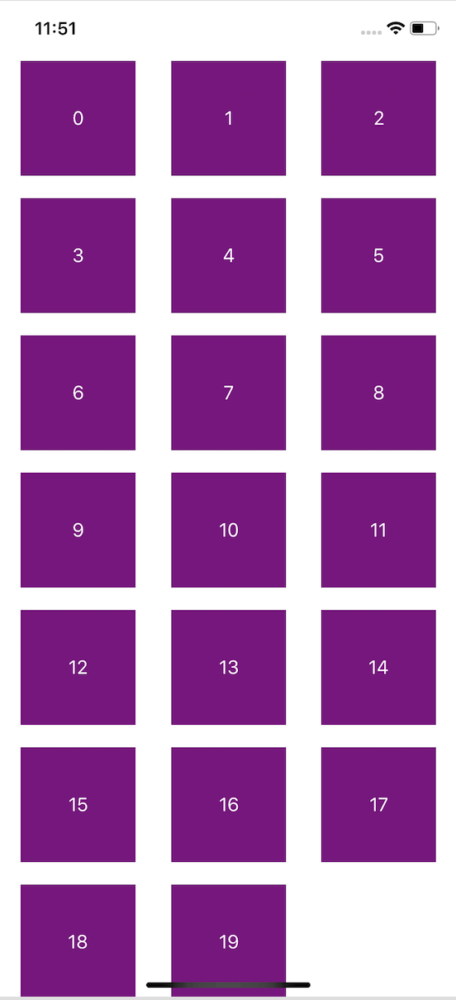

## Building a collectionView

In pairs, get the following collection view working as indicated.

1. Download the [starter project](https://github.com/amelinagzz/collectionView-starter) and finish the implementation of the `UICollectionView`. First 2 *TODOs*.
2. Experiment changing the values in the flow layout until you achieve something like this. You can find the methods in an extension at the end of the file.

<br><br>

3. Now instead of using the default flow layout. Use the subclass `CustomFlowLayout`. You will need to comment out the extension for  `UICollectionViewDelegateFlowLayout` to use the custom one.

```swift
let flow = CustomFlowLayout()
let collectionView = UICollectionView(frame: view.bounds, collectionViewLayout: flow)
```

4. The new layout displays one column only. Run it and see how it looks in both portrait and landscape mode. Run the project to see if you get the single column in both orientations.

5. This works ok but we can make better use of the space when it's on landscape mode by having more columns.

```swift
let availableWidth = cv.bounds.inset(by: cv.layoutMargins).size.width
let minColumnWidth = CGFloat(300)
let maxNumColumns = Int(availableWidth/minColumnWidth)
let cellWidth = (availableWidth / CGFloat(maxNumColumns)).rounded(.down)

self.itemSize = CGSize(width: cellWidth, height: 70.0)

```

Try the code above and see if we optimized the space. Every time our device rotates, the previous layout invalidates and the new one recalculates the item size.
