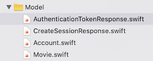
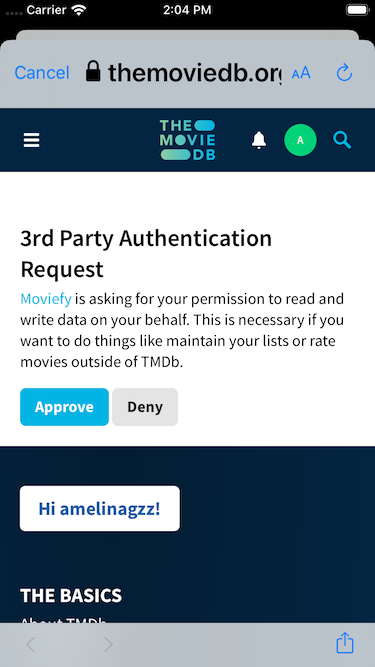

# Moviefy

**Scenario:**

- You have a working app that has a networking layer to fetch popular and upcoming movies using TMDB API. We can have users authenticate withe the API to create a session. Imagining how we could expand this app, the session would let users mark movies as favorites, or get notifications when they subscribe to a movie release.

We'll be using the completed **base** version of Moviefy from last class.

**Your mission:**

- You'll implement POST requests to authenticate the user using the third party authentication flow that TMDB's API has available.
- You'll use Apple's `AuthenticationServices` API to handle URL schemes.
- Once you can authenticate your user, you'll create a session for them and display their username in a view controller.

## Step 1 - Preparing the UI

We are going to use the other tab bar to log in the user.

Create a new ViewController and call it `LoginViewController`.
Make the changes needed in the storyboard to use that new class and add a button and a label to the view.


Don't forget to make an IBOutlet for the label and an IBAction for the button.

## Step 2 - Understanding the process

Read about how TMDB authorizes uses in their documentation.

[TMDB user authorization docs](https://developers.themoviedb.org/4/auth/user-authorization-1)

You'll need a session id as well. Read [how to get a session id](https://developers.themoviedb.org/3/authentication/how-do-i-generate-a-session-id) in the docs.

## Step 2 - Updating routes

We are going to use several routes today. Update your enum to include them:

```swift
public enum Route: String{
    ...
    case token = "authentication/token/new"
    case session = "authentication/session/new"
    case account = "account"
}
```

Links to the docs:
- [authentication/token/new](https://developers.themoviedb.org/3/authentication/create-request-token)
- [authentication/session/new](https://developers.themoviedb.org/3/authentication/create-session)
- [account](https://developers.themoviedb.org/3/account/get-account-details)

Make sure you know why wee need all the three endpoints before moving forward. If you are not sure, ask 😀

## Step 3 - New models

Since we will hit new endpoints, we are going to get new JSON structures back. We should create models to decode them. Add the following classes to new files.

```swift
struct AuthenticationTokenResponse: Codable {
    let success: Bool
    let expires_at: String
    let request_token: String
}
```

```swift
struct CreateSessionResponse: Codable {
    let success: Bool
    let session_id: String
}
```

```swift
struct Account : Codable {
    let id: Int
    let name: String?
    let username: String?

    var displayName: String {
        if let name = name, !name.isEmpty {
            return name
        }
        return username ?? "(uknown)"
    }
}
```

Your folder structure for models might now look like this:



## Step 4 - Expanding the APIClient class

According to the flow, we should first request a temporary token. So let's create the method for it.

```swift
func createRequestToken(_ completion: @escaping (Result<AuthenticationTokenResponse>) -> ()){}
```  

Notice how we are expecting a result of the type `AuthenticationTokenResponse`, which we added previously.

The body is very similar as the method you did to fetch popular and upcoming movies.

```swift
do{
    let request = try Request.configureRequest(from: .token, with: [:], and: .get, contains: nil)
    session.dataTask(with: request) { (data, response, error) in

      if let response = response as? HTTPURLResponse, let data = data {
          let result = Response.handleResponse(for: response)
          switch result {
          case .success:
              let result = try? JSONDecoder().decode(AuthenticationTokenResponse.self, from: data)
              completion(Result.success(result!))
              print(result)

          case .failure:
              completion(Result.failure(NetworkError.decodingFailed))
          }
      }
    }.resume()
}catch{
    completion(Result.failure(NetworkError.badRequest))
}
```

## Step 5 - Calling createRequestToken

We want to login the user when they tap the button. In that action, add the call to the API.

```swift
APIClient.shared.createRequestToken { (result) in
    switch result{
    case let .success(token):
    DispatchQueue.main.async {
        print(token.request_token)
    }
    case let .failure(error):
        print(error)
    }
}
```

## Step 6 - Adding AuthenticationServices

Now that we have our temporary token, we'll use it with TMDB authentication flow. There are a few ways of doing this. We'll take advantage of Apple's API that handles this process very easily.

Add the import and delegate.

```swift
import AuthenticationServices
```

```swift
class LoginViewController: UIViewController, ASWebAuthenticationPresentationContextProviding {}
```

The delegate will need the following method, that's saying what view is going to be responsible of presenting the webview with the auth flow. You can add it at the end of the current class.


```swift
func presentationAnchor(for session: ASWebAuthenticationSession) -> ASPresentationAnchor {
    return view.window!
}
```

## Step 7 - Calling the Auth flow

Right after we get back the token, let's call a method that will initiate the flow.

```swift
self.authorizeRequestToken(from: self, requestToken: token.request_token)
```

and let's add that method.

```swift
func authorizeRequestToken(from viewController: UIViewController, requestToken: String) {}
```

The method takes in a view controller (from where we will show a web view) and the token needed.

Here's the body of the method:

```swift
let url = URL(string: "https://www.themoviedb.org/authenticate/\(requestToken)?redirect_to=moviefy://auth")!      
// Use the URL and callback scheme specified by the authorization provider.
guard let authURL = URL(string: "https://www.themoviedb.org/authenticate/\(requestToken)?redirect_to=moviefy://auth") else { return }
    let scheme = "auth"
    // Initialize the session using the class from AuthenticationServices
    let session = ASWebAuthenticationSession(url: authURL, callbackURLScheme: scheme)
    { callbackURL, error in
      // Handle the callback.
      guard error == nil, let callbackURL = callbackURL else { return }

      // The callback URL format depends on the provider.
      let queryItems = URLComponents(string: callbackURL.absoluteString)?.queryItems
      print(queryItems)
      guard let requestToken = queryItems?.first(where: { $0.name == "request_token" })?.value else { return }
      let approved = (queryItems?.first(where: { $0.name == "approved" })?.value == "true")

      print("Request token \(requestToken) \(approved ? "was" : "was NOT") approved")

      self.startSession(requestToken: requestToken) { success in
        print("Session started")
      }
    }
    session.presentationContextProvider = self
    session.start()
```

```swift
func startSession(requestToken: String, completion: @escaping (Bool) -> Void) {
   APIClient.shared.createSession(requestToken: requestToken) { (result) in
      switch result{
      case let .success(session):
         DispatchQueue.main.async {
           print(session.session_id)
         }
      case let .failure(error):
            print(error)
     }
  }
  ```
  
Create the required `createSession` method in the APIClient.

```swift
func createSession(requestToken: String, _ completion: @escaping (Result<CreateSessionResponse>) -> Void){}
```

To understand everything going on here, is important to read how we can authenticate a user through a web service. Here's a short document that explains it, form Apple Docs:

[Authenticating a User Through a Web Service](https://developer.apple.com/documentation/authenticationservices/authenticating_a_user_through_a_web_service)


The flow looks something like this:

 

## Step 8 - Creating the URL scheme

If you try running the code above, you'll get an error saying the url can't be opened. This is regarding:

```
redirect_to=moviefy://auth
```

Right now you are saying to safari, that the phone should open the app moviefy. This happens from an external source and your app needs a way of knowing when an external party wants to open it. You need to set up a URL Scheme.


[source](https://developer.apple.com/documentation/uikit/inter-process_communication/allowing_apps_and_websites_to_link_to_your_content/defining_a_custom_url_scheme_for_your_app)

This should get you a working session now. Make sure you get the message on the console:

```swift
Request token YOUR_TOKEN was approved
```

## Step 9 - Getting the username

Now it's your turn to find the way of getting the username and displaying it in the LoginViewController.

- [account](https://developers.themoviedb.org/3/account/get-account-details)

## Step 10 - Review (if time allows)

With your parter, draw a diagram that explain the auth flow you just implemented.

[Jamboard link](https://jamboard.google.com/d/1YlmNKwQ7YIgGBQBfSWOdudGnxq7PHx3XIL8lAldt5RE/edit?usp=sharing), pick a board and draw (it's easier to draw with a tablet or phone)  ✏️

## Stretch challenge

Give the user the option to logout 😉 (this should clear the username).
