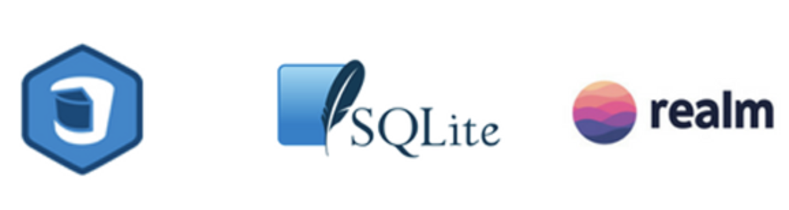

<!-- Run this slideshow via the following command: -->
<!-- reveal-md README.md -w -->

<!-- .slide: class="header" -->

# Intro to Persistence Technologies

## [Slides](https://make-school-courses.github.io/MOB-2.1-Local-Persistence-in-iOS/Slides/Lesson1/README.html ':ignore')

<!-- > -->

## Agenda

- Welcome
- Intro to course
- Objectives
- Activity
- Persistence methods

<!--

## Zen counting 🔢

**Goal:** Count to 10

**Rules:**
- Everyone umute their mic
- Only one person can speak at a time
- The same person can’t say two consecutive numbers

-->

<!-- > -->

## MOB 2.1

- 🤓 Course Description
- 💻 Course Delivery
- 🧠 Course Learning Outcomes
- 🗓 Schedule
- 📓 Assignments & Gradescope
- 💯 Evaluation

<!-- > -->

## Why you should know this

Most iOS applications have a way of persisting data.

Whether an app needs to store lightweight data such as user preferences or larger data that needs to be stored in a relational database, knowing different options of persistence is useful to decide what method to use.

Choosing the ideal method depending on your data will help you make the best use of the resources available on the device.

<!-- > -->

## Learning Objectives

- Identify the main tools to persist data in iOS.
- Compare and contrast – **at a high level** – every method of persistence.
- List some advanced persistence technologies for iOS.

<!-- > -->

## Intro

Check out [these notes](https://maggieappleton.com/databases) on databases.

Take 5 min to read it and think about:

- When have you used persistence so far in your projects at MS?
- Can you identify the database type that you used?

<!-- > -->

## What is persistence?

<!-- > -->

## What is data persistence?

In the context of storing data in mobiles phones, this means that the data **must survive** 💪🏼 after exiting our application.

For a data store to be considered persistent, it must write to *non-volatile storage*.

*NVM is a type of memory that has the capability to hold saved data even if the power is turned off.*

<!-- > -->

<!-- v -->

The problem occurs when the app terminates and our data is not stored locally. The terminating of the app can occur in the following scene:

- The operating system is trying to reclaim the resources because the user is trying to use various apps and the memory space just runs out.
- If the user force quit the app for any reasons or by mistake.
- Installing updates can really end up terminating your app.
- If the operating system is updated.

[Source](https://www.technotification.com/2018/08/data-persistence-ios-development.html)

<!-- > -->

## It all depends...

How we store data in iOS devices depends, among other criteria, on:
- The size/amount of the data.
- The type of data.
- The level of sensitivity of the data.
- How often we need to consult the data.

This lesson is intended to portray an overview of each persistence method. And upcoming classes will dive deeper on each one.

<!-- > -->

## In Class Activity I

Exploring all the options.

Instructions [here](https://github.com/Make-School-Courses/MOB-2.1-Local-Persistence-in-iOS/blob/master/Lessons/Lesson1/assignments/activity.md)

<!-- > -->

## Advanced Persistence Technologies

<!-- > -->

### Core Data

"Core Data is a framework that you use to manage the model layer objects in your application. It provides generalized and automated solutions to common tasks associated with object life cycle and object graph management, including persistence."

This is a powerful tool that has a lot of built in features.

Getting comfortable using Core data takes time and a lot of errors. 😅

<!-- > -->

### Realm

[Realm](https://realm.io/) is a good alternative for Core Data.

"Realm is a mobile database that runs directly inside phones, tablets or wearables."

Its purpose is to make managing data faster and simpler.

<!-- > -->

From the official [Github site](https://github.com/realm/realm-cocoa):

- **Mobile-first**: First database built from the ground up to run directly inside phones, tablets and wearables.
- **Simple**: Data exposed as objects and queryable by code. Most of our users pick it up intuitively, getting simple apps up & running in minutes.
- **Modern**: Supports relationships, generics and Swift.
- **Fast**: Faster than even raw SQLite on common operations, while maintaining an extremely rich feature set.

<!-- > -->

### SQLite

[SQLite](https://www.sqlite.org/index.html) is a relational database that can be used by iOS apps. It is contained in a C-library embedded to the app.

- Lightweight
- Works as part of the app, no extra services needed
- Fast & reliable
- SQL knowledge can be used

<!-- > -->

## CloudKit

**[CloudKit](https://developer.apple.com/icloud/cloudkit/)** ☁️

<!-- > -->

## Additional resources

[Realm](https://github.com/realm/realm-cocoa) 
[What is CoreData](https://developer.apple.com/library/archive/documentation/Cocoa/Conceptual/CoreData/index.html) 
[SQLite](https://www.simplifiedios.net/swift-sqlite-tutorial)
[CloudKit](https://developer.apple.com/icloud/cloudkit/)
