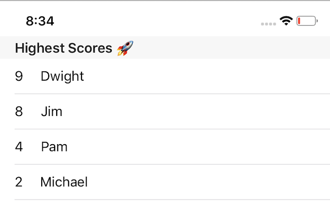

# Plist table

## Step 1 - Checkout starter files

Download the [starter project](https://github.com/Make-School-Labs/plistDemo-starter/tree/main).

## Step 2 - Populate

The goal for your plist is to have these or other example items:

You can add them manually.

## Step 3 - Display

Using the methods to handle plists or your own implementation if you want, display the items in the Scores dictionary in a `UITableView`. It should look something like this:

## Step 4 - Add

Add two more entries to the Scores array in code.

## Step 5 - Show

- When you are done, share a screenshot of you tableview on the slack channel for the class.
- Also submit your project to Gradescope.
