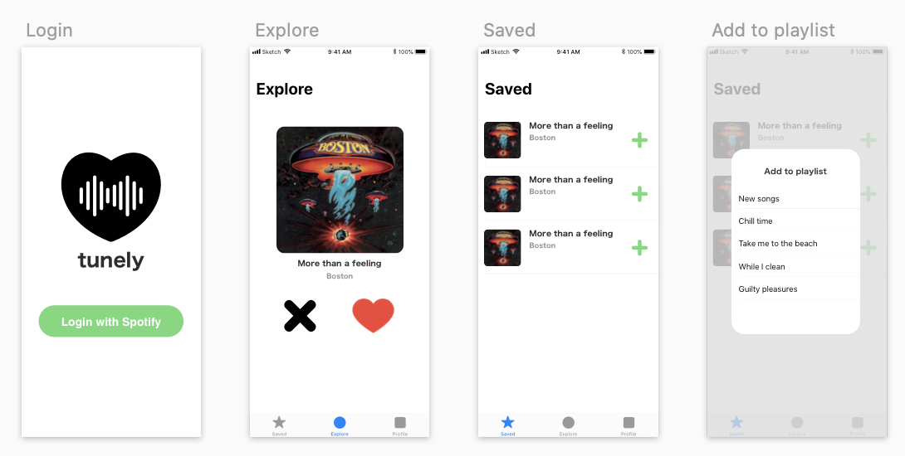

# Proposal Example

### Tunely - discover new favorite music

App that let's users explore music and save songs they like. Later they can add these songs to any of their playlists in their Spotify profile.

## User Stories

- User can login using their Spotify account
- User can listen to a preview of the songs they get
- User can discard a song to get the next one
- User can save a song they like
- User can see list of saved songs
- User can add any song to a playlist in their Spotify profile
- User can see their profile in the app
  - Stats
  - Settings
  - Contact

## Design

You can easily do a wireframe like this one using Sketch.

## Stretch challenges

- Do a swipe left/right to dismiss or save song.
- Play a preview of songs in the saved list.
- Create a new playlist before adding a song.
- Share songs

## Calendar

- Week 1
- Week 2
- Week 3

<!--
## Calendar

Wed, Aug 28
- Project assigned

Tue, Sep 3
- Proposal delivered  

Wed, Sep 4
- Proposal approved
- Github repo link added to tracker

Wed, Sep 11
- Shell of the app done
- Integrate [Spotify SDK for iOS](https://developer.spotify.com/documentation/ios/#requirements)
- User can login with Spotify

Wed, Sep 23
- User can discard a song to get the next one
- User can save a song they like
- User can see list of saved songs
- User can add any song to a playlist in their Spotify profile

Wed, Oct 2
- User can see their profile in the app
- Refactor

Tue, Oct 8
- Turn in final projects

Wed, Oct 9   
- Project presentation

-->
