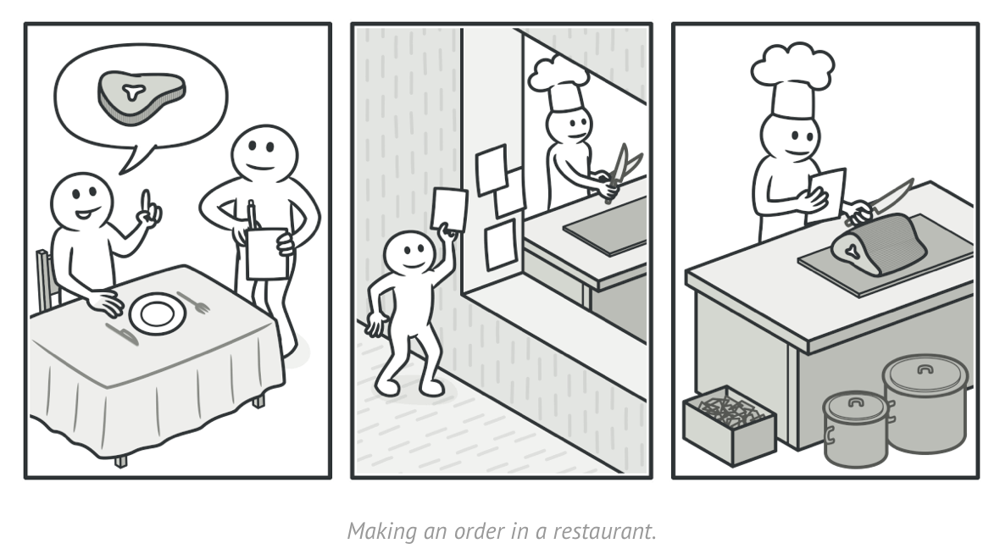
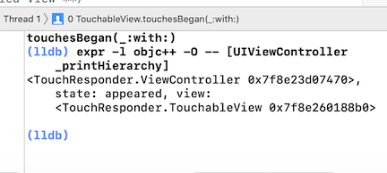

<!-- Run this slideshow via the following command: -->
<!-- reveal-md README.md -w -->


<!-- .slide: class="header" -->

# Behavioral Patterns Pt.1

## [Slides](https://make-school-courses.github.io/MOB-2.4-Advanced-Architectural-Patterns-in-iOS/Slides/03-Behavioral-PatternsPt.1/README.html ':ignore')

<!-- > -->

<!-- INSTRUCTOR:
1) For the quiz in the Initial Exercise:
- the URL is https://docs.google.com/document/d/1cwT3b-DUSuB1AwO2bqU-BWuDepK8pANbj5I4R1UOrqA/edit
2) For Activity 1:
- one possible solution is hidden in this activity's markdown
3) for Activity 2:
- the Completed solution for the RemoteControl class is hidden in its markdown
-->


## Learning Objectives

By the end of this lesson, you should be able to...

1. Describe:
    - the **Chain-of-Responsibility** and **Command** patterns
    - the software problem each is intended to solve
    - potential use cases for each (when to use them)
2. Assess:
    - the suitability of a given design pattern to solve a given problem
    - the trade offs (pros/cons) inherent in each
3. Implement basic examples of both patterns explored in this class

<!-- > -->

## Initial Exercise

### Part 1 - Individually

- A Quiz on last class content & after class section

<!-- Quiz location:
https://docs.google.com/document/d/1cwT3b-DUSuB1AwO2bqU-BWuDepK8pANbj5I4R1UOrqA/edit
-->

<!-- > -->

## Behavioral Patterns

In software engineering, **Behavioral** design patterns are design patterns that identify common communication patterns between objects.

By doing so, these patterns increase flexibility in carrying out such communications.

<!-- > -->


Though there are many more to explore, we will focus on these two key Behavioral patterns in this lesson:

- **Chain-of-Responsibility (CoR)**
- **Command**

<!-- > -->

### Chain-of-Responsibility


*[refactoring guru](https://refactoring.guru/design-patterns/chain-of-responsibility)*

<!-- > -->

The __*Chain-of-Responsibility*__ pattern is a behavioral design pattern that allows an event to be processed by one of many handlers.

It consists of a source of command objects and a series of processing objects.

Each processing object contains logic that defines the types of command objects that it can handle; the rest are passed to the next processing object in the chain.

__*Source:*__ *wikipedia.org*

<!-- > -->


*[refactoring guru](https://refactoring.guru/design-patterns/chain-of-responsibility)*

<!-- > -->

### Problems Addressed

There are several objects that can handle a request but only one of them should be used.

<!-- > -->

### How to Implement

You define a chain of **receiver** objects having the responsibility, depending on run-time conditions, to either **handle a request** or **forward it to the next receiver** on the chain (if any).

<!-- > -->

This enables sending a request to a __*chain*__ of receivers *without* having to know which one handles the request.

The request gets passed along the chain until a receiver handles the request. The __*sender*__ of a request is __*no longer coupled*__ to a particular receiver.

<!-- > -->

### Example of CoR

[Link to Example](https://github.com/Make-School-Courses/MOB-2.4-Advanced-Architectural-Patterns-in-iOS/blob/master/Lessons/03-Behavioral-PatternsPt.1/assignments/chain-example.md)

<!-- > -->

### Key Example Use Case

The Cocoa and Cocoa Touch frameworks actively use the chain-of-responsibility pattern for handling events.

Objects that participate in the chain are called __*responder objects,*__ inheriting from the `UIResponder` (iOS) class.

<!-- > -->

__*All view objects*__ (UIView), view controller objects (UIViewController), window objects (UIWindow), and the application object (UIApplication) __*are responder objects*__

Typically, when a view receives an event it can’t handle, it dispatches it to its superview until it reaches the view controller or window object.

If the window can’t handle the event, the event is __*dispatched*__ to the __*application object,*__ which is __*the last object in the chain.*__

<!-- > -->


__*Source:*__ *Apple, Inc.*

<!-- > -->

### Question: When should you use it?

<!--
- Use this pattern whenever you have a group of related objects that handle similar events but vary based on event type, attributes, user choices/input, or anything else related to the event.
-->

<!-- > -->

## Chain of responsibility - Activity

**25 min** Follow [this activity](https://github.com/Make-School-Courses/MOB-2.4-Advanced-Architectural-Patterns-in-iOS/blob/master/Lessons/03-Behavioral-PatternsPt.1/assignments/chain2.md) in groups of 2 or 3.

**10 min** Walkthrough solution

<!-- > -->

## Command



*[refactoring guru](https://refactoring.guru/design-patterns/command)*

<!-- > -->

**Command** is a design pattern in which an object is used to encapsulate all information needed to perform an action or trigger an event at a later time.

This information includes the method name, the object that owns the method and values for the method parameters

<!-- > -->

It turns a request/action into a stand-alone object that contains all information about the request.

This transformation lets you parameterize methods with different requests, delay or queue a request’s execution, and support undoable operations.

<!-- > -->

It involves **three component types**:

 - The **invoker** stores and executes commands.

 - The **command** encapsulates the action as an object.

 - The **receiver** is the object acted upon by the command.

<!-- > -->

### Problems Addressed

It should be possible to configure an object (that invokes a request) with a request.

Implementing (hard-wiring) a request directly into a class is inflexible because it couples the class to a particular request at compile-time, which makes it impossible to specify a request at run-time.

<!-- > -->

### Benefits

- **Single Responsibility Principle**.
- **Open/Closed Principle**. (Introduce new commands into the app without breaking existing code)
- You can implement **undo/redo**.
- You can implement **deferred execution** of operations.
- You can **assemble** a set of simple commands into a complex one.

<!-- > -->

### When to use it?

- When you want to parametrize objects with operations.
- When you want to queue operations, schedule their execution, or execute them remotely.
- When you want to implement reversible operations.

<!-- > -->

The most well-known use of this pattern:

In some strategy games, the ability to rollback moves the user did not like is an essential user experience feature. The command pattern simplifies the implementation of `Undo` and `Redo` user actions.  

<!-- > -->

## Command Pattern - Activity

Follow [this activity](https://github.com/Make-School-Courses/MOB-2.4-Advanced-Architectural-Patterns-in-iOS/blob/master/Lessons/03-Behavioral-PatternsPt.1/assignments/command.md)

<!-- > -->

## After Class

1. The other Behavioral Patterns in the links below
2. Research the following concepts:
- The Composite Pattern
- `UndoManager` (in Foundation framework)
- `UIEvent` Objects
- `Touch` Objects
- All Touch Events (e.g., `touchesEnded(_:_:)`)
- the `hitTest(_:With:)` function

<!-- > -->

*Stretch Challenge* Using Apple's **Media Player** framework, implement a simple (i.e., basic UI only) iPhone app that will play, pause, and restart (skip to beginning) the following sample file (or any video/audio file of your choice):

https://devimages-cdn.apple.com/samplecode/avfoundationMedia/AVFoundationQueuePlayer_HLS2/master.m3u8

<!-- > -->

[Archived activity CoR](https://github.com/Make-School-Courses/MOB-2.4-Advanced-Architectural-Patterns-in-iOS/blob/master/Lessons/03-Behavioral-PatternsPt.1/assignments/chain2.md)
(But you can try it out)

<!-- > -->

## Additional Resources

1. [Behavioral Patterns - an article](https://sourcemaking.com/design_patterns/behavioral_patterns)
2. [Behavioral pattern - wikipedia](https://en.wikipedia.org/wiki/Behavioral_pattern)
3. [Chain-of-Responsibility - wikipedia](https://en.wikipedia.org/wiki/Chain-of-responsibility_pattern)
4. [Command pattern - wikipedia](https://en.wikipedia.org/wiki/Command_pattern)
5. [Intermediate Design Patterns in Swift - Ray Wenderlich](https://www.raywenderlich.com/2102-intermediate-design-patterns-in-swift)

<!-- > -->

6. [Using Responders and the Responder Chain to Handle Events - from Apple](https://developer.apple.com/documentation/uikit/touches_presses_and_gestures/using_responders_and_the_responder_chain_to_handle_events)
7. [Design Patterns in Swift: Chain of Responsibility Pattern - an article](https://medium.com/design-patterns-in-swift/design-patterns-in-swift-chain-of-responsibility-pattern-f575c85a43c)
8. [Refactoring guru - Chain](https://refactoring.guru/design-patterns/chain-of-responsibility/swift/example#example-0)
9. [Refactoring guru - Command](https://refactoring.guru/design-patterns/command)
10. [Gang Of Four Cheat Sheet](http://www.blackwasp.co.uk/GangOfFour.aspx)


<!-- > -->

__*For The More Curious*__

1. Using the Debug View Hierarchy tool on this simple example reveals little of the powerful utility this tool can have in analyzing your code.
- TODO: To understand more of how this tool can be used, experiment with it on some of your actual projects that have more complex UI architectures.

<!-- > -->

2. Apple has long provided ways to analyze view hierarchies. In addition to the Debug View Hierarchy tool, there have been several command-line debugging phrases which can be used to analyze the view hierarchy of your app during runtime.

<!-- > -->

One example: You can return information about the state of your current view hierarchy by setting a breakpoint and executing the following command in your debug pane:

<!-- > -->

```Swift
expr -l objc++ -O -- [UIViewController _printHierarchy]
```

The output from this command can provide information useful in debugging your views:


