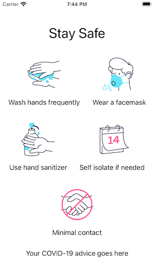

<!-- .slide: data-background="./Images/header.svg" data-background-repeat="none" data-background-size="40% 40%" data-background-position="center 10%" class="header" -->
# Intro to Course and Tools

<!-- > -->

## Learning Objectives

1. Identify the goals of the course
1. Explain how SwiftUI creates layouts
1. Use SwiftUI to create a simple layout
1. Implement @State & @Binding
1. Handle navigation and passing data between views

<!-- > -->

## Mobile 2.9

**What is it like to get your first internship or your first full time job?**

*Sharing experiences*

<!-- > -->

This course focuses on learning and practicing the process of contributing to an engineering team.

You will be onboarded to an existing project. This means:

- Getting familiar with the code base
- Understanding the workflows for reporting progress, requesting/approving reviews
- Following git specific guidelines
- If there’s an unfamiliar framework or tool, learning first about them.

<!-- > -->

## Course Learning outcomes

1. Follow a given development workflow within a team (git, code reviews, pull requests)
1. Develop new features in an existing project
1. Strengthen communication skills when executing technical stand-ups
1. Work with an automated Kanban board using GitHub Projects

<!-- > -->

## Schedule

[Course Schedule](https://make-school-courses.github.io/MOB-2.9-Technical-Seminar-MOB/#/?id=schedule)

<!-- > -->

## Project selection

[Project Description](/Assignments/project.md)

<!-- > -->

## Evaluation

[Evaluation Criteria](https://make-school-courses.github.io/MOB-2.9-Technical-Seminar-MOB/#/?id=evaluation)

<!-- > -->

## Tools

- GitHub Boards
- PetFinder API
- Swift
- **SwiftUI**

<!-- > -->

## SwiftUI


SwiftUI is an innovative way to build user interfaces across all Apple platforms using Swift.  

<!-- > -->

## Declarative syntax

*Declarative programming is a non-imperative style of programming in which programs describe their desired results without explicitly listing commands or steps that must be performed.*

Telling SwiftUI **what** we want the UI to look like and work, then it figures out **how** to make that happen.  

- Easy to read
- Natural to write

<!-- > -->

## Core Concepts

- 🎨 Mastering UI
- 📱 Handling app state and visual updates
- ⛵️ Navigation & passing data

<!-- > -->

## Stacks 📚

[designcode.io explanation for stacks](https://designcode.io/swiftui-handbook-hstack-vstack)

<!-- > -->

## Live demo

1. Finding the preview
1. Template contents
1. Hello world
1. Hello world in an HStack
1. Hello world in a VStack
1. Grid with text
1. Add image
1. Simulator

<!--
A view is a rectangular area on the screen where we can display content and interact with it.

In the template contents we have `body` that behaves like a view.

1. No change needed
2. HStack{
    Text("Hello World")
    Text("Hello World")
    Text("Hello World")
   }
3. VStack(spacing:10){
    Text("Hello World")
    Text("Hello World")
    Text("Hello World")
   }
4. VStack(spacing:30){
    HStack(spacing:30){
      Text("👩🏻‍💻")
      Text("👩🏾‍💻")
      Text("👨🏽‍💻")
      Text("👨🏻‍💻")
    }
    HStack(spacing:30){
      Text("👩🏻‍💻")
      Text("👩🏾‍💻")
      Text("👨🏽‍💻")
      Text("👨🏻‍💻")
    }
   }
 5. Image("01")
      .resizable()
      .scaledToFit()
      .frame(width: 100, height: 100)
-->

<!-- > -->

## Warmup (15 min)

- Replicate this layout and write your own text at the bottom.
- Find the thread in our Slack channel and post a screenshot when you are done.

<!-- > -->



<!-- > -->

## UI fundamentals

- Views are **structs** in SwiftUI. Lightweight **value types**.
- Views are **classes** in UIKit. **Reference types**.

Because of this principle, we can create, destroy and recreate views without impacting performance with SwiftUI.

<aside class="notes">
It's also due to this principle that views can't hold data as it changes. Whenever they get recreated they show their default state. To solve this se use @State variables
</aside>

<!-- > -->

## @State variables

`@State` is a property wrapper that tells Swift to handle the storage of a value.

When a `@State` property changes, SwiftUI automatically knows that it should reload the views to reflect the new state.

Any data marked with @State will persist and even if the UI is destroyed and recreated, the user will always see the most up to date values of these variables.

[Link to Apple Docs](https://developer.apple.com/documentation/swiftui/state)

<!-- > -->

```swift
struct ContentView: View {
    @State private var isAuthenticated = false
    var body: some View {
        Button(action: {
            isAuthenticated.toggle()
        }, label: {
            isAuthenticated ? Text("Logout") : Text("Login")
        })
    }
}
```

<!-- > -->

## Update your example

Include a @State variable and change it's value with the tap of a Button.

<!-- > -->

What if the user updates the value of the property? How can we tell Swift to make the updates in the view?

Bind the property to the view and bind the view back to the property.

**Two-way binding**

Data flows in both ways to stay in sync.

<!-- > -->

```swift
struct ContentView: View {
    @State private var isAuthenticated = false
    @State private var username = ""
    var body: some View {
        VStack{
            TextField("Enter your username", text: $username)
                .multilineTextAlignment(.center)
            Text("Welcome \(username)")
            Button(action: {
                .isAuthenticated.toggle()
            }, label: {
                isAuthenticated ? Text("Logout") : Text("Login")
            })
        }
    }
}
```

<!-- > -->

## The use of $

When you see a property being used:

```swift
Text("You entered:\(password)")
```

**We read the value.**

<!-- > -->

When you see a property with `$`:

```swift
TextField("Enter your password", text: $password)
```

Means the value is being accessed through the property wrapper. Swift handles the two-way binding. **We read and update the value.**

<!-- > -->

## Update your example

Include a @Binding variable and change it's value with a TextField.

<!-- > -->

## Navigation View

We navigate between views using a NavigationView and a NavigationLink.

```swift
var body: some View {
    NavigationView {
        VStack {
            NavigationLink(destination: HomeView()) {
              Text("Show Other view")
            }
        }
        .navigationBarTitle("Title goes here")
    }
}
```

<!-- v -->

Variation 1 - passing data

```swift
var body: some View {
    NavigationView {
        VStack {
            NavigationLink(destination: HomeView(user: username)) {
              Text("Show Other view")
            }
        }
        .navigationBarTitle("Title goes here"")
    }
}
```

<!-- v -->

Variation 2 - triggered programmatically

```swift
var body: some View {
    NavigationView {
        VStack {
            NavigationLink(destination: HomeView(user: username), isActive: $isAuthenticated) {
              EmptyView()
            }
        }
        .navigationBarTitle("Title goes here"")
    }
}
```

<!-- > -->

## Update your example

Include a Navigation Bar with a title and go to a different view when tapping on the Login Button.

<!-- > -->

## Lab Introduction

Using SwiftUI to build layouts is powerful. We've done the basics of creating an app in a single class. (Mainly because you already know Swift and the names of UI elements 😎)

If we put together what we know about **MVVM**, **SwiftUI** and even **Combine**, you'll notice how different it is to build apps with this specific stack.

<!-- v -->

The course project will use these technologies, so it's a good if we practice first.

Start [this tutorial](https://www.raywenderlich.com/4161005-mvvm-with-combine-tutorial-for-ios), we'll finish it next class and discuss the architecture used.

<!-- > -->

## Additional practice

Replicating Apple Calculator's UI

[Instructions here](https://github.com/Make-School-Courses/MOB-1.1-Introduction-to-Swift/blob/master/Lessons/05-SwiftUI1/assignments/calculator.md)

<!-- > -->

## Additional Resources

- [What is SwiftUI](https://developer.apple.com/xcode/swiftui/)
- [SwiftUI tutorials](https://developer.apple.com/tutorials/swiftui/tutorials)
- [100 days of SwiftUI](https://www.hackingwithswift.com/100/swiftui)
- [SwiftUI by examples](https://www.hackingwithswift.com/quick-start/swiftui)
- [State - Video](https://www.youtube.com/watch?v=48JYBb5yJ0s)
- [Navigation with SwiftUI](https://www.hackingwithswift.com/articles/216/complete-guide-to-navigationview-in-swiftui)
- [Warmup Images](https://www.sketchappsources.com/free-source/4389-coronavirus-icons-sketch-freebie-resource.html)
