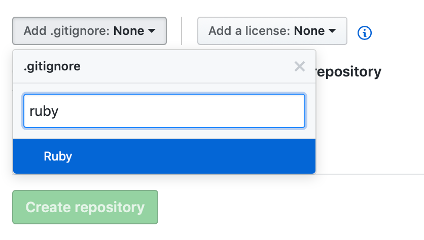

# Day 5 - Models, Migrations, and Validations (Oh My!)

| Time | Activity                              |
| ---- | ------------------------------------- |
| 0:00 | Objectives                            |
| 0:05 | Initial Exercise                      |
| 0:15 | Overview/TT I                         |
| 0:30 | In Class Activity I                   |
| 1:05 | BREAK                                 |
| 1:15 | TT II                                 |
| 1:30 | In Class Activity II                  |
| 1:55 | END                                   |

## Learning Objectives/Competencies (5 Minutes)

1. Identify and describe the role **models play in Ruby on Rails**.
1. Gain experience **generating, distributing, and applying migrations** received from other developers.
1. Understand **ActiveRecord** via the implementation of **models, migrations, and validations** in Ruby on Rails.

## Initial Exercise (10 Minutes)

* Continue working on your **Ruby Koans**. Please **update your progress each class day** in the [Course Tracker](https://make.sc/trackbew1.3).

* Additionally, please confirm that the GitHub repo link for _both tutorial implementations_ is present in our [Course Tracker](https://make.sc/trackbew1.3).

    Here's a handy **code snippet** you can **paste directly into the tracker**. _Be sure to update your repo link_:

    ```excel
    =HYPERLINK("https://github.com/droxey/rails-tutorial-walkthrough", "RoR Guide Repo")
    ```

## Overview/TT I (15 Minutes)

Present the following [slideshow](https://rubygarage.github.io/slides/models#/) on Ruby models and migrations to the class. Stop on slide 55.

## In Class Activity I (35 Minutes)

### Create a New App (10 Minutes)

1. In your browser, navigate to [github.com/new](https://github.com/new) and create a **new repository for today's challenges**.

    **PROTIP**: _Select Ruby when presented with options for `.gitignore`!_

    


1. In your terminal, **navigate to your development directory**, **clone your new repository**, and finally, **create a new Rails application for today's challenges**:

    ```bash
    $ git clone git@github.com:droxey/ruby-day-5-challenges.git
    $ cd ruby-day-5-challenges
    $ rails new learning_models
    ```

### Generating Models (15 Minutes)

> **Active Record is the _M_ in _MVC_**. It represents the model - which is the **layer of the system responsible for representing business data and logic**. It is an implementation of the Active Record pattern which itself is a description of an **Object Relational Mapping (ORM)** system.

> Active Record gives us several mechanisms, the **most important being the ability to**:

> * Represent **models _and_ their data**
> * Represent **associations between these models**
> * Represent **inheritance hierarchies** through **related models**
> * **Validate models _before_ they get persisted** to the database
> * **Perform database operations** in an **_object-oriented fashion_**

1. **Discuss with a partner** what you'd like to represent using a Ruby model, and create it!

    Use the following command and output for inspiration:

    ```bash
    $ rails generate model User first_name:string email:string password:string
    invoke  active_record
    create    db/migrate/20160410131731_create_users.rb
    create    app/models/user.rb
    invoke    test_unit
    create      test/models/user_test.rb
    create      test/fixtures/users.yml
    ```

1. **Individually, create your model**, then add, commit, and push it to GitHub.

### Adding Migrations (5 Minutes)

> Migrations are a **feature of Active Record** that allows you to **evolve your database schema over time**. Rather than write schema modifications in pure SQL, **migrations allow you to use an easy Ruby DSL** ([Domain Specific Language](https://en.wikipedia.org/wiki/Domain-specific_language)) **to describe changes to your tables**.

1. Next, **add a migration** to your model. To accomplish this, **add a new field to your model**, then run the `rails migrate` command.

    Use the following code snippet to guide you, **replacing `AddLastNameToUsers` with your own name** for the migration:

    ```bash
    $ rails g migration AddLastNameToUsers last_name:string:index
    invoke  active_record
    create    db/migrate/20160410133524_add_last_name_to_users.rb
    ```

1. **Add, commit, and push your migration** to GitHub.

### Fork & Apply Migrations (5 Minutes)

1. **Fork a classmate's repo**, then clone the fork to your local machine:

1. Navigate to the cloned fork's directory locally.

1. Run the following command to apply migrations:

    ```bash
    rails db:migrate
    ```

1. Once you've **successfully run `rails db:migrate`, move on to the next section** --- _integrating validation into your classmate's project!_


## BREAK (10 Minutes)

## TT II (15 Minutes)

[Continue the slideshow](https://rubygarage.github.io/slides/models#/22) and present the content on validation to the class to prepare for the second activity.

## In Class Activity II (25 Minutes)

### Integrate Server-Side Validation (15 Minutes)

> When Do Validations Happen?
> * create
> * save
> * update

1. Finally, using the [following slides](https://rubygarage.github.io/slides/models#/22) as a guide, **add sensible validation to your classmate's model**.

    **PROTIP**: _Are you unsure what purpose the model serves? Discuss and collaborate!_

1. Add, commit, and push your code to your fork.

1. **Submit a pull request** to the original repository.

### Code Review (10 Minutes)

1. **Once you've received a PR from a classmate, review the code and modifications!**

1. If the validations are sensible, **approve the pull request**. If you don't agree with the modifications, **leave a comment explaining why**.

1. **Post the PR to our Slack channel**, `#bew1-3`, as the final deliverable for the day!

## After Class

* Continue working on the [Ruby on Rails Guides Tutorial](https://guides.rubyonrails.org/getting_started.html).

* If complete, please begin working on the second tutorial: [RailsTutorial.org Twitter Clone](https://www.railstutorial.org/book)
