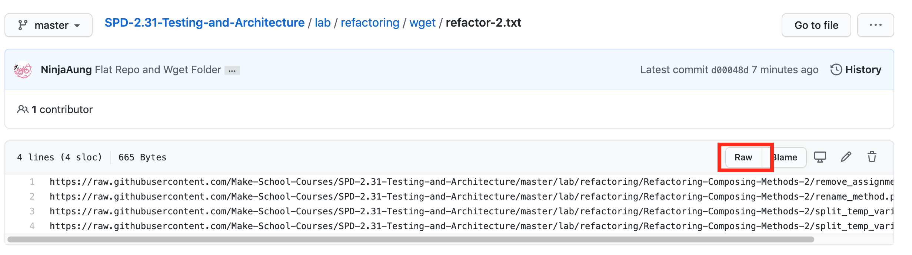

# Wget

Here are all the location of all `.txt` file for excercises or other content for students

## Creating

If you want to create a new range of files for students to download specific to this directory follow this format:

```txt
https://raw.githubusercontent.com/Make-School-Courses/SPD-2.31-Testing-and-Architecture/master/lab/{file}
```

And we will append the txt file with all desire files

## Usage

Students or Instructor can easily pull files down by viewing the `.txt` in raw:



After we will copy the link and set it up as:

```bash
wget -i https://raw.githubusercontent.com/Make-School-Courses/SPD-2.31-Testing-and-Architecture/master/lab/wget/refactor-2.txt
```

Then students should apply the above bash to download all files iterativly
