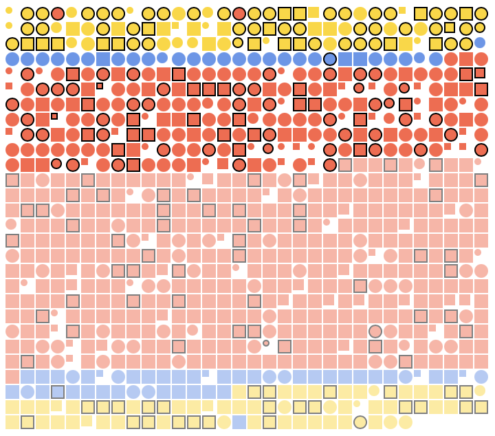

# FEW-2-5-Titanic-Visualization

The starter code here creates a simple visualization of the Titanic dataset. 

## Getting started

You'll need to run this with a local server. You can use Live Server with VS Code. 

The goal of this assignment is display the Titanic data. In the previous assignment you examined the data and processed it for useful information. Here the goal is make that information visible. 

## Learning Objectives

- Create HTML element with JS based on data
- Style HTML element with JS based on data
- Organized data to tell a story and/or reveal meaning
- Use Array.sort() to sort data
- Use Array.filter() to filter data

## Submission

Submit your work on [GradeScope](https://www.gradescope.com/courses/218919)

## What to make? 

Your project should be a web pages that displays the information graphically. Get creative, don't worry about what it looks like. 

Your page should try and answer as many of these questions as possible. You can get creative. The images can be abstract. Have fun with the numbers!

Try and display as much of the data from the Titanic dataset listed below as you can. Think about how you might display these things using CSS.

- How many passengers? 
- How many survived? 
- How many died? 
- How many men? 
- Hoe many wonmen?
- Where did each passenger embark? 
- what class did each passenger travel? 
- How much did each passenger pay? 
- Did more men or women survive?
- Did passenger class affect survival?

Stretch challenges! Try these challenges if you've completed the challenges above. 

- What was the most common fare paid? 
- What were the ages of the passengers? 
- How many passengers embarked at each of the three stops? 

Use these CSS properties to express the ideas above: 

- background color
- opacity
- width, height
- border radius
- border width, color, and style

Use sort to organize the data. You can sort on: 

- Age
- Fare
- pclass
- gender/sex
- embarked

Use filter to break up the data and show a subset of the data. You can filter on: 

- gender/sex
- pclass
- fare
- age

## What might it look like? 

Here are a few examples. You can try and recreate these, or come up with your own variations.

**Example 1:** 

- All passengers 
- Gender as color - red or blue
- Age as size - Passengers below 18 years are smaller
- Survived - Caualties are show with opacity 50%

**Example 2:** 

- All passengers 
- Gender as shape - female passengers have `borderRadius` 50%
- Age as size - Passengers below 18 years are smaller
- Survived - Caualties are show with opacity 50%
- Embarked as background color - S = Red, Q = Blue, C = Gold

**Example 3:** 

- All passengers 
- Age as size - Passengers below 18 years are smaller
- Survived - Caualties are show with opacity 50%
- Embarked as background color - S = Red, Q = Blue, C = Gold
- pclass - All first class passengers have a border

**Example 4:** 

- All passengers sorted on:
  - emabrked
  - survived
- Gender as shape - female passengers borderRadius 50%
- Age as size -
  - Less than 10 years 5px
  - Less than 18 Years 8px
  - 18 years and over 10px
- Survived - Caualties are show with opacity 50%
- Embarked as background color - S = Red, Q = Blue, C = Gold
- pclass - All first class passengers have a border

**Example 5:** 

Here I created two separate groups by filtering the data on gender. Men are on the left and women are on the right. 

Think about ways you can express different ideas and tell a story about what happened by displaying subsets or groups of data. 

**Example 6:** 

Here are three separate groups where passengers have been filtered on their port of embarkation. Southampton on the left, Cherbourg in the center, and Queenstown on the right. 

**Example 6:** 

This example shows all of the examples above. The first row shows passengers by embarkation. The second row shows passengers by gender. Men in the first column, women in the second column and all passengers in the last. 

## What will you turn in?

Post a link to the GitHub repo containing your work to [GradeScope](https://www.gradescope.com/courses/218919). 

## Evaluating your work

| Aspect | Does not meet | Meets | Exceeds |
|:-------|:--------------|:------|:--------|
| **Completion** | Displays less than 7 of the data points listed above | Displays 7 or more of the dat points | Displays all 10 of the data points |
| **Code style** | Does not follow coding best practice, the style inconsistent | Code is consistently styled, variables are well named and self documenting, follows coding best practice as confirmed by the linter | Code reviewed by peer |

### Learing Objectives 

| Aspect | Does not meet | Meets | Exceeds |
|:-------|:--------------|:------|:--------|
| **Identify Values in Titanic Dataset** | Can't identify values in the Titanic dataset | Can identify values in the Titanic dataset | Feel confident you could identify values in any dataset |
| **Extracting Data** | Can't extract data and derive values from the Titanic dataset | Can extract relevant values from the Titanic Dataset | Could extract values from any dataset |
| **Deriving Values** | Can't derive a count, min, and max values from a dataset| Can get the min, max, and count from a dataset | Could derive range, average, and other values from data provided in the Titanic dataset |
| **Display Elements** | Can't generate and display HTML elements with JS| Can generate and display element with JS | Could create and style any element with JS |
