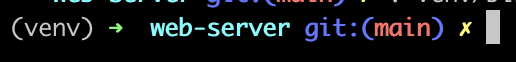
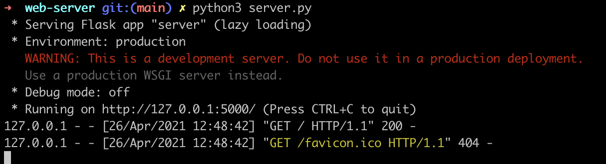

# Setting up a Flask Project

Flask framework is a simplistic and micro Python framework that is commonly used to build web servers. Follow this guide to setup the base application for Flask web server.

## Setup and Installation

Make sure to have an actively supported version (>=3.6) of Python 3 on your system.
To check if Python is installed on your system, open your terminal and type:
`python3 --version`

If you do have Python installed, you would get an output displaying the currently installed version of Python on your machine.

If you don't, no worries! Go through this guideline [here](https://github.com/Make-School-Labs/General-Project-Setup-Guide/tree/main/jupyter#install-with-anaconda) to install Python on your system.

### Setup a virtual environment with venv

* To setup a virtual environment:

  * In your terminal run the command `mkdir <your-project-directory>` to create a new project directory.
  * Navigate to your project directory `cd <your-project-directory>`.

    Python3 comes pre built with the `venv` module to create virtual environments. We create a virutal environment by running the command `python3 -m venv /path/to/new/virtual/environment`.

  * Run the command `python3 -m venv env`.
 A new vitrual environment will be created in a folder called `env`. The venv module will create a virtual python installation in the env folder.

* Activate the environment:

  * Run the command `source env/bin/activate` or `. env/bin/activate` in  your terminal to activate the virtual environment.

    **Note:** this works for `zsh` and `bash` terminals. If you use any other please see list below or visit [here](https://docs.python.org/3/library/venv.html) or see the table below on how to activate a virtual environment on your particular shell.

    | Shell    | Command |
    | ----------- | ----------- |
    | bash/zsh     | `$ source env/bin/activate`|
    |fish | `$ set VIRTUAL_ENV`|
    |csh/tcsh| `$ source env/bin/activate.csh`|
    |PowerShell Core | `$ env/bin/Activate.ps1`|
    |cmd.exe | `C:\> env\Scripts\activate.bat`|
    |PowerShell | `PS C:\> env\Scripts\Activate.ps1`|

    Once your environment is activated, your prompt will now have an `env` prefix that may look as follows:

    

    You can always deactivate the environment by typing `deactivate` in your terminal.

### Install Flask using pip

Pip is the package installer for `Python`. We can use `pip3` to install packages from the `Python` package Index - [PyPI](https://pypi.org/) and other indexes.

* Run `pip3 install Flask` to install flask so you can start using it in your project.

  You will get a prompt that looks like this on successful install:


## Building a Flask Server - Creating a Base Application

Now that you have the environment set up, let's start using Flask.  We will build a simple web server in a Python file.

In your project directory, open a new file and save it as `app.py` or something similar. **Make sure to not call it `flask.py` because this would conflict with Flask itself.**

We stick with `app.py` here.

* Include the following to the file:

```python
# import flask
from flask import Flask

# create an app instance
app = Flask(__name__)

# create a function - hello_world that returns an HTTP response - hello world
@app.route('/')
def hello_world():
    return 'Hello, World!'

# on running python3 app.py run the flask app
if __name__ == "__main__":
    app.run()
```

## Run the server

Run the server by running the `app.py` file.

In your terminal make sure you are in your project's directory and run the server with:

`python3 app.py`

You should get an output that looks like this:



Visit the URL shown on your terminal - <http://127.0.0.1:5000/> from your browser and you should see a 'Hello World!' text on display.

## Turn on debug mode

Notice that one of the items on your terminal output reads `Debug mode: off`. This is because the server runs in production mode by default. For development, we need the debug mode to be active.

To do this, we set `debug=True` in our `app.py` file.

* In your app file, replace the `app.run()` line to `app.run(debug=True)`
* Stop the running server(`Press CTRL+C`) and restart it again (`python3 app.py`)

You should see `Debug mode: on`. Now you can edit files, these changes will be detected and the server will be restarted automatically.


Well done! You have set up a simple flask web server.

## Python for VsCode

Virtual Studio Code (VsCode) is a powerful IDE that has very rich support for the `Python` language.

It has a extension that has features to make coding with Python a smoother experience. The extesnion has several helpful features like linting, debugging, refactoring etc.

The Python extension for VsCode is a nice to have tool. To install it:

* Open your VsCode IDE. Go the extensions pane (⇧⌘X) and search for `Python` in the list of extensions. The extension is maintained by Microsoft.


* Click on install and you would have it enabled. Check [here](https://code.visualstudio.com/docs/languages/python) for more about the features it offers.

## Project Layout - Packages and Blueprints

The set up above helps to get started on a simple flask web server. Most apps you would build with flask will grow to be larger than having just a single `app.py` file.

As your application grows, you need to set up a structure or layout that will help with easy maintenance and navigation. Flask doesn't enforce any project layout, however there are best practices. We will discuss structuring your flask project as a package.

In this method, you can define your app as a package and import it as same. The method will instruct us to break our code into separate files and folders based on the logic they implement.

The illustration below shows the basic layout:

```md
📦Root-folder
 ┣ 📂 your-app
 ┃ ┣ 📂 static
 ┃ ┣ 📂templates
 ┃ ┣ 📜__init__.py
 ┃ ┣ 📜config.py
 ┃ ┣ 📜forms.py
 ┃ ┣ 📜models.py
 ┃ ┗ 📜routes.py
 ┣ 📂 env
 ┣ 📂 tests
 ┃ ┗ 📜__init__.py
 ┣ 📜.env
 ┣ 📜__init__.py
 ┣ 📜README.md
 ┣ 📜app.py
 ┣ 📜.gitignore
 ┗ 📜requirements.txt
```

The structure above has three main top levels:

* `app`: Your flask application stays is contained in this package
* `env`: contains the Python virtual environment
* `tests`: Test files are contained in this package

There are also other files and folders. The table below shows a basic run down of these files and folders:

| File/Folder | Description |
| ----------- | ----------- |
| `/app/static` | This directory contains the public CSS, JavaScript, images and other files that you want to make public via your app. It is accessible from yourapp.com/static/ by default. |
| `/app/templates` | This folder contains file templates e.g. html templates |
| `/app/_init_.py` | This file contains code that tells Python that this folder should be treated as a package. It also contains code that creates the Flask instance |
| `/app/config.py` | This file contains the configuration variables that your app's environment defines or depends on |
| `/app/forms.py` | This is where you define the form classes for your application(if you use forms in your templates) |
| `/app/models.py` | This is where you define the models of your application. |
| `/app/routes.py` | This is where the routes for application is defined |
| `/test/_init_.py` | This file contains code that tells Python that this folder should be treated as a package|
| `.env` | This file is defines the environment variables that the `config.py` module uses. |
| `__init__.py` | This file contains code that tells Python that this folder should be treated as a package |
| `app.py` | This is the file that is run to start up a development server |
| `requirements.txt` | This file lists the package dependencies so that it is easy to regenerate an identical virtual environment on a another system |

Your project might require some additional files specific to its context. The files are folders shown here are the common ones you will find in most Flask applications.

### BluePrints

Blueprints are a great way to organise projects into distinct components. They come in handy when you application grows large and has a lot of related components.
Check this guide [here](https://flask.palletsprojects.com/en/2.0.x/blueprints/) on how to structure your projects with Blueprints.

## Other References

[Working with BluePrints](https://flask.palletsprojects.com/en/2.0.x/blueprints/)

[Large Applications as Packages](https://flask.palletsprojects.com/en/2.0.x/patterns/packages/)

[Official Flask Documentation for Project Layout](https://flask.palletsprojects.com/en/2.0.x/tutorial/layout/)

<https://flask.palletsprojects.com/en/1.1.x/>

<https://docs.python.org/3/library/venv.html>

<https://flask.palletsprojects.com/en/1.1.x/quickstart/>
