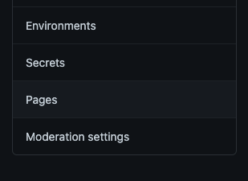
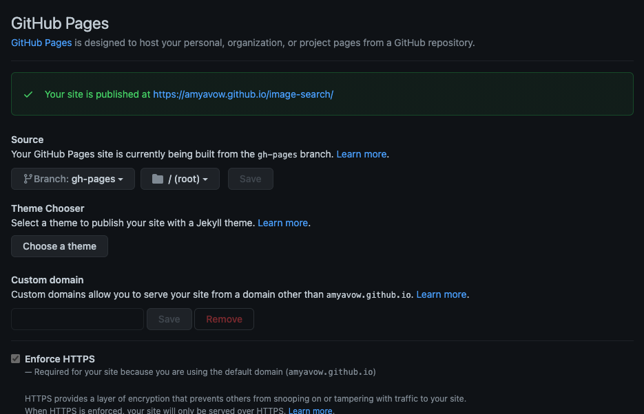

# Hosting Static Webpages on GitHub Pages

GitHub Pages is a static site hosting service. In this guide, we will walk through hosting a specific project hosted on GitHub. It is a simple process!!

## Getting Started

To host your site on GitHub Pages, you should have at least basic understanding of:

* Git and Git commands. Check out this [handy guide](https://www.atlassian.com/git/tutorials/atlassian-git-cheatsheet) for a refresher.
* GitHub. Check out this [guide](https://guides.github.com/activities/hello-world/)

## Enable GitHub Pages on a GitHub Repo

Before we get started know that you should have some static web content that you would like to host.
That content should also be hosted on a GitHub repository.

Once you have committed your content up in a GitHub repo, you will need to configure where in your repository GitHub should serve the content from.

We recommend you serve content from the root folder of the branch `gh-pages` branch:

* Create the `gh-pages` branch and  push it to your repository. On your terminal, make sure your have navigated to your project directory, run these commands:

```bash
git checkout -b gh-pages
git push -u origin gh-pages
```

* Go to your GitHub Repository, click on the settings tab right at the top of the page


* To the left of the page scroll down the menu to the `Pages` link and click on it



* The branch should be configured to `gh-pages` and the folder to `/(root)`. Like the screenshot below:



Take note of the site address/url your content was pubilshed at.

It will typically follow the format  - <https://{your-githubusername}.github.io/{name-of-your-repository}/>.

Navigate to the site URL published for you and viola! you have your content up and publicly visible.

## Deploying a React App to GitHub Pages

To deploy a React App to GitHub Pages, you need to add some more steps in addition to the ones above:

* On your terminal, navigate to your app's base directory:

    `cd <name-of-your-react-app>`

* Install `gh-pages` package and save it as it as a dev dependency:

    `npm install gh-pages --save-dev`

* Update your `package.json` with the URL you saved earlier and add it to the top of the file as the value for the `homepage` property. Like so:

    ```json
    {
        "homepage": "https://{your-githubusername}.github.io/{name-of-your-repository}/",
        "name": "my-react-app",
        
        <!-- //..... -->
    }
    ```

    **Note: Make sure you change the {your-githubusername} to your GitHub username and {name-of-your-repository} to the name of your repository.**

* Next, still in your `package.json` file, update your existing `scripts` to include the `predeploy` and `deploy` commands:

    ```json
    "scripts": {
        <!-- //... build, start, test etc. scripts go here -->
        "predeploy": "npm run build",
        "deploy": "gh-pages -d build"
        }

    ```

    Your final `package.json` file should look like:

    ```json
    {
    "homepage": "https://{your-githubusername}.github.io/{name-of-your-repository}/",
    "name": "my-react-app",
    "private": true,
    "dependencies": {
        "@testing-library/jest-dom": "^5.11.4",
        "@testing-library/react": "^11.1.0",
        "@testing-library/user-event": "^12.1.10",
        "axios": "^0.21.1",
        "react": "^17.0.1",
        "react-dom": "^17.0.1",
        "react-scripts": "4.0.2",
        "semantic-ui-css": "^2.4.1",
        "web-vitals": "^1.0.1"
    },
    "scripts": {
        "start": "react-scripts start",
        "build": "react-scripts build",
        "test": "react-scripts test",
        "eject": "react-scripts eject",
        "predeploy": "npm run build",
        "deploy": "gh-pages -d build"
    },
    "eslintConfig": {
        "extends": [
        "react-app",
        "react-app/jest"
        ]
    },
    "browserslist": {
        "production": [
        ">0.2%",
        "not dead",
        "not op_mini all"
        ],
        "development": [
        "last 1 chrome version",
        "last 1 firefox version",
        "last 1 safari version"
        ]
    },
    "devDependencies": {
        "gh-pages": "^3.1.0"
    }

        }
    ```

* Now deploy to GitHub Pages with the command in your terminal(make sure you are at the base directory of your app):

    `npm run deploy`

There you go!! You can visit your site URL to see your web page will be visible.

For more about deploying a React app and some common issues students face with the process, you can read through this [post](https://anjelicaa.medium.com/how-to-create-and-deploy-a-react-js-app-to-github-pages-215d8d2683a8).

## Deploying to GitHub Pages using GitHub Action

You can set up your site so that it is updated automatically every time your source code is updated.
To do this, GitHub Actions come in very handy.

Follow the instructions in the  guide [here](https://github.com/marketplace/actions/deploy-to-github-pages) to go through with this process.

## Other References

<https://docs.github.com/en/pages>

<https://github.com/features/actions>

<https://www.npmjs.com/package/gh-pages>
