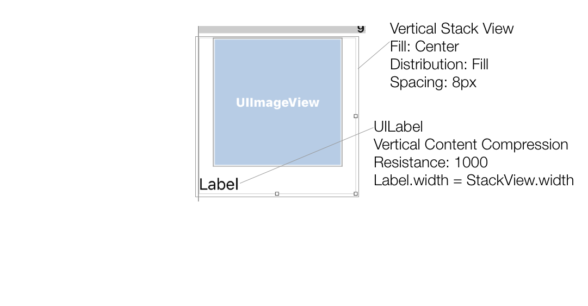

# Some Sample Clone App (2) - Part 3 - Collections
## CollectionView - datasource and delegate
#### Layout the Collection View
1. In the Storyboard, remove the *Show Item Details button* and add a *UICollectView*
	1. Pin the collection view to *all edges* with *0px*
	2. Create a new *segue show* from the *collection view cell* to the *ItemDetailedViewController*
		1. Name the segue *show detailed item*
	3. Be sure to *rearrange the collection view* in the *Document Outline* so the *floating button* is in front of the *collection view*

#### Populate with dummy values
1. In the Storyboard, connect the *dataSource* and the *delegate* of the *collection view* to the *ViewController*
2. Select the `UICollectionViewCell` and update the following:
	1. Cell identifier to *item cell*
	2. Cell background color to *gray*
3. In `ViewController.swift` conform to `UICollectionViewDataSource` and `UICollectionViewDelegate`

```swift
...
extension ViewController: UICollectionViewDataSource, UICollectionViewDelegate {

    func collectionView(_ collectionView: UICollectionView, numberOfItemsInSection section: Int) -> Int {
        return 5
    }

    func collectionView(_ collectionView: UICollectionView, cellForItemAt indexPath: IndexPath) -> UICollectionViewCell {
        let cell = collectionView.dequeueReusableCell(withReuseIdentifier: "item cell", for: indexPath)

        return cell
    }
}
```
::unable state: see 5 gray cells populate the collection view. Click on one of the cells and notice it segues to a detailed view of our dummy data::

#### Adding data to the ViewController
1. In `ItemDetailedViewController.swift`, remove `func viewDidLoad()` and its body
2. In `ViewController.swift` add the following *properties* and *methods* and *connect the collection view on the storyboard*

```swift
class ViewController: UIViewController {

    var items: [Item] = []
    ...
    func createNewItem() -> Item {
        ...
    }

    func add(new item: Item) {
        items.insert(item, at: 0)
        collectionView.insertItems(at: [IndexPath(row: 0, section: 0)])
    }

    func markItemAsReturned(at index: Int) {
        //TODO: archive returned items instead of deleting them
        deleteItem(at: index)
    }

    func deleteItem(at index: Int) {
        items.remove(at: index)
        collectionView.deleteItems(at: [IndexPath(row: index, section: 0)])
    }
	  ...
    @IBOutlet weak var collectionView: UICollectionView!
	  ...
}
...
```
3. Update `func unwindToHome(segue:)` to use the new CRUD methods we just added

```swift
class ViewController: UIViewController {
	  ...
    @IBAction func unwindToHome(_ segue: UIStoryboardSegue) {
        guard let identifier = segue.identifier else {
            return
        }

        switch identifier {
        case "unwind from back":
            break
        case "unwind from trash":
            guard
                let selectedIndexPaths = collectionView.indexPathsForSelectedItems,
                let selectedItemIndexPath = selectedIndexPaths.first else {
                    return
            }

            deleteItem(at: selectedItemIndexPath.row)
        case "unwind from mark as returned":
            guard
                let selectedIndexPaths = collectionView.indexPathsForSelectedItems,
                let selectedItemIndexPath = selectedIndexPaths.first else {
                    return
            }

            markItemAsReturned(at: selectedItemIndexPath.row)
        case "unwind from saving new item":
            guard let itemContactVc = segue.source as? ItemContactInfoViewController else {
                return print("storyboard not set up correctly")
            }

            add(saved: itemContactVc.item)
        default:
            break
        }
    }
	  ...
}
...
```
4. Update `func collectionView(collectionView:, numberOfItemsInSection:) -> Int`

```swift
extension ViewController: UICollectionViewDataSource, UICollectionViewDelegate {

    func collectionView(_ collectionView: UICollectionView, numberOfItemsInSection section: Int) -> Int {
        return items.count
    }
	  ...
}
```
5. Update `func prepare(segue:)` to send the selected item to the *ItemDetailedViewController*

```swift
class ViewController: UIViewController {
    ...
    override func prepare(for segue: UIStoryboardSegue, sender: Any?) {
        if let identifier = segue.identifier {
            switch identifier {
            case "show detailed item":
                guard let detailedItemVc = segue.destination as? ItemDetailedViewController else {
                    return print("storyboard not set up correctly")
                }

                guard
                    let collectionViewCell = sender as? UICollectionViewCell,
                    let indexPath = collectionView.indexPath(for: collectionViewCell) else {
                        return print("'show detailed item' was performed by a non-collection view cell")
                }

                let selectedItem = items[indexPath.row]
                detailedItemVc.item = selectedItem
            case "show new item":
                ...
            default: break
            }
        }
    }
	  ...
}
...
```

::runable state: collection view is empty. Try adding a new item to loan and see a new cell appears. Select the cell to view its details and then trash the item to see the collection view remove that cell::

#### Create ItemCollectionViewCell
 1. Create `ItemCollectionViewCell` class
	 1. In the storyboard update the cell’s identity to this new class
	 2. Add the following `IBOutlets` and `func configure(item)`
	 3. Connect the storyboard with the `ItemCollectionViewCell` class

```swift
class ItemCollectionViewCell: UICollectionViewCell {

    @IBOutlet weak var labelTitle: UILabel!
    @IBOutlet weak var imageView: UIImageView!

    func configure(_ item: Item) {
        labelTitle.text = item.itemTitle
        imageView.image = item.itemImage
    }
}
```
2. Update the cell in the storyboard with
	1. Cell size *164px*



3. In `ViewController.swft` update `fun collectionView(collectionView:cellForItemAt:) -> UICollectionViewCell`

```swift
...
extension ViewController: UICollectionViewDataSource, UICollectionViewDelegate {
	  ...
    func collectionView(_ collectionView: UICollectionView, cellForItemAt indexPath: IndexPath) -> UICollectionViewCell {
        let cell = collectionView.dequeueReusableCell(withReuseIdentifier: "item cell", for: indexPath) as! ItemCollectionViewCell

        let item = items[indexPath.row]
        cell.configure(item)

        return cell
    }
}
```

::runable state: Add another item and see its details appear::
