# Pop The Bubble

Pop the bubble game

## Baseline Challenges
Complete the following Phases of the `Pop The Bubble` iOS Game.

### Phase 1 - Setup Scene

1. Create An Xcode Game Project.

  | Step 1: New Game | Step 2: Project Name |
  | :------------- | :------------- |
  |  | 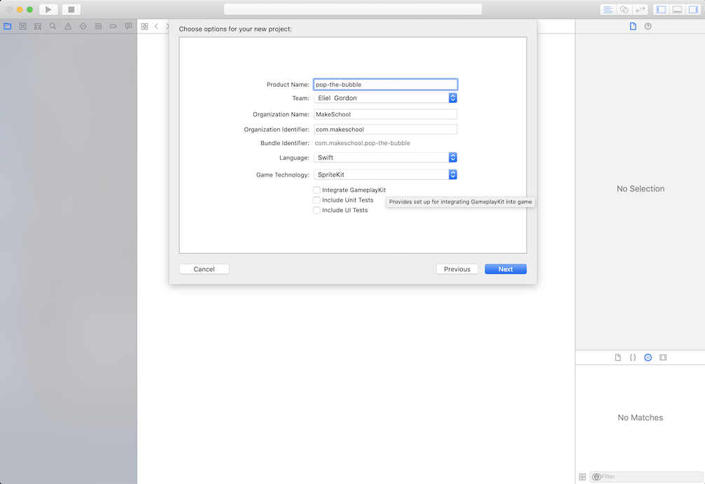 |

2. Remove all the .sks files

  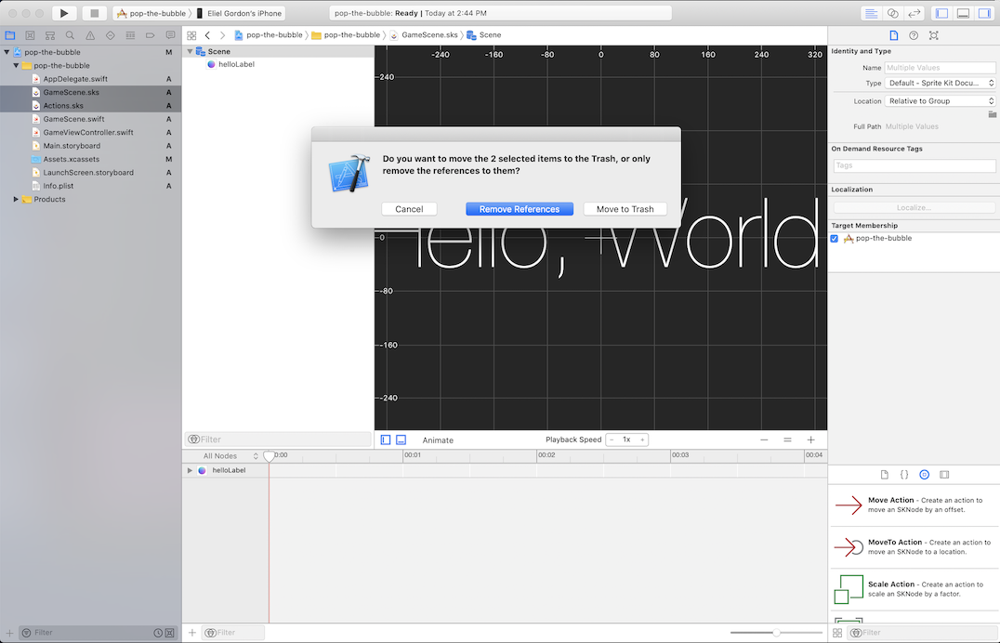

3. Replace the contents of `viewDidLoad` in `GameViewController.swift` to setup the GameScene for presentation

  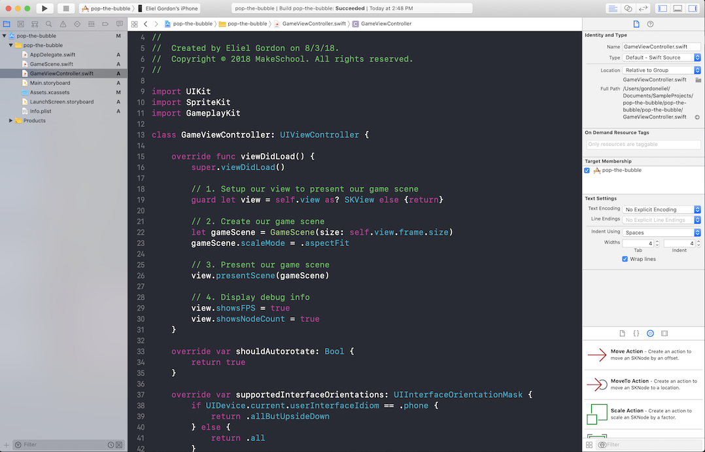

4. Remove boilerplate code from the `GameScene.swift` file

  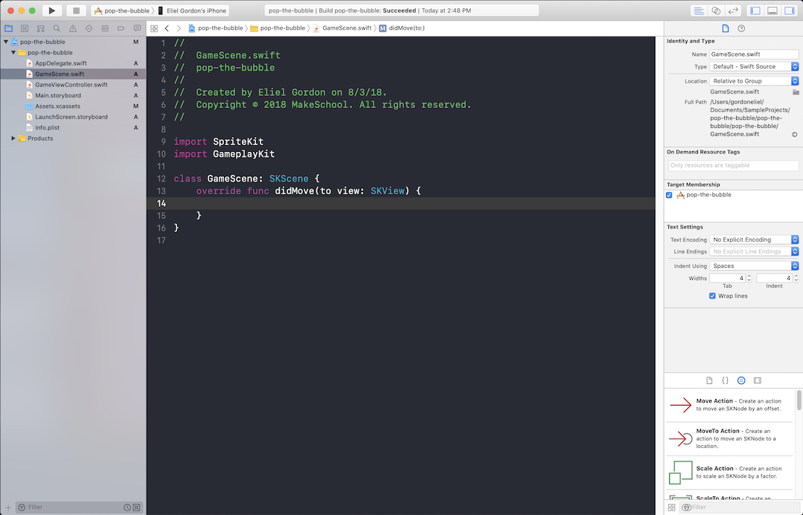

---

### Phase 2 - Create A Bubble

1. Write a function that generates a bubble

  

2. Modify the function to add a random color to the bubble being created

  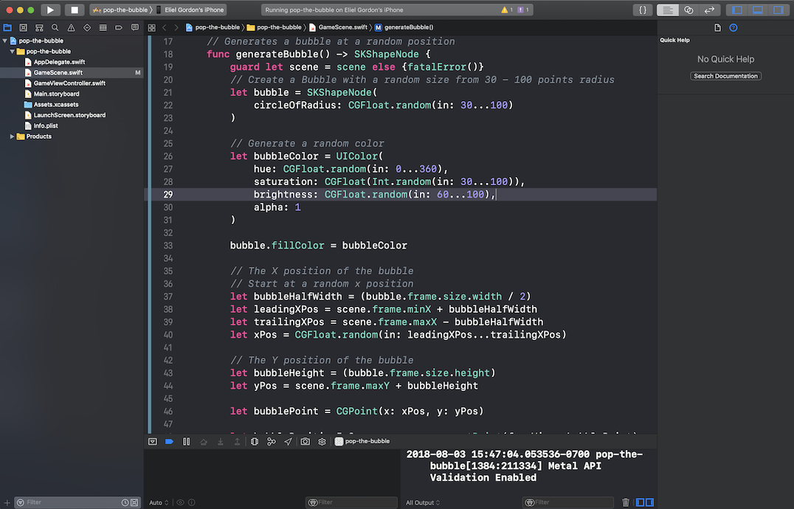

---

### Phase 2 - Timer - Generate Random Bubbles

1. Setup a timer to generate a random bubble to add to the scene every (x) seconds

  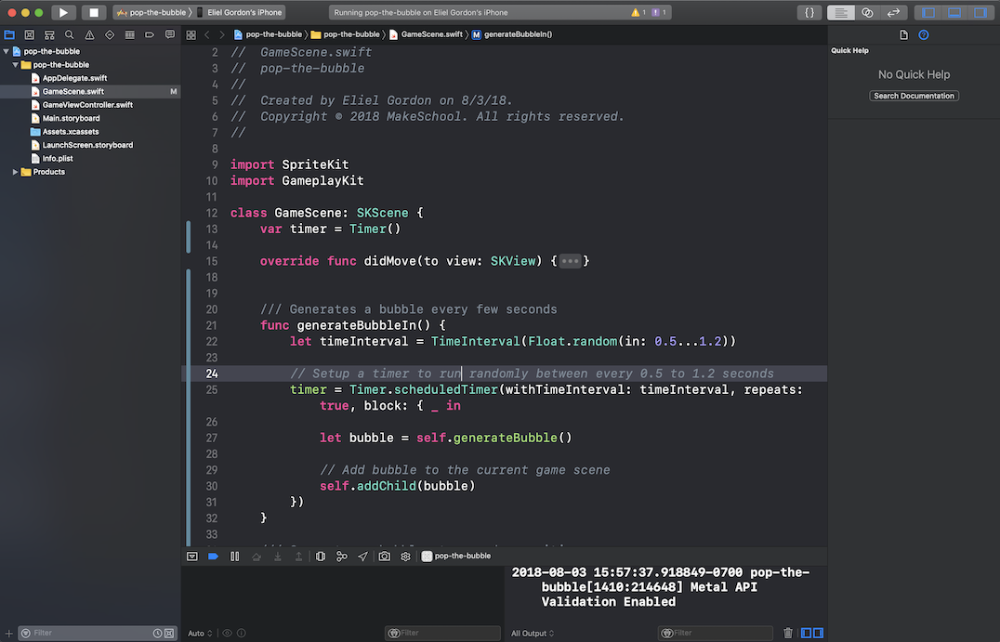

2. Move the bubble towards the top of the screen

  | Step 1: Create Move Bubble Function | Step 2: Call moveBubble() |
  | :------------- | :------------- |
  |  | 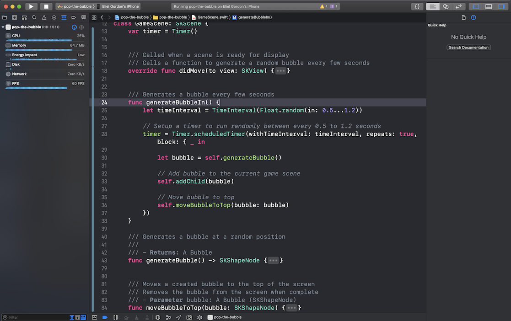 |

---

### Phase 3 - Bubble Interactions

1. Create a variable to hold Points and a label to show the points on screen

  

2. Setup PointsLabel to display points

  | Step 1: Create function to display points | Step 2: Call setupPointsLabel() |
  | :------------- | :------------- |
  |  | 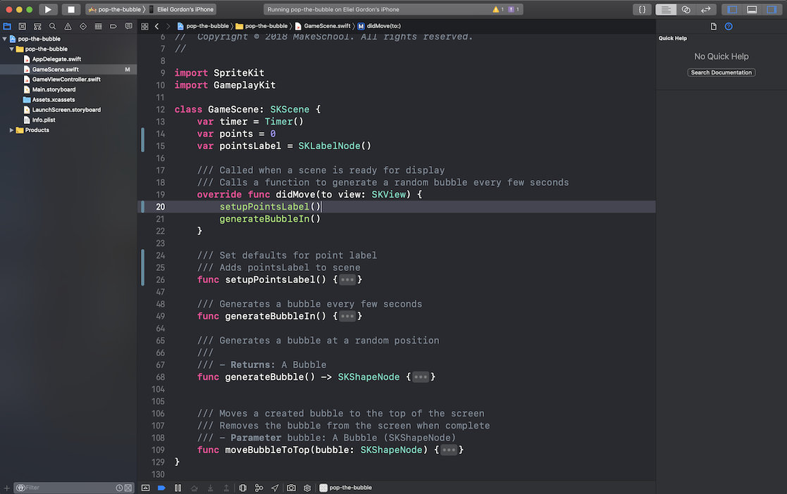 |

3. Handle touch events when user taps a Bubble

  

  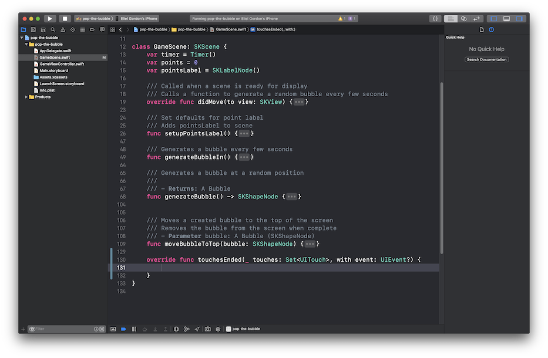

3. Increment number of points and remove Bubble when user taps a Bubble

  

  
---

### Phase 4 - Game Over Scene

1. Create a function to check if the game is over

  

2. Create a scene to handle when the game is over

  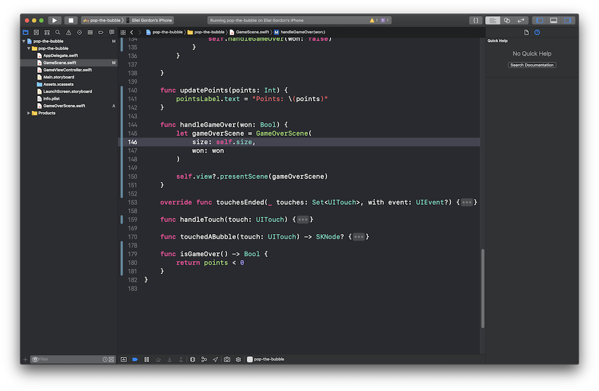

3. Present `GameOverScene` when won

  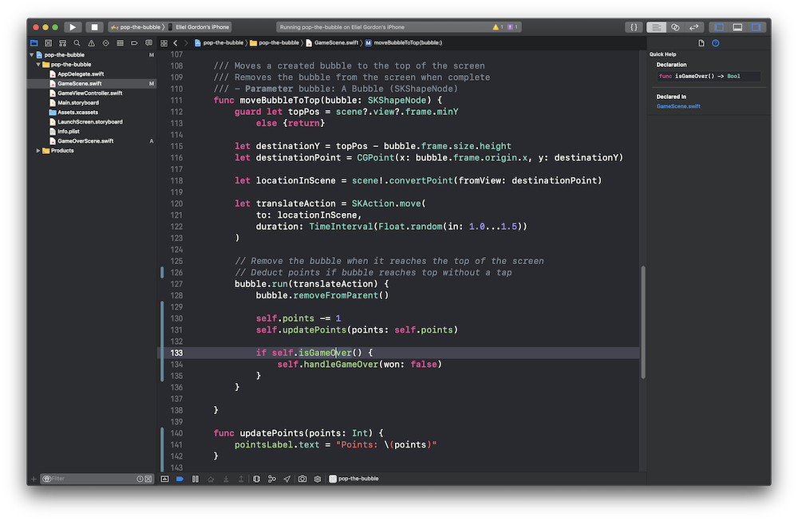

4. Display results of game and restart button
