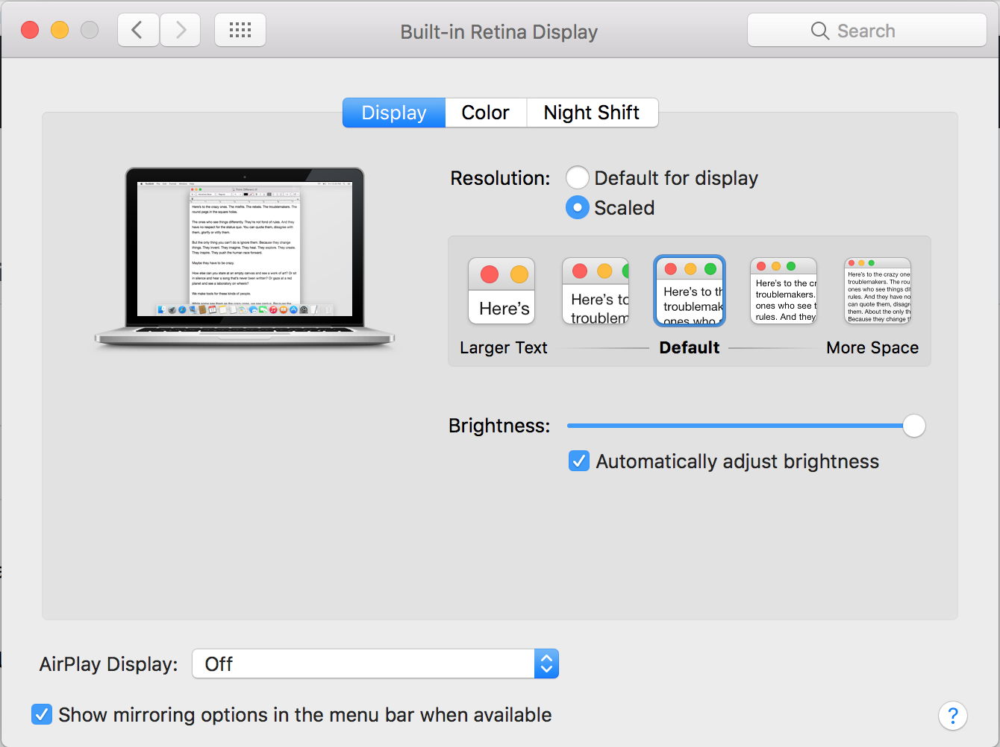
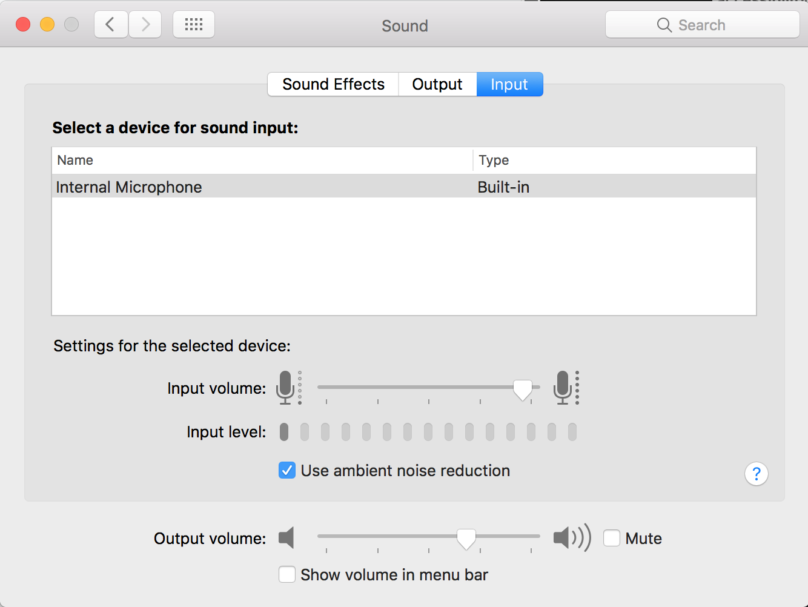
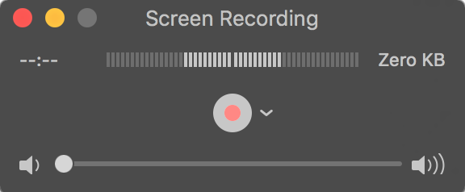
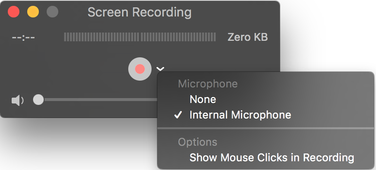

# Screencast

- [screencast](https://en.wikipedia.org/wiki/Screencast)

> A screencast is a digital recording of computer screen output, also known as a video screen capture, often containing audio narration.

## Why screencast

Capturing yourself on video doing explaining what you are doing can be a very effective
tool for teaching. Describing a series of menu items and other options can come across
as confusing, where demonstrating the actual operation can be very clear. 

Some advantages of screencasts:

- Screencasts can be watched over and over again. 
- Students can control the speed and playback. 
  - Speeding up the video to move through familiar material quickly.
  - Slow the video to pick up details for dificult topics. 
  - Rewind and replay sections for review. 

Screencasts can save time in the classroom since you can ask students to watch the 
video on their own time outside of class. This saves class time and avoids material 
in class that might lose the interest of your class when presented as a lecture. 

Sometimes it is faster to create a screencast than it is to write and describe a topic. 

Video is very captivating and effective form of communication. 

## Tools

The easiest and less costly method for creating screencasts is QuickTime. 
Quicktime is free and works well. You can also screencast from an iOS device. 

### System Setup 

Set the screen size. This makes everything larger. Realize the finished video when viewed 
will be *smaller* than your screen size. *It is important to make everything larger than 
you would normally work.* 

Clean up your desktop and get your files together. Consider only keeping the files that 
will be used in the demo on your desktop (and nothing else). 

> You might create an account just for creating screencasts.

> System Preferences > Displays. Choose Scaled and then choose a size. 

Set the zoom. You can use this to zoom into the screen to show details:

> System Preferences > Accessibility > Zoom: Turn on the keyboard shortcut for Zoom, 
> and consider turning on "Use Scroll gesture...". Memorize the keyboard shortcuts! 

Check your sound. If you have an external mic consider using it. The sound quality will 
be much better. 

Choose your sound source: 

> System Preferences > Sound > Input: Choose your input. Look at the levels and adjust. 
> You want as much volume going in as you can get without topping out.  

## Setup QuickTime

Test Quicktime before making your video.

> Open QuickTime, choose File > New Screen Recording. The small window that opens shows
> the record levels QuickTime is seeing. Make sure you see these move. Try to get they 
> to go as high as possible without hitting the end of the bar. 

*If you aren't getting levels in QuickTime click the > next to the Record button. Choose
the mic you are using and test again.*

Make a short test video. 

> Press record. You can draw a marquee to record a portion of the screen, or click to 
> record the entire screen. Do a short demo speaking as you will in the actual video. 
> A Record icon appears in the menu bar. Click this to stop recording. Play your file. 
> Listen for the volume and sound quality.

## Do's and don'ts

**Do**

- Make short videos 5 to 10 mins.
- Speak slowly and clearly
- Use a mic (not the built in mic) if you can
- Practice
- Don't be afraid to do a second take
  - If the video is only 5 to 10 minutes long do it again will only be another 5 to 10 minutes. 
- Plan what you will do in advance
  - Walk through the whole video before recording. 
- Clean your desktop!
  - Having a lot of visual distractions is distracting. 
    - Remove all of the extra files from your desktop. 
    - Hide your HD. (Finder > Preferences > General)
  - For bonus points use a Make School image for your desktop image. [make-school-logo.png](./make-school-logo.png)
- Decrease the resolution of your screen (System Preferences > Displays choose "Scaled" 
and pick a size.)
- Use the Zoom option under preferences (System Preferences > Accessibility > Zoom. Choose 
"Use keyboard shortcut to zoom" or "Use scroll gesture to zoom")
- Increase the font size in any application you might be working in. 
  - Xcode > Preferences > Fonts & colors: Choose Presentation or Presentation Large. 
  - Atom and Brackets allow the font size to be increased with: ⌘+

**Don't**

- Try to avoid too many "um's" and "oh's"
- Don't fumble around your system looking for files.

