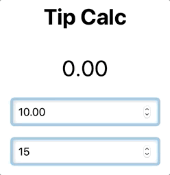

# Tip Calc 

In this tutorial, you will create a tip calculator with HTML, CSS, and JS. The overall goal is to get a picture of how HTML, CSS, and JavaScript work together to create web applications. 

Here is a picture of what you will make: 



**Learning Objectives:**

- Build web application with HTML, CSS, and JS
- Use HTML to create documents
- Use Attributes to configure elements
- Use JavaScript to...
	- Define variables 
	- Reference DOM elements 
	- Use Events to handle user input
	- Write functions
- Use CSS to...
	- Control the appearance of elements
	- arrange elements on the screen

## Getting Started 

Make a new file named `index.html`.

You'll add code to this file. Open the file in your web browser to see your application in progress. Be sure to refresh the browser each time you save your `index.html` file. 

## HTML

HTML is a language that defines the structure. It is written in "tags". Tags define elements. Think of HTML as the bones, frame, or foundation of your application. 

## Markup

Default document structure. 

```html
<!DOCTYPE html>
<html>
  <head>
    <title></title>
  </head>
  <body>

  </body>
</html>
```

Tags usually come in pairs with an opening and closing tag. The closing tag has a `/`. For example: 

`<html>` and `</html>`

- `<html>` - opening tag
- `</html>` - closing tag

Tags should never overlap. A tag within another tag should close before it's parent tag.

```html
<html> <body></body> </html> <!-- Good -->

<html> <body> </html> </body> <!-- Bad! -->
```

Notice in your code the HTML, head, title, and body do not overlap. 

## Calculator markup

Markup provides a structure for the tip calculator and defines the elements that accept input and display the output.

Add some markup for your application **inside the body tag**.

```html
<main>
  <div id="display">0.00</div>
  <input id="bill" value="10.00">
  <input id="tip" value="15">
</main>
```

The names of the tags describe their function. 

- `<main>` specifies the "main" content of the page. 
- `<input>` specifies an input field where a user can input data.
- `<div>` specifies a division or section of a document. 

**Challenge**

Your tip calculator needs a heading. Add a new tag inside `<main>` at the top.

`<h1>Tip Calculator</h1>`

Check your work in the browser. Open `index.html` in the browser if you haven't already, or refresh the brwoser if you have. 

### Attributes 

Think of attributes as options that are used to configure elements. You add attributes to the opening tag. 

Attributes follow a syntax of `name="value"`.

Earlier you included the `id` and `value` attributes each with different values.

Identify the attributes, their names, and values in the sample code above...

**Challenge**

Add some new attributes. The input fields in the tip calculator should only take numbers. You can configure inputs to accept numbers by adding:

`type="number"`

Add this attribute to the **input** tags.

Stretch challenge: try adding these attributes:

- min
- max 
- step

## Add some JavaScript

JavaScript is the brains of your application. Add JS to bring your application to life!

JavaScript can be written in the script tag or linked to a .js file.

Add a script tag **inside the body tag at the bottom**. 

```html
<script>

</script>
```

### Defining Variables 

Variables are names that represent stored values. Always declare a variable with one of the keywords `const`, `let`, or `var`.

- `const` represents a value that won't change

`const` should be your first choice when defining variables! We will use `const` exclusively in this tutorial. 

```js 
const display = document.getElementById('display')
const billInput = document.getElementById('bill')
const tipInput = document.getElementById('tip')
```

What happened here? You used `document.getElementById(id)` to create a reference to an element in the DOM and you stored it in a variable. You won't be reassigning this value again so you used `const`. 

What about `document.getElementById(id)`? You're using this to connect your JavaScript to the HTML. 

Notice the id names here match the id attribute values on the tags you created earlier! 

- `getElementById('display')` - `<div id="display">0.00</div>`
- `getElementById('bill')` - `<input id="bill" value="10.00">`
- `getElementById('tip')` - `<input id="tip" value="15">`

With these references, your JS code can access the HTML elements and get values from the inputs and set the content of the div. 

### Events

Events are things that happen in your program. If you want your program to react to changes you need an action to listen for those changes. 

Events can come from the mouse, the keyboard, the browser, user input, and almost anywhere else.

Register an event to handle input. Add this below the previous code inside the script tag.

```JS 
bill.addEventListener('input', function() {
 
})
```

**`addEventListener(event, handler)`**

The `addEventListener()` takes two pieces of information to do its job. The first is the name of the event you are listening for, the second is a function that will handle the event when it occurs. 

Functions are blocks of code that can be used and reused when needed. A function looks like this: 

```JS 
function () {

}
```

Find the function in `addEventListener` above. It's the code inside this function that will be run when an input event occurs. 

### Calculate the Tip

Now some code to calculate the tip amount:

```JS
billInput.addEventListener('input', function() {
  const billValue = billInput.value // 1
  const tipValue = tipInput.value   // 2
  const tipAmount = billValue * tipValue / 100 // 3

  display.innerHTML = tipAmount // 4
})
```

What happened here? 

- 1 - Get the value from the bill input
- 2 - Get the value from the tip input
- 3 - Calculate the tip amount 
- 4 - Display the tip amount by setting the content of the display element

Test your code. You should be able to see the tip calculated when you change the value in the **bill input**. 

### Challenge

Currently changing the bill amount will update the tip amount. **Changing the tip percent will have no effect**. You're going to fix that! 

Add an event to `tipInput`. This should look like the event added to the bill input. Then calculate the tip amount.

```JS 
tipInput.addEventListener('input', function(e) {
  // ... your code here ...
})
```

When you're done test your work. If things do not work open the Inspector in the browser and check the console for any error messages (pro tip: these usually include a line number.)

## Functions

Functions are blocks of reusable code. You can use functions to simplify your work.

The syntax for a function looks like this:

```JS 
function myFunc() {

}
```

There is a function in each of the event listeners you created earlier. You can replace this with the name of a function you define. In this way you can reuse the block of code contained in that function. 

```js
const display = document.getElementById('display')
const bill = document.getElementById('bill')
const tip = document.getElementById('tip')

// Define your function 
function calculateTip() {
  const billValue = bill.value
  const tipValue = tip.value
  const tipAmount = billValue * tipValue / 100

  display.innerHTML = tipAmount
}

// Update the event listeners
bill.addEventListener('input', calculateTip) // put the function here
tip.addEventListener('input', calculateTip)

```

## Challenges

Google is a pretty interesting company. They make some pretty solid software products. Did you know they have a tip calculator? Go to Google.com and search: Tip calculator. 

Notice their tip calculator has a couple of extra features. It has a field for the number of people that are used to split the bill. Besides the bill, it displays the total per person. 

Here are some challenges.

Modify the structure of your document. To add a new input and display element. This should go inside the `<main>` tag.

- Add a new input where we can input the number of people. Follow the pattern of the other inputs.
	- `<input>`
	- This should be type number: `type="number"`
	- It should have an id like 'people': `id="people"` 
- Add a new element to display the total per person. Follow the idea of the div id display. 
	- `<div></div>`
	- Add an id: `id="total"`

Modify the JavaScript to work with these new elements. This will all go inside the `calculateTip()` function.  

- You'll need a reference to the new input and div elements. Define some new variables to hold these references at the top of your script. You can follow the pattern of the existing references. 
	- `const total = document.getElementById('total')`
	- `const peopleInput = document.getElementById('people')`
- In your `calculateTip()` function you'll need to get the value from the people input and use that to calculate the price per person. 

You may have noticed that the amounts come out as strange numbers sometimes. For example: 

- 1.23 * 15% = 0.1845
- 11.88 * 15% = 1.7820000000000003
- If any of the inputs are not a number you might see NaN

These are two different problems. 

The first problem can be solved by rounding the answer to two decimal places. Try this: 

`display.innerHTML = tipAmount.toFixed(2)`

The `toFixed()` method rounds a number to a fixed number of decimal places. The argument you supply the function (2 in the example) says how many decimal places. For example: 

- `(1).toFixed(1)` 1.0
- `(12).toFixed(3)` 12.000
- `(3.145678).toFixed(3)` 3.146 

## CSS

CSS is a language that defines the appearance of elements.

Add a style tag to the head of the document: 

```html
<head>
  <style>
    /* Your styles here! */
  </style>
</head>
```

You'll write code in the CSS language here. 

CSS works with selectors and properties. Each block of code starts with a selector. The selector defines which elements that rule applies to. 

```CSS
/* Element selectors (use the tag name) */

body {
  /* Applies to the body element */
}

main {
  /* Applies to main element */
}

/* ID selector (begins with #) */

#display {
  /* Applies to the element with id="display" */
}
```

In any selector, you'll define properties and values that determine the appearance of the element the selector is describing. 

```CSS
selector {
  property: value
  ...
}
```

Here's a real example: 

```CSS
body {
  background-color: #eee;
  height: 100%;
  font-family: Helvetica;
}
```

### Styling the tip calculator

To put the tip calculator in the center of the page you have to make the height of the page fill the height of the browser window. HTML elements are only as tall as their content by default. You need the html and body elements be as tall as the page. 

```CSS
html, body {
  height: 100%;
}
```

Flexbox arranges elements on an axis. The flex property is applied a parent to arrange it's children. The body has one child main. Put it in center with: 

```CSS
body {
  display: flex;
  justify-content: center;
  align-items: center;
}
```

You can use Flexbox to arrange the children of main (#display, #bill, #tip) with flex. This time use the `flex-direction` property to arrange the elements in a column. 

```CSS
main {
  display: flex;
  flex-direction: column;
}
```

The inputs could use some styles. CSS has properties that set all the different appearance aspects of any element. Here are some styles for the inputs: 

```CSS
input {
  font-size: 1em;
  padding: 0.5em;
  border: 4px solid rgb(135, 194, 230);
  box-shadow: inset 1px 1px 6px rgba(0,0,0,0.25);
  border-radius: 6px;
  margin: 0.5em;
}
```

Take a look at these styles and see if you can guess what they do. 

Try changing the numbers. and see what happens. 

Last, style the #display element. 

```CSS
#display {
  font-size: 2em;
  padding: 0.5em;
}
```

### Challenges 

That completes the tutorial but you should continue to improve the tutorial. Try changing the styles to make it uniquely your own design. 
