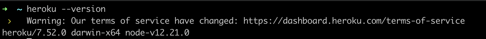

# Deploying Apps on Heroku

Heroku is a platform as a service (PaaS) that enables developers to deploy apps for free using a full range of free cloud services available.

In this guide, we will walk through setting up your operating system with the necessary requirements. We would alos link the official guides on deploying apps for Nodejs and Python applications.

## Set up

### Create a free Heroku account

To get started with deploying your apps to Heroku, you have to sign up for an account with Heroku.
If you already have an account with Heroku, you can make sure you are logged in to your dashboard [here](https://dashboard.heroku.com/apps).

To create an Heroku account, visit [here](https://signup.heroku.com/dc) and fill the required form fields to create a free account.


* Follow the prompt to confirm your account and check your email address for a verification message.
* Set your new password.
* Accept terms and conditions.

That's all! You now have a free heroku account!! You should be logged in to your dashboard now.

### Download and Install git

Heroku deployments are easy using git. You can deploy code in git repos to Heroku easily with some readily available commands. To do this, you need to have git installed on your operating system.

To check if git is alredy installed on your system. Type this in your terminal

`git --version`

If, you have it installed, you should get an output that shows what version is installed.

If you don't have it installed, it will prompt you to install it.

You can also install it using the [homebrew](https://brew.sh/) formulae:
`brew install git`

### Download and Install Heroku CLI

Heroku platform offers a `Command Line Interface` (CLI) that you can use to manage your deployments, monitor logs and also run your application locally.

You can either:

* Download and run the installer for macOS [here](https://cli-assets.heroku.com/heroku-darwin-x64.tar.gz)

    OR

* Install it with homebrew formulae:

    `brew tap heroku/brew && brew install heroku`

Verify your CLI installation by running the `heroku --version` command. It should give you an output showing the version of heroku installed. It will look something like so:



### Heroku CLI Login

With the installation complete, you can use heroku CLI commands from your command line.

Login to Heroku CLI with the command `heroku login`.

* Follow the prompt from the output
* The command opens a web browser to the Heroku login page.
* Simply click the `Log in` button on display

    

* Once you are logged in, you will get a prompt both on your browser and terminal

    On the browser:

    

    And on your command line:

    ```shell
    ➜  ~ heroku login
    heroku: Press any key to open up the browser to login or q to exit:
    Opening browser to https://cli-auth.heroku.com/auth/cli/browser/**
    heroku: Waiting for login...
    Logging in... done
    Logged in as youremail@email.com
    ```

You are now logged in!! Let's get on to deploying your app now!

## Deploying your Apps

 To deploy apps on Heroku please follow these official guides for your specifc use case:
 | App     | Guide |
| ----------- | ----------- |
| Nodejs    | <https://devcenter.heroku.com/articles/getting-started-with-nodejs?singlepage=true>      |
| Python - Django   |   <https://devcenter.heroku.com/articles/getting-started-with-python?singlepage=true>      |
|Golang |<https://devcenter.heroku.com/articles/getting-started-with-go?singlepage=true>|
| General Deployment with git | <https://devcenter.heroku.com/articles/git> |

## Other References

[Install Heroku CLI](https://devcenter.heroku.com/articles/heroku-cli)

<https://devcenter.heroku.com/categories/deployment>

<https://git-scm.com/book/en/v2/Getting-Started-Installing-Git>
