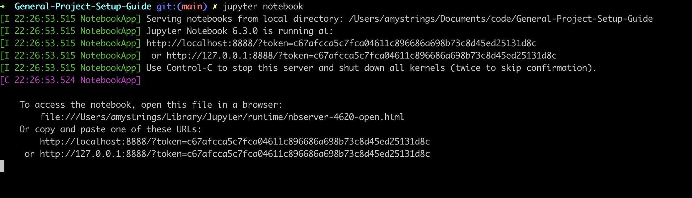
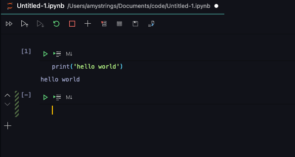

# Getting Started with Jupyter Notebook

The Jupyter Notebook is an open-source web application that allows you to create and share documents that contain live code, equations, visualizations and narrative text.

This guide will discuss how to setup Jupyter Notebook on your local machine.

## Installation

Jupyter works with the Python Language server so make sure to install python on your system.
To check if Python is installed on your machine, open your terminal and type:

```shell
python3 --version
```

If you do have Python installed, you would get an output displaying the currently installed version of Python on your machine.

If you don't, no worries! Go through the instructions [here](#install-with-anaconda) on how to install Jupyter with Anaconda. Installing Anaconda means you are getting a version of Python installed.

## Install with Pip

For exisiting Python users, you could install jupyter with Python's package manager, pip.

Make sure you have the latest version of pip; to upgrade pip you can follow it by:

```python
pip3 install --upgrade pip
```

Then install Jupyter with pip using the command:

```python
pip3 install jupyter
```

To run the notebook, type the following command into your

```python
jupyter notebook
```

## Install with Anaconda

For new users to Python, it's best to use Anaconda to install Jupyter notebook.

Anaconda is a very popular Python distribution software. It comes with tons of scientific packages(including Python, Jupyter Notebook) for computing and data science.

### Install Anacoda with the Installer

* Download Anaconda installer [here](https://www.anaconda.com/products/individual)
* Install the Anaconda on your machine; follow the instructions on the download page
* Now you have Anaconda installed, run jupyter notebook with `jupyter notebook`

### Install Anacoda with Homebrew

Use the following steps from your command line:

* Install anaconda

    `brew install --cask anaconda`
* Set your anaconda path. Edit your ~/.zshrc or ~/.bashrc file.
  * Open your .zshrc or .bashrc file with vscode editor

    For zsh:

    `code ~/.zshrc`

    For bash:

    `code ~/.bashrc`
  * Add the following to the top of the file:

    `export PATH="/usr/local/anaconda3/bin:$PATH"`
  * Save and exit the editor

* Restart your terminal

    You can either close the terminal or load the path configuration by running:

    For zsh:
    `source ~/.zshrc`

    For bash:
    `source ~/.bashrc`

Like the other methods, open the jupyter notebook with this line in your terminal:

`jupyter notebook`

You should see an ouput in your terminal that looks like this:


## Use Jupyter Notebook in VsCode

Virtual Studio Code (VsCode) is a powerful IDE that has native support for Jupyter Notebook when the official Python extension is installed.

Follow these steps to use Jupyter Notebook In VsCode

* **Installation**:  Open your VsCode IDE. Search for [`Python`](https://marketplace.visualstudio.com/items?itemName=ms-python.python) in the list of extensions and click on install.

If you already have it installed, check to see if you need to update it.


* **Create a new Notebook**:

  * Open the Command Pallette - Use Shortcuts - `CTRL + SHIFT + P` (Windows) or `Command + SHIFT + P` (macOS)

  * Search for `Jupyter: Create New Blank Notebook`. VsCode will start a Jupyter server locally and display the notebook in the editor.

  

Jupyter Notebook in VsCode offers so many features:

You can execute cells with code or have them with markdowm, debug a notebook, you can use a remote Jupyter server, open an existing notebook file, use python packages etc.

## Try in your Browser without installing

If you don’t want any installation and would like to try the Notebook with your browser instead, you can click [here](https://jupyter.org/try).

## FAQ

## Other References

[Running  Jupyter Notebook](https://jupyter.readthedocs.io/en/latest/running.html#running)

[Official Python Download](https://www.python.org/downloads/)

<https://jupyter.readthedocs.io/en/latest/tryjupyter.html>

<https://www.anaconda.com/products/individual>

<https://jupyter.readthedocs.io/en/latest/install.html>

<https://jupyter.readthedocs.io/en/latest/tryjupyter.html#id1>

<https://towardsdatascience.com/jupyter-notebook-in-visual-studio-code-3fc21a36fe43>
