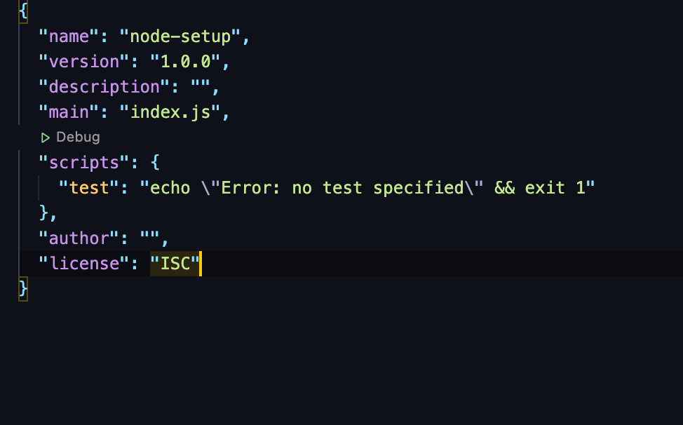
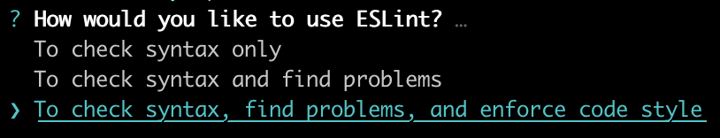
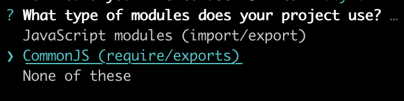
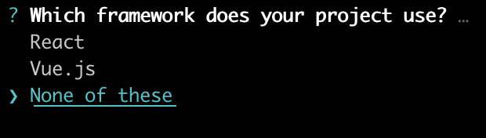
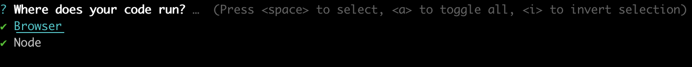
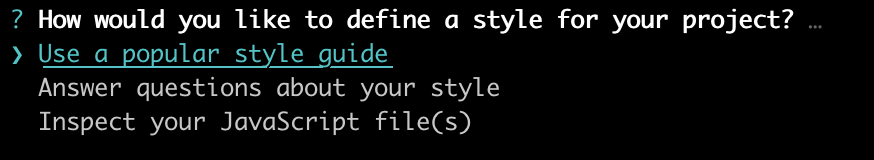
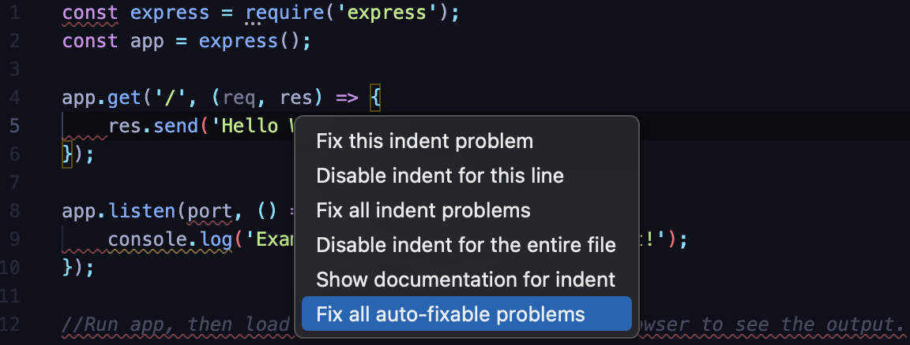
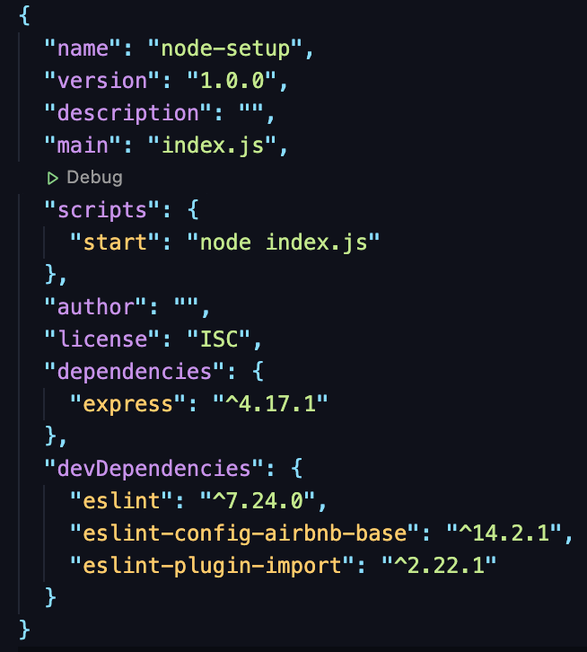

# Setting up a Node/Express Project

[Node.js](https://nodejs.org/en/) is an open-source JavaScript runtime environment for building server-side and networking applications.

In this guide we will discuss how to set up a Node.js/Express project for development on your local machine.

## Install Node.js

Let's start by installing the latest stable release of Node.js. Installing Node.js differs based on operating system.

| Operating System      | Installation Instructions |
| :----:        |    :----:   |
| MacOS     | Download and install easily from the [official Installer here](https://nodejs.org/en/#download)       |
| MacOS      | You can also install with [Homebrew here](https://formulae.brew.sh/formula/node#default), if you prefer.       |
| Windows   | Download and install easily from the [official Installer here](https://nodejs.org/en/#download)     |
| Windows | You can install with [Chocolately here](https://community.chocolatey.org/packages/nodejs.install) if you prefer.
| Linux     | Look out for the instructions to download the right for your specific Linux distro [here](https://nodejs.org/en/download/package-manager/) |

**Note**: For the official installer, select the button to download the LTS build that is _Recommended for most users_. Install Node by double-clicking on the downloaded file and following the installation prompts.

### Test your Nodejs installation

Installing Nodejs also installs [Node Package Manager (NPM)](https://docs.npmjs.com/)on your operating system. To test if you have Node installed on your system, open your terminal and type the following:

```shell
$ node -v
v15.14.0
```

You can test for npm too with:

```shell
$ npm -v
7.7.6
```

You would get the current instlled version of Node and NPM as output, respectively.

## Initialise a Project with "npm init"

The `npm init` command creates a **package.json** file in your appliaction. Follow these steps to initialise your node project with `nom init`:

* Create a new empty directory with your project name `mkdir <my-project-name>`
* Navigate in to that directory `cd <my-project-name>`
* Initialiase a new project by running `npm init` command.

`npm init` command prompts you for a number of things (name of yur application, version, entry point file etc.). For now, accept the defaults by pressing the enter key at every prompt.

You can open the package.json file with your code editor `code package.json` to see the defaults that you accepted. It would look like so:


**Note**: You can accept all defaults automatically by running `npm init -y`.

## Install Project Dependencies with "npm install"

With `npm install` command, you can install packages and save them to your `package.json` as project dependencies so you can eventually use them your project. Project dependencies can either be **development dependencies** or **production depndencies**.

If a dependency would be used only during development and not in production, it should be saved as a "development dependency".

If we wanted to be more explicit in the way we installed and saved production dependencies we can use the command `npm install <package-name> --save`. The `npm install <package-name>` command defaults to this automatically.

To install and save development depndencies, we use the `--save-dev` flag with npm install. The command will look like so: `npm install <package-name> --save-dev`.

**Note:** Include a `.gitignore` file to your project if you are `git`. Copy and paste the content [here](https://www.toptal.com/developers/gitignore/api/node) to your `.gitignore` file.

Follow these steps to install dependecies and dev dependencies necessary for your peoject setup(make sure you are in your project's directory on your command line):

### Install Express

* Run the command `npm install express` to install express

### Install and configure Eslint

* run the command `npm install eslint --save-dev` to install and save eslint as a dev dependency
* Next, to configure eslint run the command `npx eslint --init`.
* A set of prompts will be brought up for you, let's go through each of them:
  * First, `How would you like to use Eslint`. Use your arrow key to choose the best answer for your scenario and press enter key.

  
  * Next, `What type of modules does your project use?`. Use the arrow key to choose the best for your project and press enter.

  
  * `Which framework does your project use?`. With your arrow key choose `None of these` and press enter.

  

  * `Does your project use Typescript`. Use the arrow key to choose the best for your project and press enter.

  .

  * `Where does your code run?`. We will follow the prompt and press the **a** key to select all options and press enter.

  

  * `How would you like to define a style for your project?`. We will choose to `Use a popular style guide` and press enter.

  

  * `Which style guide do you want you follow?`. We will choose the `Airbnb style guide` and press enter.

  

  * `What format do you want your config file to be in?`. We will choose `JSON` and press enter.

  

  * Finally, the prompt will ask for permission to install the dependencies that support the configuration you have chosen.

  

* At the end of configuration, a config file `.eslint.json` file will be created for you in your project directory.

_**Why install and configure eslint?** We want to make sure that we are writing clean, readable and industry standard code. Eslint is a very popular Javascript linting tool and it will help make sure our coding style falls in line with some standards._

## Enable Eslint on VsCode

If you use a VsCode, you can install and enable the [Eslint extension](https://marketplace.visualstudio.com/items?itemName=dbaeumer.vscode-eslint) to help you with linting checks while writing code.
Squiggly red lines indicate a problem in coding style and squiggly yellow lines indicate a warning. The extension helps with quick fixes for problems it detects.



## Start your Project

To start your project, create an entry file, `index.js`, that would start up your express server. You can give whatever name you want to this file. It is common to see developers name it `app.js`.

 In the file, you can start with following starter code:

```js
const express = require('express');

const app = express();
const port = 3000;

app.get('/', (req, res) => {
  res.send('Hello World!');
});

app.listen(port, () => {
  console.log(`Example app listening on port ${port}!`);
});

// Run app, then load http://localhost:port in a browser to see the output.
```

To run the app, go to your termainal and run the command `node index.js`. You should see the following output:

```shell
Example app listening on port 3000!
```

Open your browser and load <http://localhost:3000> to see the `Hello World` output.

## Run Scripts

You can define named scripts in your `package.json` file and execute them with [NPM run script](https://docs.npmjs.com/cli/v7/commands/npm-run-script) commands.

These scripts run commands from the `package.json` `scripts` object. This is commonly used to automate parts of the development cycle like running tests.

Include a start script to your `package.json` file. It will execute the command `node index.js` that starts the server.

```json
    "scripts": {
    "start": "node index.js"
  },
```

Your `package.json` file should look like this now:



Now, in your terminal, when you run the command `npm start`, you should get the same output as before when you ran `node index.js`.

## Nodemon and Dotenv

## Nodemon

Starting and restarting your server each time you make a change can be a chore. Luckily, `nodemon` helps with automatically restarting your server when it detects a change in in the files in your project directory.

* Run `npm install nodemon --save-dev`to install `nodemon` as a development dependency
* include `nodemon index.js` as an npm run script in your `package.json`.

```json
  "scripts": {
    "start": "node index.js",
    "dev": "nodemon index.js"
  },
```

To run the script type `npm run dev` in your terminal.

## Dotenv

The `dotenv` package helps with storing environment variables. `Dotenv` helps load environment variables from a `.env` file into `process.env`.

* Run `npm install dotenv` to install it as a dependency.
* Create a `.env` file in the root of your project directory.
* In your `.env` file, include this:

```js
PORT=3000
```

* include the `dotenv` package to your `index.js` file

```js
// require the dotenv package
require('dotenv').config();
// load the port variable fro .env file
const port = process.env.PORT;
const express = require('express');

const app = express();

app.get('/', (req, res) => {
  res.send('Hello World!');
});

app.listen(port, () => {
  console.log(`Example app listening on port ${port}!`);
});

```

Well done! You have successfully setup a Node.js project! Happy Coding!!

## Set up with Express Application Generator

You can easily use the `Express Application Generator` to quickly create an application skeleton for your project.

Go through the guide [here](https://expressjs.com/en/starter/generator.html) to set it up.

## Other References

<https://nodejs.org/en/>

<https://nodejs.org/en/download/package-manager/>

<https://docs.npmjs.com/specifying-dependencies-and-devdependencies-in-a-package-json-file>

<https://expressjs.com/>

<https://docs.npmjs.com/cli/v7/commands/npm-run-script>

<https://nodejs.org/docs/latest/api/process.html#process_process_env>
