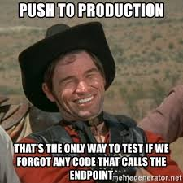

# Going Live

### ⏱ Agenda

1. [✅ [**20m**] Quiz](#%e2%9c%85-20m-quiz)
2. [🏆 [**5m**] Learning Objectives](#%f0%9f%8f%86-5m-learning-objectives)
3. [💻 [**15m**] Activity: Compare & Contrast](#%f0%9f%92%bb-15m-activity-compare--contrast)
4. [🚢 [**35m**] Demo: Going Live... Live](#%f0%9f%9a%a2-35m-demo-going-live-live)
5. [👍 [**10m**] Release Management Protips](#%f0%9f%91%8d-10m-release-management-protips)
6. [🌃 After Class](#%f0%9f%8c%83-after-class)
7. [📚 Resources & Credits](#%f0%9f%93%9a-resources--credits)

## ✅ [**20m**] Quiz

## 🏆 [**5m**] Learning Objectives

1. Gain insight into engineering and operational decisions made by your Industry Collaboration Partners throughout the term.
2. Use 'How the Internet Works' as an integration point to form a real-world launch plan.
3. Analyze a typical production launch workflow live in class.
4. Practice and extend knowledge and usage patterns of common Unix utilities.
5. Understand and utilize the `ssh` utility to log into to a remote server.

## 💻 [**15m**] Activity: Compare & Contrast

### Mini-Reflection

📝 **PROMPT**: **Compare and contrast your current project with your experiences in the past.** Is anything **different** this term? What remains the **same**?

In the next **`5` minutes**, **write down *ALL* the similarities and differences** that come to mind.

### Discussion

  

In the last five weeks, many of you...

- Contributed to an **existing** product!
- Jumped in to a codebase where the **language**, **framework**, and **development methodology** had been in place *way* before this term.
- Had to **run unit tests regularly**, and were required to add or modify the unit tests where appropriate.
- Received **numerous, thorough code reviews** from your team lead.
- Gained hands-on understanding of **build and release** workflows, tools, and processes.

📝 **PROMPT**: **Raise your hand if you've encountered any of these scenarios this term**.

Sincere dedication and attention to detail is required when working on software released to the public. The same tenacity is required when launching for the first time, too. Let's explore what it takes to successfully launch a web-based project.

📝 **PROMPT**: **What ingredients do we need at launch? Think of a few possibilities, then discuss them with the person next to you**.

## 🚢 [**35m**] Demo: Going Live... Live

> Software and cathedrals are much the same - first we build them, then we pray. 

**STUDENTS**: The below step by step guide is for your future reference only. **Close your laptops, dive in, and help me deploy IRL**!

### Launch Reference Guide (Step by Step)

1. Provision a virtual private server:
     - Vendors: [DigitalOcean], [Vultr], [SSDNodes]
2. Associate a new domain (`litebrite.live`) to the server with an `A` record.
	- Create `staging` subdomain using a `CNAME` record.
3. Log in to the server: `ssh root@litebrite.live`
4. Update to install latest patches: `apt update && apt upgrade`
5. Perform basic server hardening: `apt install ufw`, `apt install fail2ban`
6. Enable public key authentication:  `ssh-copy-id -i ~/.ssh/id_rsa.pub  dani@litebrite.live`
7. Test new passwordless login via public key: `ssh dani@litebrite.live`
8. Install an application server (`nginx`, `haproxy`)
9. Clone your project's GitHub repository in your home folder.
10. Copy `.env` settings and other secrets to the new server.
11. Turn off debug mode!
12. Configure and restart your application server.
13. Test the root domain in the browser: `http://litebrite.live`

## 👍 [**10m**] Release Management Protips

  

    
  

  - **Have a plan!** Write it down and discuss with your team.
  - **Mitigate Risk**
    - **Blue-Green Deployments**:
      - Reduce the risk of downtime by using blue and green deployment techniques. Basically, you maintain two parallel production environments.
      - Keep one (e.g., blue) active for traffic, while also keeping the other (e.g., green) on standby. You can use green to test new builds/versions of your application. This way, you avoid putting blue at risk of bugs and, in turn, you can find and clean-up bugs on green.
    - **Use Canary Testing**:
      - Alternatively (or in conjunction with blue-green), you can roll-out updates to a subsection of your users first. In case there’s a problem, you can confine that problem to that specific user group and avoid downtime for all users.
  - **Budget for TWO servers for your `v1` release**.
    - 1 for `staging`, 1 for `production`. MUST be the EXACT SAME configuration.
      - Environment or system configuration mismatch can lead to unexpected, difficult-to-diagnose bugs before your launch.
      - Create a `staging` server first. When you're happy with it, clone the server and rename it to `production`.
  - **ALWAYS use a [Deployment Checklist]**.
    - Ask your lead for a copy.
    - Are you the build manager on your team?
      - Use class activity step-by-step to guide you!
  - **Level up your automation skills**.
    - Continuous Integration / Continuous Delivery
    - BEW 2.3: Docker, DevOps, & Deployments
  - **Live Monitor all releases** with a product like [Sentry](https://sentry.io)
  - **Above all --- stop testing manually!**
      

        
      

## 🌃 After Class

Use the Deployment Checklist distributed in class today to audit the deployment plan for one of your portfolio projects.

## 📚 Resources & Credits

### Wikipedia

- [Software Release Life Cycle]
- [Software Deployment]

### Tutorials

 - Follow [this guide](https://www.digitalocean.com/community/tutorials/initial-server-setup-with-ubuntu-18-04) from DigialOcean to create and secure your own production server.
 - [Using Blue-Green Deployment to Reduce Downtime and Risk](https://docs.cloudfoundry.org/devguide/deploy-apps/blue-green.html)

### Virtual Private Servers

- [DigitalOcean] - **Visit [this link](https://gist.github.com/giansalex/8be8b68dce8f4e2e8dc228cb599a596c) to get a $100 credit!**
- [Vultr] - **Click link for a free month of service ($50 Credit)**
- [SSDNodes] - Recommended

### Domain Names

- [Namecheap]
- [Hover]

[Software Release Life Cycle]: https://en.wikipedia.org/wiki/Software_release_life_cycle
[Software Deployment]: https://en.wikipedia.org/wiki/Software_deployment
[Namecheap]: https://namecheap.com
[Hover]: https://hover.com
[CloudFlare]: https://cloudflare.com
[DigitalOcean]: https://digialocean.com
[Vultr]: https://www.vultr.com/promo/try50/?service=try50
[SSDNodes]: https://ssdnodes.com
[Deployment Checklist]: [https://app.process.st/checklists/droxeys-Deployment-and-Release-Checklist-m8wE6eyejcSYi4uFYvlP_w]
