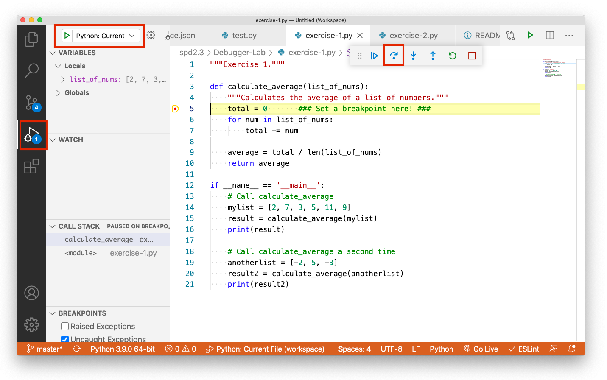
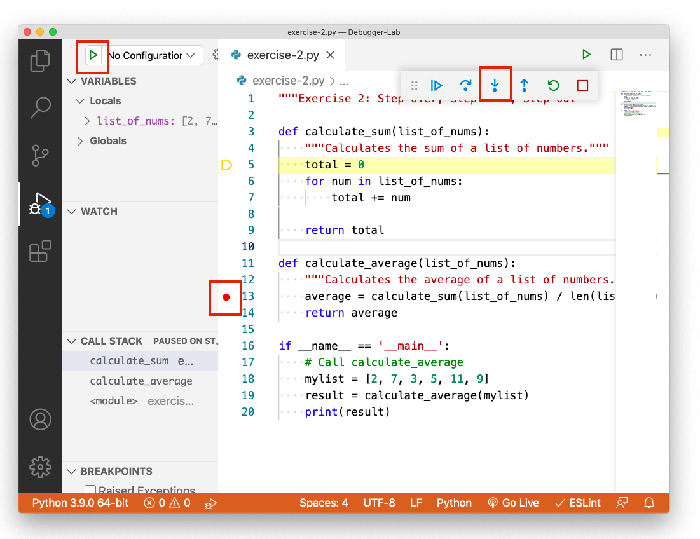
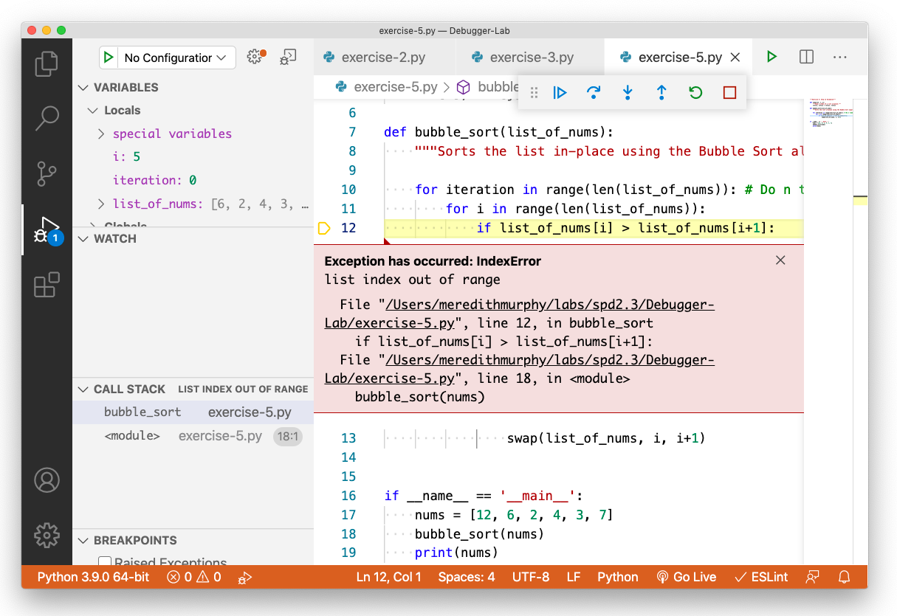
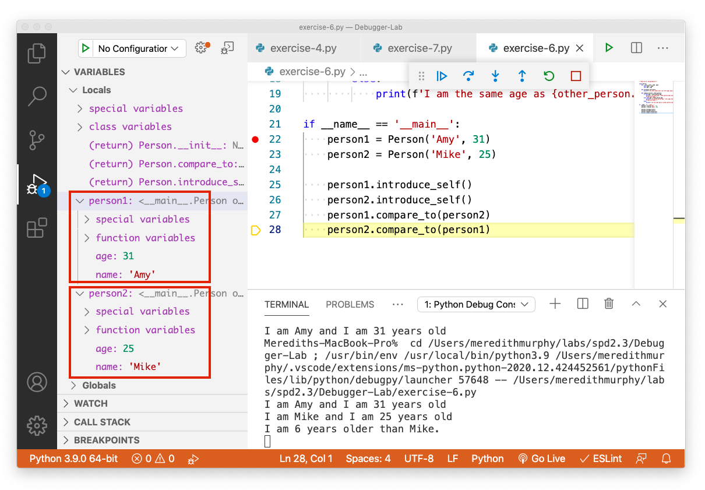

# VSCode Debugger Lab

## Purpose (Why should I do this?)

This lab is designed to get you started with using the Visual Studio Code Python debugger tool. This tool is very similar to other professional-style debuggers, so even if you happen to switch languages or IDEs, it's possible that the debugger you use will look very familiar!

It's important that every software engineer is familiar with how to use a professional debugger tool. You will use them a lot in industry! It will also help you to level up your coding skills when working on any other project - it makes your debugging process easier and more effective!

## Getting Started

First, **clone this repository** to your computer:

```
git clone git@github.com:Make-School-Labs/VSCode-Debugger-Lab.git
```

Then, open this folder in Visual Studio Code. You can either add it to an existing workspace with `File -> Add Folder to Workspace`, or create a new workspace.

To run the debugger on a file, click on the "Run" tab on the far left-hand side of the window, then click the green "Start Debugging" arrow.

## Instructions

### Exercise 1: Step Through Code

Open up `exercise-1.py` and give it a read. This program calculates the mathematical average of 2 lists. The program works correctly, but we are going to use it to practice our debugging skills before tackling real bugs.

**Set a breakpoint** on line 5, just inside the `calculate_average` function. You can set a breakpoint by clicking on the left-hand side of the line number; you should see a red circle appear.


Then, **click on the Debug tab** and **click the green Run button**. Click the `Step Over` button in the controls until the entire function completes. As you do that, watch the "Variables" section of the debug tab! You should see variables come in and out of scope.



Note that this program actually hits the breakpoint twice! Because we are calling the function twice, there are **two times** when we hit line 5 of the program. To verify this, you can click the `Restart` button in the controls, followed by the `Continue` button. After pressing `Continue`, you should see that the `list_of_nums` variable has a different value! When you're finished, you can press the `Stop` button in the controls to exit the debugging view, or just keep pressing `Continue`.

Before moving on to the next exercise, let's review what we've learned:

1. We can set a **breakpoint** to tell our program to stop when it reaches a certain line. Then, we can use the `Step Over` control to keep going line-by-line to see how the program executes from that point.
1. The `Variables` tab contains all in-scope variables at the given point in the program.


### Exercise 2: Step Over, Step Into, Step Out

Open up `exercise-2.py`. It contains the same function as exercise 1, except this time, it's been refactored to use a helper function. Now that we have multiple functions, we want to be able to step through each of them using the debugger.

**Set a breakpoint** on line 13, at the beginning of the `calculate_average` function. Run the debugger as before, then use the `Step Into` button in the controls to step **into** the `calculate_sum` function. 



To keep stepping through this function, you can use either the `Step Over` or `Step Into` buttons (since there's nothing else to step over).

Note that by default, the `Step Into` button **won't step into library code**, such as the `len()` function. It'll only step into functions in your code. How handy!

If you want to run the rest of the `calculate_sum()` function without stepping through it (looking at all those numbers can get tiresome!), **you can use the `Step Out` button** to go back to line 13 in `calculate_average()`. If you press `Step Out` again, it'll take you to line 19 where the `calculate_average()` function was called.

Before moving on, let's review what we've learned:

1. The `Step Over` button will go to the next line of code, without stepping into any helper functions.
1. The `Step Into` button will go to the next line of code; if the current line contains a call to a helper function, it will step into that function call.
1. The `Step Out` button runs the remainder of the current function and goes to where it was called.

### Exercise 3: Set a Watch Expression

Open up `exercise-3.py` and give it a read. This program is a little longer, and it uses a histogram to calculate the number of occurrences of the most common words in a sentence.

**Set a breakpoint** on line 16 (at the beginning of `find_most_common_word`) and step through the code until you get to line 22. You should see that the `sentence`, `list_of_words`, and `word_to_count` variables are now in scope.

Now, **let's create some watch expressions.** Watch expressions can be really useful! You can type in literally any valid Python expression using in-scope variables, and it will be calculated on the spot! Let's test this out - **add a watch expression for the expression `1 + 2`.**


You should be able to see both the expression and its result. Cool! Add two more watch expressions for `len(list_of_words)` which should tell us how many words there are, and `word_to_count['fish']` which tells us the current count of the word `fish`.

Now, continue stepping through the code until you reach the end. See how your watch expression changes over time!

Before moving on, consider: **What is one way you could use watch expressions in code you've written?** Discuss with your partner!

### Exercise 4: Use the Call Stack

Take a look at `exercise-4.py`, which contains a recursive function `fibonacci()`.

**Set a breakpoint** on line 6, at the beginning of `fibonacci()`. This time, we'll use the `Continue` button to step through the code. Run the debugger and press `Continue` a few times. Notice how the call stack gets longer and longer - then after a while, as the recursive calls reach the base case, the call stack gets shorter again.


Clicking into one stack frame will show you the in-scope variables within that particular function call. So, you can see multiple scopes all at once. Pretty cool!

### Exercise 5: Stop on Exception

For this next exercise, we won't need to set any breakpoints at all! Take a look at `exercise-5.py`, which contains a `bubble_sort()` algorithm. Before moving on, see if you can understand what the code is doing. If you're fuzzy on how the Bubble Sort algorithm works, take a look at [this article](https://www.geeksforgeeks.org/bubble-sort/) or watch [this animation video](https://www.youtube.com/watch?v=JP5KkzdUEYI). 

If you run the code as-is, you will get a `list index out of range` error instead of a valid result. If you can identify the bug at this point, that's great - but don't fix it just yet!

Now, **run the debugger _without_ setting a breakpoint**. By default, the debugger tool will stop whenever it encounters an uncaught exception. It should look like this:



Look through the "Variables" list in the debug tab. See if you can use the in-scope variables to figure out what the error is, and then fix it. Once you fix the error and run the code, you should see the sorted list printed to the console!

### Exercise 6: Using Objects

Take a look at `exercise-6.py`, which contains a class `Person` and some class methods.

**Set a breakpoint** on line 22, and use the `Step Over` button to step through the next few lines. Take a look at the "Variables" list - it should contain a variable for Amy and Mike, with their names & ages nested nicely inside. How cool!



### Exercise 7: Find the Bug(s)

Now it's time to put it all together! Take a look at `exercise-7.py`. It contains the recursive function `replace_substring()`. For example, if we call `replace_substring('an apple and a banana', 'an', 'foo')`, we should get the result of `foo apple food a bfoofooa`. **Read over the code** and see if you can understand what it does.

Now, **run the code** to see what it **actually** outputs. (It's always a good idea to verify that there's a bug before you start debugging!) Then, **set a breakpoint** and use your new debugging skills to step through the code. Since this is a recursive function, there will be multiple stack frames to look through.

When looking over the in-scope variables, see if you can form a **hypothesis** on what values those variables **should** hold, if the program were working correctly. Whenever your hypothesis doesn't match reality, **find the source of the discrepancy** and see if you can fix it.

As you are working, **fill out the `debug_log.md` file** with an explanation of how you used the tools we've covered to find the bugs. You'll turn this in as your homework assignment.

This one might take you a while! It requires some critical thinking as well as understanding someone else's code. If you're still stuck after working on the problem for a while, you can check out the `solutions.md` file which gives the answer.

## Submission

When you are finished with the lab, you will need to submit the `debug_log.md` file to Gradescope.
