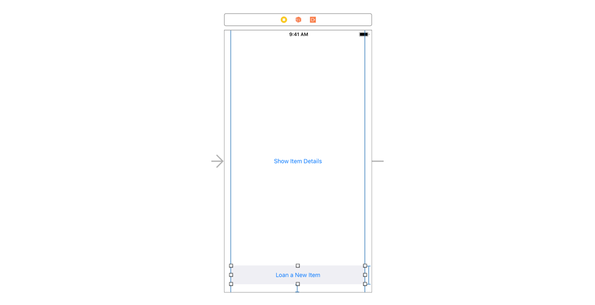

#### Layout ViewController to segue to a New Item
1. Add another button just like the floating button in the *ItemDetailedViewController*:
	1. Add the same constraints from *ItemDetailedViewController*



2. Add a segue from the *Loan a New Item* button to a new `UIViewController` and set it as a *show* segue
	1. segue identifier *show new item*
	2. Create a new class named *ItemEditorViewController* and *update the identity* of the new view controller

3. In `Item.swift` add the following constructors

```swift
struct Item {
    ...
    init(itemTitle: String) {
        self.itemTitle = itemTitle
    }

    init(itemTitle: String, notes: String, itemImage: UIImage, loanee: Loanee?) {
        self.itemTitle = itemTitle
        self.notes = notes
        self.itemImage = itemImage
        self.loanee = loanee
    }
}
```
4. In the `ViewController.swift` add a method to that creates a blank Item

```swift
class ViewController: UIViewController {

    func createNewItem() -> Item {
        return Item(itemTitle: "Untitled Item")
    }
    ...
}
```
5. In `ItemEditorViewController.swift` add the following property

```swift
class ItemEditorViewController: UIViewController {

    var item: Item!

    func updateUI() {
        print(item)
    }

    override func viewWillAppear(_ animated: Bool) {
        super.viewWillAppear(animated)

        updateUI()
    }
}
```
6. Pass the new item in the `func prepare(segue:)`

```swift
class ViewController: UIViewController {

    override func prepare(for segue: UIStoryboardSegue, sender: Any?) {
        if let identifier = segue.identifier {
            switch identifier {
            case "show new item":
                guard let itemEditorVc = segue.destination as? ItemEditorViewController else {
                    return print("storyboard not set up correctly")
                }

                let newItem = createNewItem()
                itemEditorVc.item = newItem
            default: break
            }
        }
    }
}
```

## Layout Item Editor View Controller
1. recreate the same nav bar from *ItemDetailedViewController* but don’t include the trash button
	1. Set the back button title to *Cancel*


2. Layout the Item Details to look like the following


3. ImageView
	1. Content Mode to *Aspect Fit*
	2. User Interaction Enabled *True*
4. TextField
	1. Return Key *Done*
5. Notes Button
	1. Titled *Add Notes*
	2. Line Break to *Truncate Tail*
	3. Control Horizontal Alignment to *leading*
6. Duplicate the *Floating button* from the *Home Screen* and constraint it to the bottom of this screen
	1. Add the same constraints from pervious
	2. Set the title of the button to *Contact Info*
	3. Add a vertical spacing constraint between the outer stack view and the top of the floating button
		1. Update the *Relation* of the constraint we just aded and set it to *Greater Than or Equal*
		2. Constant set to *32*


::testable state: can show how the view controller looks::

#### Update the UI from the given item
1. Create outlets in the `ItemEditorViewController.swift`

```swift
class ItemEditorViewController: UIViewController {
	  ...
    @IBOutlet weak var labelTitle: UILabel!
    @IBOutlet weak var buttonLeft: UIButton! //<- this is named buttonLeft because this button will have two different titles: Cancel for adding a new item and Done for editing an existing item
    @IBAction func pressLeftButton(_ sender: Any) {
        //TODO: confirm with user if they're sure they want to cancel adding a new item
    }

    @IBAction func pressItemImage(_ sender: Any) {
        //TODO: present the photo library picker to pick an image for the item
    }

    @IBOutlet weak var imageViewItem: UIImageView!
    @IBOutlet weak var textFieldItemTitle: UITextField!
    @IBOutlet weak var buttonNotes: UIButton!
    @IBAction func pressNotes(_ sender: Any) {
        //TODO: present a notes view controller to edit the item's notes
    }

    @IBAction func pressContactInfo(_ sender: Any) {
        //TODO: segue to the next step only if the user has select an image and added an item title
    }
	  ...
}
```
2. To allow the user to tap on the UIImageView, use a TapGestureRecognizer on the UIImageView
	1. *note* be sure enable the *UIImageView.isUserInteractionEnabled = true* in the storyboard or in code
3. Update the `func updateUI()` with the following

```swift
class ItemEditorViewController: UIViewController {
	  ...
    func updateUI() {
        labelTitle.text = "Item Details"
        imageViewItem.image = item.itemImage
        textFieldItemTitle.text = item.itemTitle
        if item.notes.isEmpty {
            buttonNotes.setTitle("Add Notes", for: .normal)
        } else {
            buttonNotes.setTitle(item.notes, for: .normal)
        }
    }
}
```
::testable state: update the ui from a new item::
