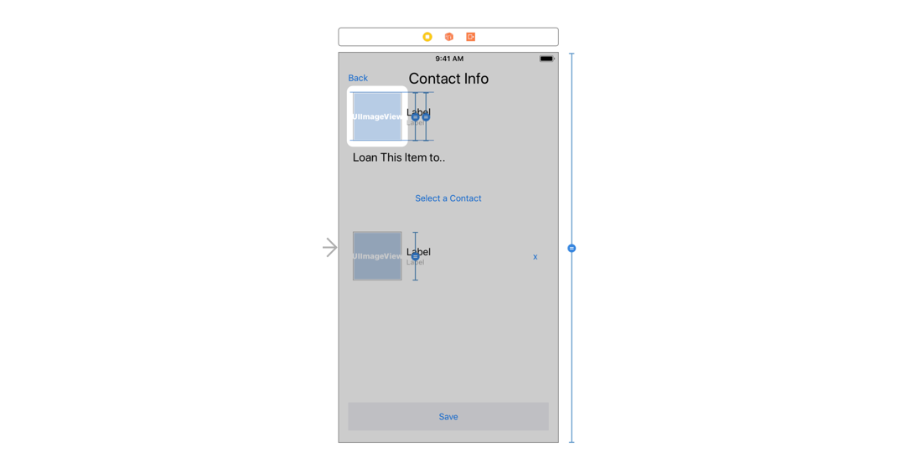
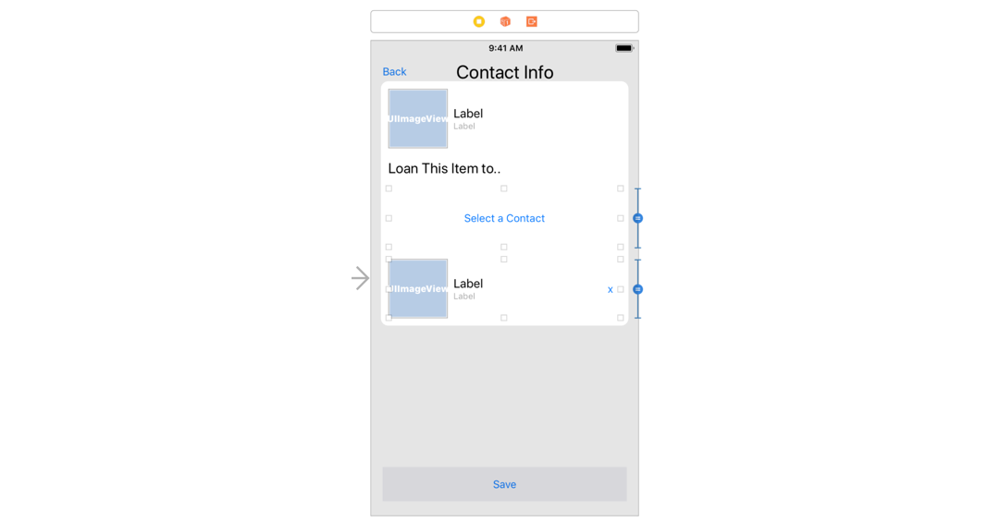

## Layout Item Contact Info View Controller
#### Layout ItemContactInfoVc
1. Add the following elements: *UIImageView + 2 UILabels* *UILabel* *UIButton* and a *UIImageView + 2 UILabels + UIButton*


2. Embed all *four elements/groups* into an *outer horizontal stack view*
	1. Alignment *Fill*
	2. Distribution *Fill*
	3. Spacing *16px*
	4. Pin this stack view with the following constraints
		1. Top *8px to nearest neighbor*
		2. Leading and trailing *8px to container’s margins*
3. Both UIImageView’s have *equal heights* and have *Aspect Ratio of 1:1*
4. The first *UIImageView.height = View.height* with a multiplier of *1:8*



6. The *UIButton.height = second Horizontal StackView.height*



7. Duplicate the *floating button*
	1. Add the same constraints
	2. Name the title *Save*
	3. Add a vertical spacing constraint between the *Save button* and the *horizontal outer stack view*
		1. Relation *Greater Than or Equal*
		2. Constant *32*
8. Final outcome should look like this
#### Update the UI from the given item
1. Add the following `IBOutlets` and `IBActions` and connect the storyboard with the view controller

```swift
class ItemContactInfoViewController: UIViewController {
	  ...
    @IBOutlet weak var labelTitle: UILabel!
    @IBOutlet weak var imageViewItem: UIImageView!
    @IBOutlet weak var labelItemTitle: UILabel!
    @IBOutlet weak var labelItemNotes: UILabel!
    @IBOutlet weak var buttonAddContact: UIButton!
    @IBAction func pressAddContact(_ sender: UIButton) {
        //TODO: present contact picker
    }

    @IBOutlet weak var stackViewContactInfo: UIStackView!
    @IBOutlet weak var imageViewContact: UIImageView!
    @IBOutlet weak var labelContactName: UILabel!
    @IBOutlet weak var labelContactNumber: UILabel!
    @IBAction func pressDeleteContact(_ sender: UIButton) {
        //TODO: clear loaner property and update ui
    }

    @IBOutlet weak var buttonSave: UIButton!
    @IBAction func pressSave(_ sender: UIButton) {
        //TODO: validate input and unwind from save
    }
}
```
2. Add an `func updateUI()`

```swift

class ItemContactInfoViewController: UIViewController {
    ...
    func updateUI() {
        labelTitle.text = "Contact Info"
        imageViewItem.image = item.itemImage
        labelItemTitle.text = item.itemTitle
        if item.notes.isEmpty {
            labelItemNotes.text = "No Notes"
        } else {
            labelItemNotes.text = item.notes
        }

        updateContactInfo()
    }

    func updateContactInfo() {
        if let contact = item.loanee {
            buttonAddContact.isHidden = true
            stackViewContactInfo.isHidden = false
            imageViewContact.image = contact.profileImage
            labelContactName.text = contact.name
            labelContactNumber.text = contact.contactNumber ?? "No Number"

        } else {
            buttonAddContact.isHidden = false
            stackViewContactInfo.isHidden = true
        }
    }
    ...
    override func viewDidLoad() {
        super.viewDidLoad()

        updateUI()
    }
}
```

::testable state: view the item from the first view controller be passed to the second::
