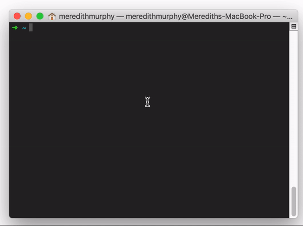
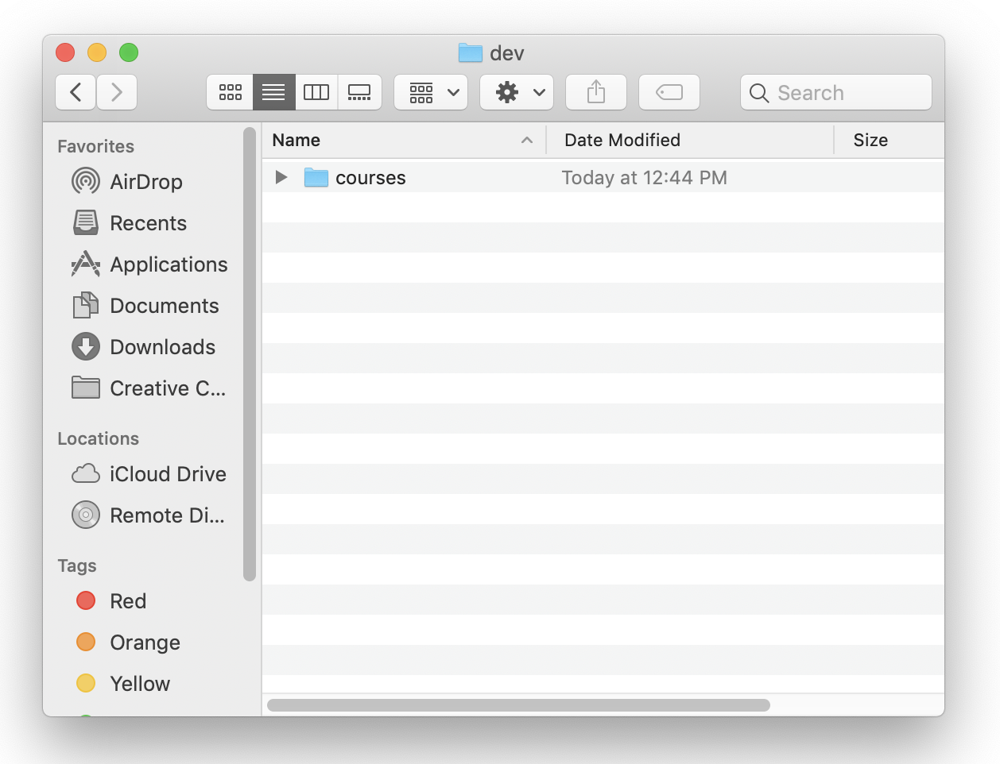

The Terminal is an application that gives you command line control over your system, meaning you can type commands in  text form and the computer does stuff. For developers the terminal is one of the most important tools in our toolbox. It may seem weird to want to use a simple text based command system when we have all these awesome graphics, but the Terminal gives you control over almost everything on your computer! It can also be faster and more flexible as you dive deeper into the world of coding.

Since it's one of our most important tools we are going to make sure to polish it up (we're going to make our terminal pretty and work well).

# Make Your Terminal Professional

> [action]
>
> 1. Use the keyboard shortcut `command` + `spacebar` and type "terminal" to open your terminal.
> 1. Now use the keyboard shortcut `command` + `,` to open your preferences (this keyboards shortcut works for every program on your computer!).
> 1. Set your profile to "Pro" and click "Default".

Looking professional!

# Make a dev or code directory

All good developers have well organized folders and files in their computer. Always keep your folders, files, and desktop clean and organized. It will make you work faster and look and feel more professional.

## IMPORTANT NOTE ON $

Whenever you see code prefixed with a dollar sign `$`, that indicates that it's a command to be entered in the command prompt. **Don't include the `$` when you paste the command in.**

## Create a dev directory

A best practice to organize your code projects is to create one folder called either `dev` or `code` in the root of your computer.

> [action]
>
> **REMEMBER: Don't include the `$` when you paste a command in to your terminal!**
>
> 1. Use your terminal to make this now.
>
	```bash
	$ mkdir dev
	$ cd dev
	```
>
> 1. Now you are in your `dev` folder. You should create your portfolio coding projects in this folder!
> 1. Let's add one more thing which is a folder for your courses. In this folder you can make directories for your coursework.
>
	```bash
	$ mkdir courses
	```



> [info]
>
> Don't worry if your terminal has a different color scheme, or if the style doesn't match up 100% to the image. You will learn more as you get into your first classes!

Great! Now, if you explore the `dev` folder in Finder, you should see the `courses` folder we just created.

> [action]
>
> 1. Use the keyboard shortcut `command` + `spacebar` and type "finder" to open Finder.
> 1. In the menu at the very top of your screen, go to "Go" -> "Home".
> 1. Click on the "dev" folder to open it in Finder and check that it contains a folder "courses".



If this step was difficult for you, don't worry - we'll be going over Terminal in much more detail during Term 1.

# Show Hidden Files

As a developer, it's often very useful to be able to see hidden files and folders in Finder. They're hidden because messing with them can cause problems, but we're fancy-pants developers and we're not afraid.

Showing hidden files is useful because a lot of the coding tools we will be using have hidden files associated with them that aren't normally visible to an average computer user.

> [action]
>
> 1. Open your Finder application, go to File->New Window. Once the window is open press CMD + SHIFT + . which will tell the finder to show hidden files.

<!-- -->

# Homebrew

Homebrew is a package manager for Mac OS. It makes it easy to install software packages from the terminal while also installing and managing their dependencies. For more information, see the [Homebrew website](http://brew.sh/)

> [action]
>
> Install Homebrew by following the install instructions on the [Homebrew website](http://brew.sh/)

If you already have Homebrew installed, you need to update your formulae by running:

```bash
$ brew update
```

This may take several minutes to download updates, so be patient while it completes.

# Node

Node is an open-source, cross-platform, JavaScript runtime environment that executes JavaScript code outside a web browser. It allows us to run JavaScript programs on our computer.

> [action]
>
> Install Node by running the following in Terminal:
>
```bash
$ brew install node
```

If you've already installed Node, you can verify that it's been updated to the latest version by running:

```bash
$ node -v
```


# Run Make School's Bash Setup Script

What about bash color coding? We've got ya covered! Make School has our own custom script to help you set up your terminal settings. It should take less than 30 seconds! However, for a full walkthrough of how to run the script, watch [this video](https://www.youtube.com/watch?v=35A1mDFRrBY).

> [action]
>
> Go to [make.sc/bash-setup](https://make.sc/bash-setup) and follow the steps to run Make School's bash setup script to set up your terminal.

<!-- -->
