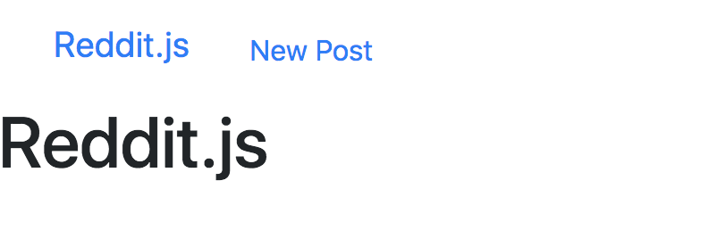
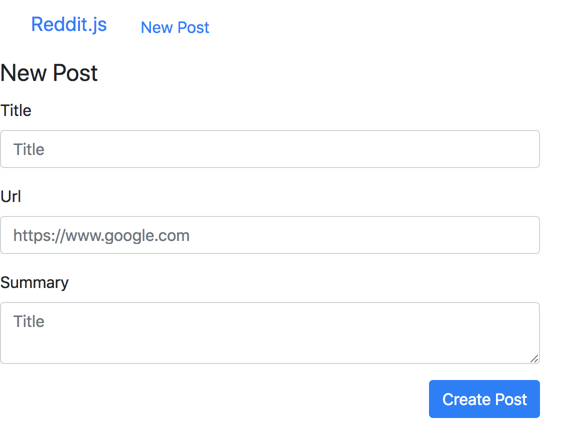

Follow the technical planning list we made, and make sub tasks for each major feature.

1. **Create a post**
   1. Make a /posts/new route (`/posts/new`) and template (`posts-new.handlebars`)
   1. Add form to `posts-new` template
   1. Make `create` posts route and check that form data is sending to new route
   1. Add `Post` model with mongoose
   1. Confirm posts are saving to database
1. Show all posts
1. Show one post
1. Comment on posts
1. Create subreddits
1. Sign up and Login
1. Associate posts and comments with their author
1. Make comments on comments
1. Vote a post up or down

## New Post Form

To create a new instance of a resource, we first have to make a button to make a new post.

> [action]
> Since making a post is a very important **Call To Action (CTA)**, we'll put it in the navbar.

```html
<li><a href="/posts/new" class="btn btn-primary navbar-btn">New Post</a></li>
```

Next, we have to create the form. Let's follow RESTful routing and make the url match this pattern: `/<<RESOURCE NAME PLURAL>>/new`. In the case of a resource `Post`, the path will be `/posts/new`.

> [action]
> Create this `/posts/new` route and have it render a newly created template named `posts-new.handlebars`.
>
> Now, use the [bootstrap form classes](https://getbootstrap.com/docs/5.0/forms/overview/#overview) to add a form for an object with a `title`, `url`, and `summary` attributes. Your form should have an action that points to a `create` route => `/posts`.
>
> **Remember** to put this form in the center 4 columns of a grid.

```html
<div class="row">
  <div class="col-sm-4 col-sm-offset-4">
    <form action="/posts/new" method="post">
      <legend>New Post</legend>
      <div class="form-group">
        <label for="post-title">Title</label>
        <input
          type="text"
          name="title"
          class="form-control"
          id="post-title"
          placeholder="Title"
        />
      </div>
      <div class="form-group">
        <label for="post-url">Url</label>
        <input
          type="url"
          name="url"
          class="form-control"
          id="post-url"
          placeholder="https://www.google.com"
        />
      </div>
      <div class="form-group">
        <label for="post-summary">Summary</label>
        <textarea
          name="summary"
          class="form-control"
          id="post-summary"
          placeholder="Summary"
        ></textarea>
      </div>
      <div class="text-right">
        <button type="submit" class="btn btn-primary">Create Post</button>
      </div>
    </form>
  </div>
</div>
```

Your nav bar should look like the following:



And the form:


## Submit the Form

So what happens when you submit this form?

Nothing! We're missing a `/posts/new` route, so let's make it.

> [action]
> First, make a new folder called `controllers`. Within, create the file `posts.js`.
>
```js
module.exports = (app) => {
  // CREATE
  app.post('/posts/new', (req, res) => {
    console.log(req.body);
  });
};
```
>
> Next, require this file in your `server.js` file, and pass in the `app` variable as an argument.
>
```js
require('./controllers/posts')(app);
```

What happens when you submit the form?

Is `req.body` defined? No?

That's because you need to parse the json coming in through the `req.body`.

It's time to get `req.body` to reflect and contain the submitted form inputs from your front-end.

## Req.body for Middleware

Research what [express json](https://expressjs.com/en/api.html) does in the documentation.

While you're at it, also research the role of [express validator](https://express-validator.github.io/docs/). What role does it play alongside the `express.json()` middleware?

Essentially, `express.json()` is a necessary middleware to communicate with your `POST` requests.

`express-validator` is a wrapper around [validator.js](https://github.com/chriso/validator.js) that validates and sanitizes string inputs.

> [info]
> In production, your users will try to type in all kinds of nonsense into your forms --- even things your site wasn't intended to deal with! `express-validator` plugs into the Express.js ecosystem and helps keep you and your code safe.


> [action]
> Install `express-validator`:
>
```bash
npm install express-validator
```
>
> Note: as of npm 5.0.0 installed modules are added as a dependency by default. The `--save` option is no longer needed.
> [Stack Overflow Answer](https://stackoverflow.com/questions/19578796/what-is-the-save-option-for-npm-install)


> [action]
> Next, add the following to your `server.js` file:
>
```js
app.use(express.json());
app.use(express.urlencoded({ extended: false }));
```


## Connecting to your database

You're going to need to connect to a NoSQL database called [MongoDB](https://docs.mongodb.com/). Look through the documentation as a reference if you get stuck. It's just a good habit to get into.

> [action]
> Let's start off by creating a new `/data` folder in the top-level structure of your project, then create a new JavaScript file.
>
> Open your terminal and type:
>
```bash
mkdir data
cd data
touch reddit-db.js
```

Now, we need to make sure that we have `mongodb` installed by doing a `which` command.

> [action]
> You should see a destination path to the Mongo executable:
>
```bash
$ which mongod
/usr/local/bin/mongod
```
>
> We're also going to make sure that our Mongo database is running:
>
```bash
brew services restart mongodb-community
```

Great! Next, we're going to use the `reddit-db.js` file we made earlier to connect to the database.

> [action]
> Open `reddit-db.js`, and paste the following code inside:
>
```js
/* Mongoose Connection */
const mongoose = require('mongoose');
assert = require('assert');
>
const url = 'mongodb://localhost/reddit-db';
mongoose.connect(
  url,
  {
    useNewUrlParser: true
  },
  function(err, db) {
    assert.equal(null, err);
    console.log('Connected successfully to database');
>
    // db.close(); turn on for testing
  }
);
mongoose.connection.on('error', console.error.bind(console, 'MongoDB connection Error:'));
mongoose.set('debug', true);
>
module.exports = mongoose.connection;
```

Now all that's left is to tie this into our main `server.js` file.

> [action]
> Open up `server.js`, and paste this in:
>
```js
// Set db
require('./data/reddit-db');
```

## Saving to the Database

In order to interact with the MongoDB database we're going to use the npm module [`mongoose`](https://www.npmjs.com/package/mongoose). Mongoose is the ODM - the Object Document Mapper. That means that it maps JavaScript objects in our application to documents in the database. Mongoose works through schemas, written in code, called Models.

**IMPORTANT NOTE:** Make sure that you put all middleware requires **_BEFORE_** all routes (including routes imported from other files), or your routes may not work!

> [action]
>
> Read the note above again! No really, re-read it so that you remember to do this throughout the tutorial. Your future self will thank you from all the time/frustration you save


> [action]
> Create the folder `models` and inside put the `post.js` file. Here's a sample model for our `Post` resource.
> We can use [destructuring](https://developer.mozilla.org/en-US/docs/Web/JavaScript/Reference/Operators/Destructuring_assignment) to get `Schema` directly from the require statement.
> If you would like a video explaining destructuring check out [JS Destructuring in 100 Seconds](https://vid.puffyan.us/watch?v=UgEaJBz3bjY)
>
```js
const { Schema, model } = require('mongoose');
>
const postSchema = new Schema({
  title: { type: String, required: true },
  url: { type: String, required: true },
  summary: { type: String, required: true }
});
>
module.exports = model('Post', postSchema);
```
>
> Now that we have a model, require it at the top of `controllers/posts.js`:
>
```js
const Post = require('../models/post');
```
>
> Put it to use in our "create posts" endpoint:
>
```js
const Post = require('../models/post');

module.exports = (app) => {

  // CREATE
  app.post('/posts/new', (req, res) => {
    // INSTANTIATE INSTANCE OF POST MODEL
    const post = new Post(req.body);

    // SAVE INSTANCE OF POST MODEL TO DB AND REDIRECT TO THE ROOT
    post.save(() => res.redirect('/'));
  });
>
};
```
>
> Notice how `res.direct` is on the same line and we have left out the curly brackets.
> This is not a mistake. If an arrow function only has one line in the curly brackets and we want to return that line, we can put it on the same line and remove the curly brackets.
> [Read more](https://codeburst.io/javascript-understand-arrow-function-syntax-ab4081bba85b?gi=b9a68f0812ca).
> 
> Additionally, we want to ensure we always return the `res` and exit the code execution, unless we have a specific reason why we want to continue the code execution.

## Confirming Posts are Saving

So we can save to the database, but how can we be sure? There are a couple of ways! We could go into the `mongo` shell and inspect our database, observing that the `posts` collection is now populated with documents. Alternatively, we can use a program, [Robo 3T](https://robomongo.org/download), to graphically inspect our database and observe what collections and documents we've created.

Use either the `mongo` shell or [Robo 3T](https://robomongo.org/download) to confirm you are successfully creating posts before moving on.

## Now Commit

```bash
$ git add .
$ git commit -m 'Users can submit and save posts'
$ git push
```

## STRETCH CHALLENGE: Adding Created At and Updated At Attributes

> [challenge]
> Create a new model, and figure out how you can display these new attributes in your app:

```js
const { Schema, model } = require('mongoose');

const postSchema = new Schema({
  title: { type: String, required: true },
  url: { type: String, required: true },
  summary: { type: String, required: true },
}, { timestamps: true });

module.exports = model('Post', postSchema);
```

As of Mongoose 4.0 you can now set [timestamps](https://mongoosejs.com/docs/guide.html#timestamps) options on the Schema and have Mongoose handle the created at and updated at attributes for you. The type assigned is `Date`.
