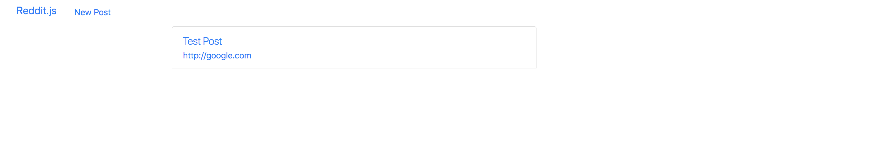
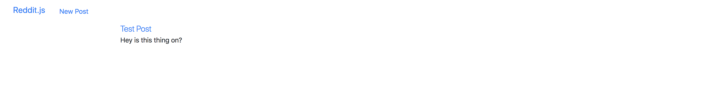

Alright next step! Now that we can create posts, let's display them.

1. Create a post
1. **Show all posts and show one post**
   1. Make the root route (`/`) go to the `/posts/index` route render a `posts-index` template
   1. Style the template and loop over the `posts` object
   1. Make route to `/posts/show` route (`/posts/:id`)
   1. Style the template and display the `post` object
1. Show one post
1. Comment on posts
1. Create subreddits
1. Sign up and Login
1. Associate posts and comments with their author
1. Make comments on comments
1. Vote a post up or down

## Connection Script

Next, you'll need to handle promises from the Mongoose perspective.

I'm going to encourage the use of `promises` to handle asynchronous transactions. As of Mongoose 5.0 native promises are used by default. [Read more](https://stackoverflow.com/questions/51862570/mongoose-why-we-make-mongoose-promise-global-promise-when-setting-a-mongoo)

Finally, for testing, we can add an error handler for connection errors.

> [action]
> Open `/data/reddit-db.js` and make the following changes to support connection error handling and promises:

```js
mongoose.connect(
  url,
  {
    useNewUrlParser: true, useUnifiedTopology: true, useCreateIndex: true, useFindAndModify: false,
  },
  (err) => {
    assert.equal(null, err);
    console.log("Connected successfully to database");
>
    // db.close(); turn on for testing
  }
);
mongoose.connection.on('error', console.error.bind(console, 'MongoDB connection Error:'));
```

Note that the following line we included previously allows us to display debug info from Mongoose in the console:

```js
mongoose.set("debug", true)
```

## /Posts/Index Route

> [action]
> Next, let's create a `posts-index` template in our `views` folder. Don't worry about it looking fancy right now, we'll spruce it up in a bit. Just have it display `hello world` for now, or something equally simple.
>
> Once that's created, we want to have the root route (`/`) render the `posts-index` template. We also need to then pull the `posts` out of the database, and send them along with the response. Let's edit our `INDEX` call in our `posts.js` controller. Remember to put it AFTER you require all the middleware:

```js
app.get("/", (req, res) => {
  Post.find({})
    .lean()
    .then((posts) => res.render("posts-index", { posts }))
    .catch((err) => {
      console.log(err.message)
    })
})
```

**Want more of a challenge?**

> [challenge]
>
> As a stretch challenge try rewritting the code block above to be async/await.
> Here is are some video resources:
>
> [Fireship](https://invidious.tube/watch?v=vn3tm0quoqE)
>
> [The Event Loop](https://invidious.tube/watch?v=cCOL7MC4Pl0)
>
> [Callbacks vs Promises vs RxJs Observables vs async/await](https://invidious.tube/watch?v=jgWnccjXR4I)
>
> And also some text resources:
>
> [Callbacks vs Promises vs RxJS vs async/await](https://academind.com/tutorials/callbacks-vs-promises-vs-rxjs-vs-async-awaits/)
>
> [Async/Await vs Promises](https://levelup.gitconnected.com/async-await-vs-promises-4fe98d11038f?gi=853e56aa6d97)
>
> [async/await vs then/catch](https://www.smashingmagazine.com/2020/11/comparison-async-await-versus-then-catch/)

**Async/Await Solution**

> [solution]
>
> We will not give you the solution to every async/await stretch challenge but hopefully this first one gives you a positive direction to head in.

```js
app.get("/", async (req, res) => {
  try {
    const posts = await Post.find({}).lean()
    return res.render("posts-index", { posts })
  } catch (err) {
    console.log(err.message)
  }
})
```

> Now, how clean does that async/await code look?

Try running this and see if your `posts-index` is being displayed. If so, replace your `hello world` with the variable `{{posts}}`. What do you see?


Now, back to those `posts`! Let's fix them up and display the them properly.

## Styling and Looping Over Posts

> [action]
> If you haven't already, let's go back to our layout template `main.handlebars` and put the whole `{{{body}}}` object into a div with a container class.

```html
<div class="container">{{{body}}}</div>
```

Great, now let's go back to `posts-index.handlebars` and make it look good!

> [action]
> To start, we'll put the list of posts into the middle 8 columns of the grid.

```html
<div class="row">
  <div class="col-sm-8 col-sm-offset-2">{{!-- more code will go here --}}</div>
</div>
```

Now that we have `{{posts}}`, we can use handlebars' [built in `each` operator](https://handlebarsjs.com/guide/builtin-helpers.html#each) to loop over the posts, and display each one.

> [action]
> In each post, use bootstrap's `list-group` and `list-group-item` classes. Display the post title in a div with the class `lead`, and add an anchor tag that links to the post's url. Finally, add `target="_blank"` to the anchor tag, so that the url opens in a new tab. Here's the full `posts-index.handlebars`:

```html
<div class="row">
  <div class="col-sm-8 col-sm-offset-2">
    <ul>
      {{#each posts}}
      <li class="list-group-item">
        <div class="lead">{{this.title}}</div>
        <a href="{{this.url}}" target="_blank">{{this.url}}</a>
      </li>
      {{/each}}
    </ul>
  </div>
</div>
```

## Now Commit

```bash
$ git add .
$ git commit -m 'Users can view a list of posts'
$ git push
```

## Viewing One Post

In order to view a single post when a user clicks on it, we'll need to establish a route for individual posts, and render them in their own template.

Let's begin with the **user action** - clicking on a post in the `post-index` template.

> [action]
> Replace the current `div` for displaying a post's `title` with the following:

```html
<div class="lead"><a href="/posts/{{this._id}}">{{this.title}}</a></div>
```

The title is a link to the show page. If we click it, what happens? Error! No route! It's time to fix that.

## /Posts/Show Route

We need the path `/posts/:id` to resolve to displaying a `posts-show` template.

> [action]
> open `controllers/posts.js`, and add a new GET endpoint. Make sure all middleware requirements happen ABOVE it:

```js
// LOOK UP THE POST
app.get("/posts/:id", (req, res) => {
  Post.findById(req.params.id)
    .lean()
    .then((post) => res.render("posts-show", { post }))
    .catch((err) => {
      console.log(err.message)
    })
})
```

**Async/Await stretch challenge!**

> [challenge]
>
> Refactor the code block above to be async/await.
> If you get stuck, there are video and text resources linked at the first async/await stretch challenge.

What happens if we refresh? No template!

## Making the Template

Time to template. As a bare minimum we'll use some bootstrap classes to make things look reasonable as we continue to develop the application.

> [action]
> In your `views` folder, make `posts-show.handlebars` with the following template:

```html
<div class="row">
  <div class="col-sm-6 col-sm-offset-3">
    <a href="{{post.url}}" class="lead">{{post.title}}</a>
    <p>{{post.summary}}</p>
  </div>
</div>
```

## Product So Far

Now can you see your post?



What about clicking into your post?



## Now Commit

```bash
$ git add .
$ git commit -m 'Users can see individual posts'
$ git push
```
