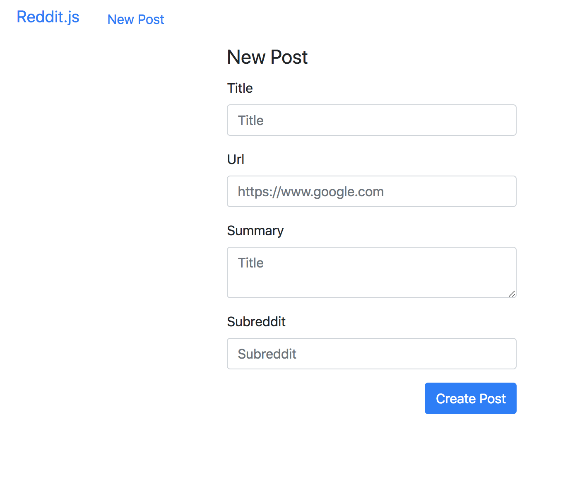
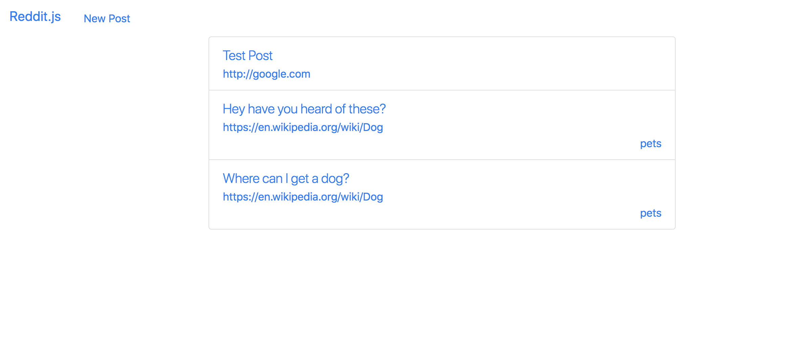
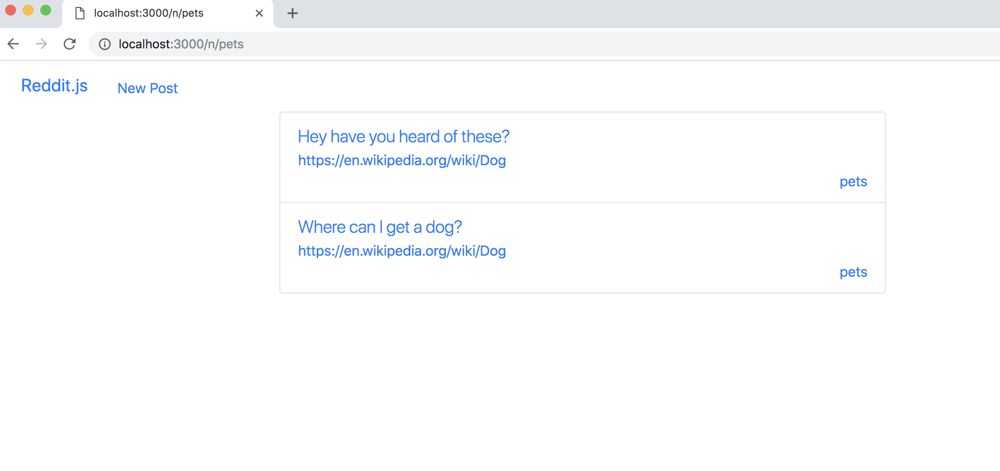

We've got posts, but let's categorize them into subreddits.

1. Create a post
1. Show all posts
1. Show one post
1. Comment on posts
1. **Create subreddits**
    1. Add a `subreddit` attribute to our post resource
    1. Navigate to view all the posts of the same subreddit
1. Sign up and Login
1. Associate posts and comments with their author
1. Make comments on comments
1. Vote a post up or down

# Create Subreddits

In Reddit, all posts are associated with one or more "subreddit". You can view subreddits by navigating to the path `/r/<<NAME OF SUBREDDIT>>`. For example some wonderful giggle-fests include [/r/funny](https://www.reddit.com/r/funny/), [/r/youtubehaiku](https://www.reddit.com/r/youtubehaiku/).

In general this pattern is called "categories". Its used all over the web. Consider news stories that have 1 category like "Politics" or "World Affairs" or "Sports". Or think about products that have 1 category like "Home" or "Wellness" or "Grocery". We're going to categorize our posts, in the context of Reddit, these categories are called "Subreddits".

It might seem quite complex to create subreddits, but using the flexibility and powers of a schemaless, document-based database, we can actually make subreddits extremely quickly!

# Thinking Like MongoDB

If we were using a SQL database we would have to make a new table called "subreddits" and then we would do a join between posts and their parent subreddit. However, in a schemaless database we can save the name of the subreddit with the post, and search for all posts with a subreddit. Let's look at how we'd implement this simple solution.

> [action]
> First, we work from what the users sees, so we need to add a subreddit field to our posts form in `posts-new`.
>
```html
<div class="form-group">
  <label for="post-subreddit">Subreddit</label>
  <input name="subreddit" type="text" class="form-control" id="post-subreddit" placeholder="Subreddit">
</div>
```
>
>Next we update our `Post` model to have a `subreddit` attribute. This attribute will just be a `String`.
>
```js
subreddit: { type: String, required: true },
```

After that, your form should look like this:



Now when you make a new post, you should be able to type in a subreddit string and save the post.

The post should save with its new subreddit string, but we won't be able to see it just yet.

> [action]
> Let's see that subreddit by adding it to the display of our posts in `posts-index`.
>
```html
<li class="list-group-item">
  <div class="lead">
    <a href="/posts/{{this._id}}" class="lead">{{this.title}}</a>
  </div>
  <a href="{{this.url}}" target="_blank">{{this.url}}</a>
  <div class="text-right">{{this.subreddit}}</div>
</li>
```

# Viewing a Subreddit

Now that posts can be categorized, let's make it so we can view all the posts of a single subreddit.

Once again, we start with what the user sees and can do. Let's turn each post's subreddit into a link that displays all posts of that subreddit. We'll use the same `/r/<<SUBREDDIT NAME>>` pattern as reddit does, but we'll use an 'n' for "Node-Reddit":

> [action]
> Tweak your code in `posts-index` to allow for the subreddit to be a link:
>
```html
<li class="list-group-item">
  <div class="lead">
    <a href="/posts/{{this._id}}" class="lead">{{this.title}}</a>
  </div>
  <a href="{{this.url}}" target="_blank">{{this.url}}</a>
  <div class="text-right">
    <a href="/n/{{this.subreddit}}">{{this.subreddit}}</a>
  </div>
</li>
```



Now if you click this link what happens? No route!

# Resolving the `/n/subreddit` Route

Let's see if we can make this route work.

> [action]
> As a sanity check on our route setting, let's have the terminal output the subreddit name in the url when you navigate to it. Add the following code to your `posts` controller. Remember to put it AFTER you require all the middleware:
>
```js
// SUBREDDIT
app.get('/n/:subreddit', (req, res) => {
  console.log(req.params.subreddit);
});
```

**Async/Await stretch challenge!**
>[challenge]
>
Refactor the code block above to be async/await.
If you get stuck, there are video and text resources linked at the first async/await stretch challenge in the Displaying All Posts section.

Let's switch out our console log for an actual navigation to our subreddit! We want to ensure that we only return posts that have a `subreddit` that matches the one passed into the url.

We can also reuse our `posts-index` template for displaying our posts in the subreddit!

> [action]
>Tweak your `app.get('/n/:subreddit'` call to return actual posts:
>
```js
// SUBREDDIT
app.get('/n/:subreddit', (req, res) => {
  Post.find({ subreddit: req.params.subreddit }).lean()
    .then((posts) => res.render('posts-index', { posts }))
    .catch((err) => {
      console.log(err);
    });
});
```

<!-- -->

>[challenge]
>
Refactor the code block above to be async/await.

# Product So Far

How does that look? Are you getting just posts with that subreddit?

**BOOM** - Subreddits!



But before we forget...

# Now Commit

```bash
$ git add .
$ git commit -m 'Users can see Subreddits'
$ git push
```

# Stretch Challenge

> [challenge]
>
> Make it possible for a post to have multiple subreddits. What would be the changes you would have to make to do that?
