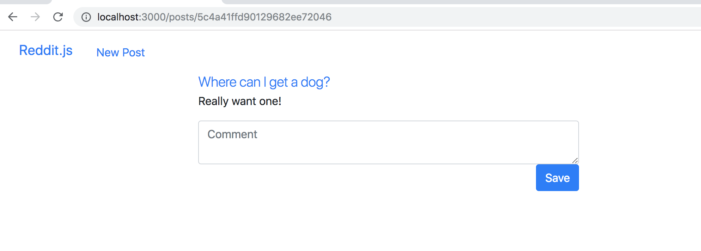
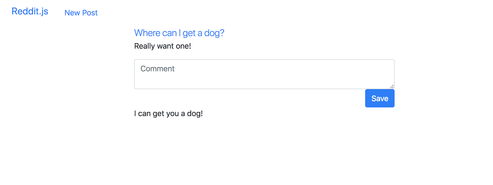

Alright next step! We can see those posts, let's comment on them.

1. Create a post
1. Show all posts
1. Show one post
1. **Comment on posts**
    1. Make a new comment form in the `/posts/show` template
    1. Make a create route for comments
    1. Associate comments with posts
    1. Display comments
1. Create subreddits
1. Sign up and Login
1. Associate posts and comments with their author
1. Make comments on comments
1. Vote a post up


# New Comment Form (with Nested Route)

Remember, we are always coding using an agile and user-centric approach, so we are going to always start any feature from what the user sees and does. Then we'll code back towards what the server and code do.

So, if we want to allow users to comment on these posts, first we can add a comment form to our `/posts/show` page. This form will send its data to a path that resolves to the `/comments/create` action. The path for this link will follow the standard nested RESTful convention `/<<PARENT RESOURCE PLURAL>>/<<PARENT ID>>/<<CHILD RESOURCE PLURAL>>`.

> [action]
> Let's add the following `form` to `posts-show` so that we can write a comment if we're viewing a post:
>
```html
<div class="row">
  <div class="col-sm-6 col-sm-offset-3">
    <a href="{{post.url}}" class="lead">{{post.title}}</a>
    <p>{{post.summary}}</p>
    <form action="/posts/{{post._id}}/comments" method="post">
      <textarea class='form-control' name="content" placeholder="Comment"></textarea>
      <div class="text-right">
        <button type="submit" class="btn btn-primary">Save</button>
      </div>
    </form>
  </div>
</div>
```



If you submit the form, it fails because there is no POST route to `/posts/{{post._id}}/comments` yet. Let's fix that!

# Make Create Comment Route

Now we need a create comment route. We can start with the code we used for the create route for posts.

> [info]
> Remember that a route can be called a number of different names: an endpoint, a webhook, a path, and others.

Follow the pattern you used for the `Post` resource to create a `Comment` resource:

> [action]
> Create a comments controller as a new file `comments.js` in your `controllers` folder
>
```js
module.exports = (app) => {
>
};
```

<!-- -->

> [action]
> Export the comments controller into `server.js`.
>
```js
require('./controllers/comments.js')(app);
```

<!-- -->

> [action]
> Make the CREATE in a nested route (hint: `/posts/:postId/comments`). Remember to put it AFTER you require all the middleware:
>
```js
// CREATE Comment
app.post('/posts/:postId/comments', (req, res) => {
  // INSTANTIATE INSTANCE OF MODEL
  const comment = new Comment(req.body);
>
  // SAVE INSTANCE OF Comment MODEL TO DB
  comment
    .save()
    // REDIRECT TO THE ROOT
    .then(() => res.redirect('/'))
    .catch((err) => {
      console.log(err);
    });
});
```

<!-- -->

> [action]
> Create a Comment model in a `comment.js` file in your `models` folder
>
```js
const { Schema, model } = require('mongoose');
>
const commentSchema = new Schema({
  content: { type: String, required: true },
}, { timestamps: true });
>
module.exports = model('Comment', commentSchema);
```

<!-- -->

>[action]
> Require the comment model in the comments controller
>
```js
const Comment = require('../models/comment');
```

<!-- -->

>[challenge]
>
Refactor all the code blocks above to be async/await.

Alright, let's check our work:

1. Create a comment by submitting your form
1. Confirm that comments are saving by inspecting the database

# Associating Comments and Posts

**The Gotcha** - the gotcha here is that if you just use the same code from `posts.js` you will only create comments in their own collection and not associate them with their parent post. We're going to use a **Reference Association**, which means we will _reference the child document by its id in the parent's document_. The child's id acts similarly to a **Foreign Key** in a SQL database. Let's get to it!

First we'll do the controller logic, then the model logic.

> [action]
> In the controller we need find the parent `Post` from the `:postId` we have in the url parameters, then associate this parent with the comment by pushing the comment into an array in the parent's `comments` attribute that we haven't created yet.
>
> Also remember to add a `require` for your `Post` model, since we'll now be using it within the `comments` controller. Lastly, remember to put the routes AFTER you require all the middleware
>
```js
const Post = require('../models/post');
const Comment = require('../models/comment');
>
...
>
// CREATE Comment
app.post('/posts/:postId/comments', (req, res) => {
  // INSTANTIATE INSTANCE OF MODEL
  const comment = new Comment(req.body);
>
  // SAVE INSTANCE OF Comment MODEL TO DB
  comment
    .save()
    .then(() => Post.findById(req.params.postId))
    .then((post) => {
      post.comments.unshift(comment);
      return post.save();
    })
    .then(() => res.redirect('/'))
    .catch((err) => {
      console.log(err);
    });
});
```

Why did I recommend we use `unshift` here instead of `push`?

> [solution]
> `unshift` adds an element to the front of an array, while `push` adds it to the end. Reddit puts its newest comments at the top, so we want the default order to be reverse chronological order.

<!-- -->

> [action]
> Next we need to add an array attribute to the `Post` model.
>
```js
comments: [{ type: Schema.Types.ObjectId, ref: 'Comment' }],
```

<!-- -->

>[challenge]
>
Refactor all the code blocks above to be async/await.

Finally, create some new comments and confirm that their `_id`'s are being added to this `comments` attribute.

# Displaying Comments

Now that we have the comments associated, we can see them in the parent `post` object.
> [action]
> Let's add them to the `posts-show` template below the new comment form.
>
```html
{{#each post.comments}}
  {{this}}
{{/each}}
```

What do you see?

Just the id's right? **When we do a reference association, we only save the id's into the parent's document**. In order to replace these id's with the actual child document, we have to use the mongoose function `.populate()` when we fetch the parent from the database.

>[action]
> Update your `SHOW` call in your `posts` controller to be the following:
>
```js
// LOOK UP THE POST
Post
  .findById(req.params.id).lean().populate('comments')
  .then((post) => res.render('post-show', { post }))
  .catch((err) => {
    console.log(err.message);
  });
```

<!-- -->

>[challenge]
>
Refactor the code block above to be async/await.

Now do we see the comments? Sure do! Well...at least as an object...

In order to view just the content of the comment, you have to access the `content` attribute of each comment. You can add more style to these if you like, but let's start with just a paragraph tag.

>[action]
> Update your `#each post.comments` body in `posts-show` to display just the `content` and not the entire object:
>
```html
{{#each post.comments}}
  <p>{{this.content}}</p>
{{/each}}
```

# Product So Far

Make a comment, and it should look similar to this:



# Now Commit

```bash
$ git add .
$ git commit -m 'Users can comment'
$ git push
```

Right on! Let's keep at it!
