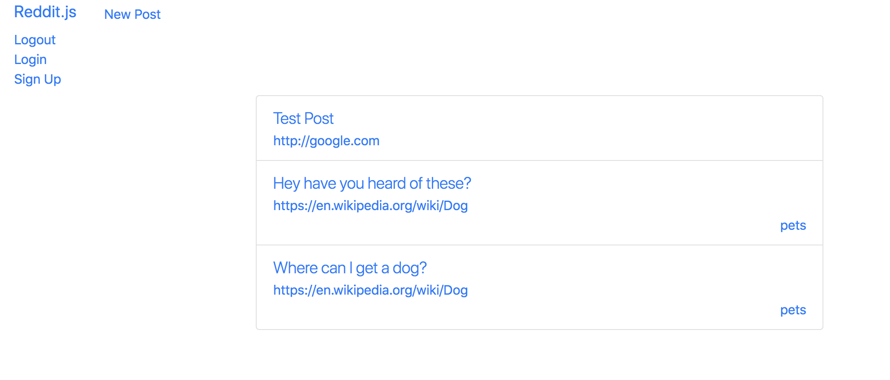
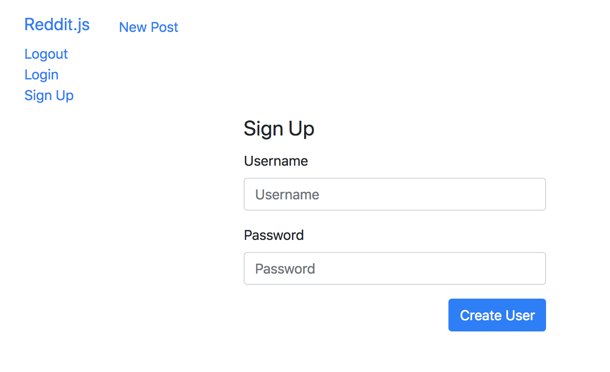
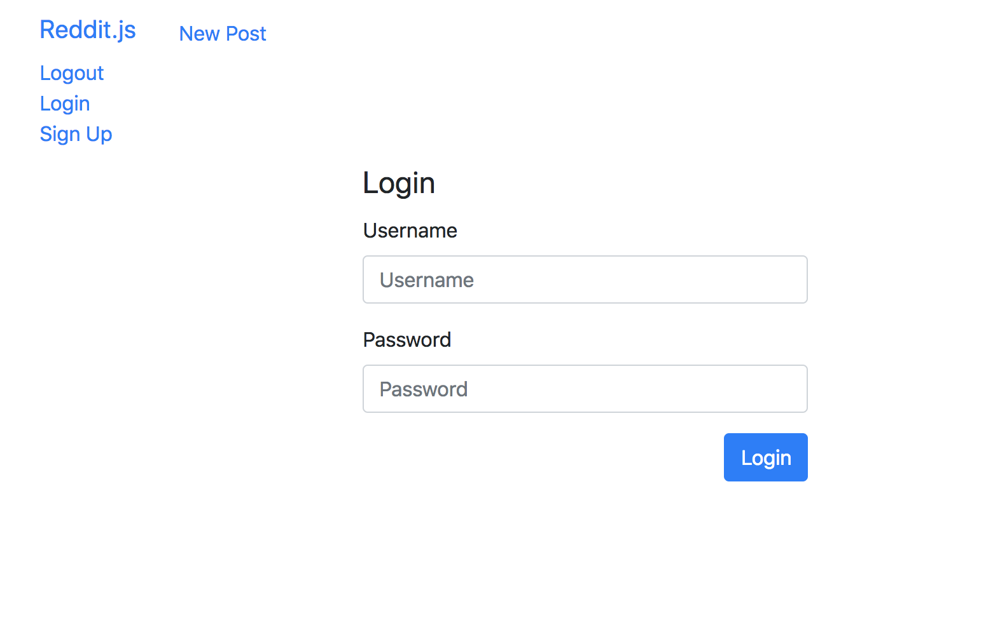

Alright next step! Its time to allow people to take responsibility for the silly things they are posting on our Reddit clone. We are going to create user accounts so folks can securely signup and login using a username and password.

1. Create a post
1. Show all posts
1. Show one post
1. Comment on posts
1. Create subreddits
1. **Sign up and Login**
    1. Make `/sign-up` route, template and form
    1. Make POST `/sign-up` route and logic
    1. Make `User` model
    1. Encrypt users' passwords
    1. Create JWT and add cookies
    1. Demonstrate that user is logged in and password is encrypted
    1. Make `/login` route, template and form
    1. Make POST `/login` route and logic
1. Associate posts and comments with their author
1. Make comments on comments
1. Vote a post up or down

# Make `/sign-up` Route

Always think first about what the user's experience should be, and then develop for that. We'll follow the convention of a "sign up / login" links living in the navbar of our project.

>[action]
> Update `/views/partials/navbar.handlebars` to include `logout`, `login` and `sign-up` links:
>
```html
<nav class="navbar navbar-default">
  <div class="container-fluid">
    ...
    <ul class="nav navbar-nav navbar-right">
      <li><a href="/logout">Logout</a></li>
      <li><a href="/login">Login</a></li>
      <li><a href="/sign-up">Sign Up</a></li>
    </ul>
  </div>
</nav>
```



Now that we have the links, let's make the `/sign-up` route work.

>[action]
> Make a new controller file called `/controllers/auth.js` to put all our authentication routes.
>
```js
module.exports = (app) => {
  // SIGN UP FORM
  app.get('/sign-up', (req, res) => res.render('sign-up'));
};
```
>
> Remember to add this new controller as a `require` within `sever.js`:
>
```js
require('./controllers/auth.js')(app);
```

Now we can create our sign up form with `username` and `password` fields.

# Make the POST Route to `/sign-up`

>[action]
> Use the template code you used to create a post but alter it to fit a username/password form. This should be a new files in your `views` folder called `sign-up` Don't forget:
>
> 1. Set the password input field type to `password`
> 1. Set the action of the form to `/sign-up`
> 1. Put the form in the middle third of the grid.
>
> Define a `User` model. Add a new file called `user.js` in your `models` folder.
>
```js
const { Schema, model } = require('mongoose');
>
const userSchema = new Schema({
  username: { type: String, required: true },
  password: { type: String, select: false },
}, { timestamps: true });
>
module.exports = model('User', userSchema);
```
>
> Next define a route `/sign-up` in `/controllers/auth.js`.
>
```js
const User = require('../models/user');
>
module.exports = app => {
  ...
  // SIGN UP POST
  app.post('/sign-up', (req, res) => {
    // Create User
    const user = new User(req.body);
>
    user
      .save()
      .then(() => res.redirect('/'))
      .catch((err) => {
        console.log(err.message);
      });
  });
};
```

<!-- -->

>[challenge]
>
Refactor the code block above to be async/await.

# Product So Far

Your form should look similar to this:



Now we have a user model, but if we save our password it will be saved in our database as plaintext and not be secure.

# Encrypting the Password

The special issue we have with users is that we can't know their password, so we have to encrypt it. To do that we'll use a project called `bcrypt` that gives us some easy methods to encrypt passwords and save a secure **hashed password** instead of the actual password.

>[info]
> You can think of **hashing** as a function whose input is text (or anything) and whose output is a hashed string: a new, very large string that isn't even remotely similar to the input string.
> If you want to learn more check out [this video](https://vid.puffyan.us/watch?v=cczlpiiu42M) made by Simply Explained.
>
This function can also take in the hashed string as an input and provide the original, pre-hashed string as an output. The idea being that only this function can convert between the two, and that unless you have the secret sauce in that specific instance of that function, you won't be able to crack the hashed string.

All this `bcrypt` logic will live in the `user` model. What we'll do is:

> [action]
>
> 1. Install `bcryptjs` to our project and require it in our model.
> 1. Add a method to our user model that detects if the `password` attribute is being modified, and if it is, salt and hash the password to produce a hashed password that we'll save into the database.
> 1. Lastly, make a model method called `comparePassword()` that takes in an attempted password and returns true or false if the attempt matches what is in the database.

You'll need to 'salt' the password. Read about 'salting' [here](https://en.wikipedia.org/wiki/Salt_(cryptography)). While you can include a your secret 'salt' value in an environment variable that is accessible throughout node. We can use `dotenv` library to help.

> [action]
>
1. Install `dotenv`.
1. Create a file in the root of your project named `.env` and define a variable with the following key-value syntax. Define `SECRET` as the key, and `somehashvalue` as the value: `SECRET=somehashvalue`. `somehashvalue` can be **any** random set of characters.
1. Last, `require('dotenv').config();` as early as possible in your project. Adding it at the top of `server.js` is probably a good idea.

Read more about `dotenv` [here](https://www.npmjs.com/package/dotenv).

> [action]
> Read this implementation closely and implement the same into your `User` model.
>
```js
const { Schema, model } = require('mongoose');
const bcrypt = require('bcryptjs');
>
const userSchema = new Schema({
  username: { type: String, required: true },
  password: { type: String, select: false },
}, { timestamps: true });
>
// Must use function expressions here! ES6 => functions do not bind this!
userSchema.pre('save', function (next) {
  // ENCRYPT PASSWORD
  const user = this;
  if (!user.isModified('password')) {
    return next();
  }
  bcrypt.genSalt(10, (err, salt) => {
    bcrypt.hash(user.password, salt, (_, hash) => {
      user.password = hash;
      next();
    });
  });
});
>
// Need to use function to enable this.password to work.
userSchema.methods.comparePassword = function (password, done) {
  bcrypt.compare(password, this.password, (err, isMatch) => {
    done(err, isMatch);
  });
};
>
module.exports = model('User', userSchema);
```

Now let's sign up and check if our password was encrypted. We'll be able to see if the password is salted and hashed, and later we'll be able to test if the encryption actually worked when we create the login form.

# Create JWT Tokens and Cookies

Besides just creating a user document when the user signs up, we also want to log that user in to our application. What does it mean to be logged in? To be authenticated?

In our case, being logged in will mean that there is an authentic **JWT token - a JSON Web Token - set as a cookie**. This token is another piece of neat encryption that _uniquely identifies a specific user_. We'll use a library called `jsonwebtoken` to generate this token, and then we'll use `cookie-parser` to set this token as a cookie.

>[action]
> Install `cookie-parser` and `jsonWebToken`:
>
```bash
npm install cookie-parser jsonwebtoken
```

# Use Middleware to handle tokens

Use middleware to to authenticate tokens and attach them to `req` object passed to routes.

First, we generate **JSON Web Tokens (JWTs)** --- consequently, we need to require the `jsonwebtoken` module we just installed at the top of the `auth.js` controller. We will use it to generate a JWT _after_ the new user document is saved.

> [action]
> Update TOP of `auth.js` with the require, and then edit the `SIGN UP POST` method as shown below. Remember the route goes AFTER you require all the middleware:
>
```js
const jwt = require('jsonwebtoken');
...
// SIGN UP POST
app.post('/sign-up', (req, res) => {
  // Create User and JWT
  const user = new User(req.body);
>
  user
    .save()
    .then((user) => {
      const token = jwt.sign({ _id: user._id }, process.env.SECRET, { expiresIn: '60 days' });
      return res.redirect('/');
    })
    .catch((err) => {
      console.log(err.message);
      return res.status(400).send({ err });
    });
});
...
```

Next we need to set the JWT as a cookie so that it will be included in all future requests from the current user's client.

> [action]
> Next we include `cookieParser` and `jsonWebToken` in the project by requiring them in the `server.js` file so that their methods can be used anywhere in the app.
>
```js
...
const cookieParser = require('cookie-parser');
...
const app = express();
...
app.use(cookieParser()); // Add this after you initialize express.
...
```

Next we'll set the cookie. (We'll want our JWT cookie variable's name to bit unique so it doesn't get confusing with other sites, so we'll use the variable `nToken`.)

>[action]
> We want to set the cookie when someone signs up and logs in. In the `auth.js` controller, update the `post /sign-up` route:

```js
...
  user
    .save()
    .then(() => {
      const token = jwt.sign({ _id: user._id }, process.env.SECRET, { expiresIn: '60 days' });
      res.cookie('nToken', token, { maxAge: 900000, httpOnly: true });
      return res.redirect('/');
    });
...
```

Now lets see if the cookie is set by examining the cookies in the client.

>[action]
> Go through the Sign Up flow on Reddit.js. Then open the Developer Tools, and view the cookies under Developer Tools > Application tab > Cookies, or by typing in `document.cookies` in the client console. Do you see the cookie?

<!-- -->

>[challenge]
>
Refactor all the code blocks above to be async/await.

# Now Commit

```bash
$ git add .
$ git commit -m 'Users can sign up'
$ git push
```


# Let's Logout

Now that we have signed up, let's log out. Since "being logged in" just means that the cookie is set, we can create a new `/logout` route that just removes this cookie.

> [info]
> It might be more accurate to use the DELETE method, because we are sort of deleting something, but we will just use the get method to simplify our requests at this point.

<!-- -->

> [action]
> Update the `auth.js` controller to include a logout method. Remember to put it AFTER you require all the middleware:
>
```js
  // LOGOUT
  app.get('/logout', (req, res) => {
    res.clearCookie('nToken');
    return res.redirect('/');
  });
```

After you click the "Logout" link is the cookie still present in the server in `req.cookies` or in the client in Dev Tools > Application > Cookies?

# Now Commit

```bash
$ git add .
$ git commit -m 'Users can log out'
$ git push
```


# Let's Login

Now that we've signed up, logged out, now let's login. We can use the same pattern as we did with the `/sign-up` routes, with one GET and one POST both with the path `/login`.

> [action]
> First let's build the GET route and template. You can copy and modify the sign up template to create login template. Remember to put it AFTER you require all the middleware:
>
```js
  // LOGIN FORM
  app.get('/login', (req, res) => res.render('login'));
```
>
> Use the `sign-up` template code to make a new `login` view. It should be a very similar form to what you used for `sign-up`. Be sure to change the `action` field on the form!

# Product So Far

The form should look like the following:



>[action]
> Now let's make the logic for the POST route to `/login` work. Remember to put it AFTER you require all the middleware:
>
```js
// LOGIN
app.post('/login', (req, res) => {
  const { username, password } = req.body;
  // Find this user name
  User.findOne({ username }, 'username password')
    .then((user) => {
      if (!user) {
        // User not found
        return res.status(401).send({ message: 'Wrong Username or Password' });
      }
      // Check the password
      user.comparePassword(password, (err, isMatch) => {
        if (!isMatch) {
          // Password does not match
          return res.status(401).send({ message: 'Wrong Username or password' });
        }
        // Create a token
        const token = jwt.sign({ _id: user._id, username: user.username }, process.env.SECRET, {
          expiresIn: '60 days',
        });
        // Set a cookie and redirect to root
        res.cookie('nToken', token, { maxAge: 900000, httpOnly: true });
        return res.redirect('/');
      });
    })
    .catch((err) => {
      console.log(err);
    });
});
```

<!-- -->

>[challenge]
>
Refactor the code block above to be async/await.

# Now Commit

```bash
$ git add .
$ git commit -m 'Users can log in'
$ git push
```

Phew!

If we did everything right, now we should be able to sign up, log out, and login securely. This means that you have successfully **implemented an authentication flow through JWTs that allows users to sign up, log in, and log out.** Nice!

In the next chapter we'll associate our user record with our posts and comments.

# Stretch Challenges: More Authentication Patterns

>[challenge]
> There is a lot more to make a full fledged authentication system. See which ones you want to try:
>
1. Add a Remember Me checkbox. What is the difference from when it is checked or not?
>
1. Require a password confirmation field.
>
1. Plan out how you would do a "forget password" process.
