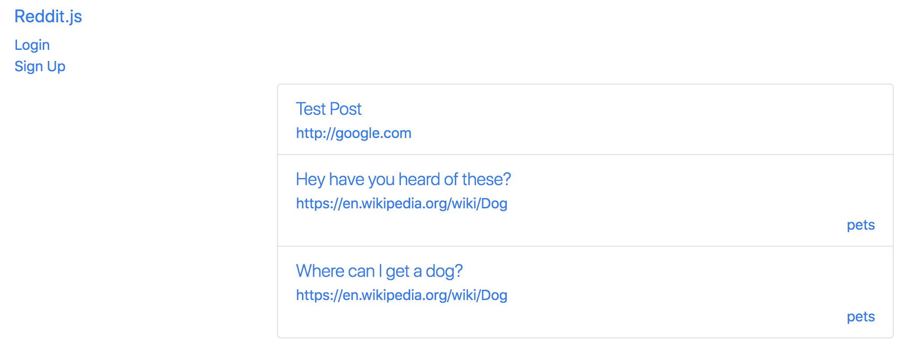
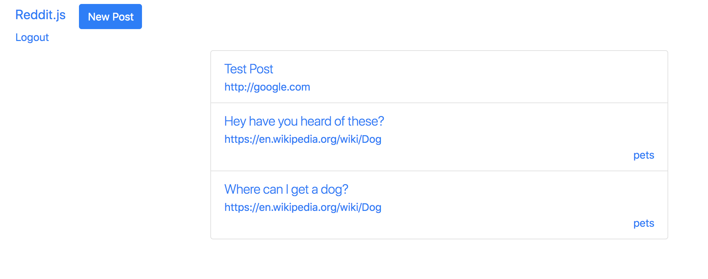
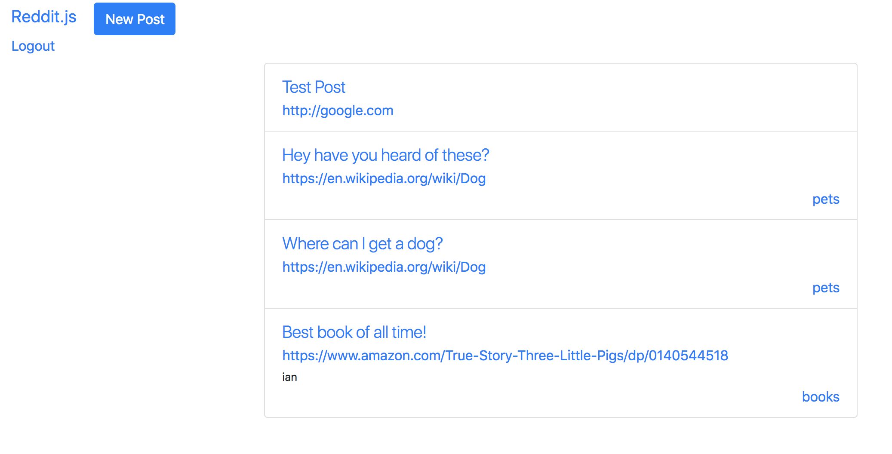
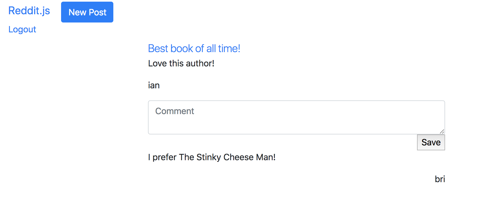

Alright next step! Its time to allow people to take responsibility for the silly things they are posting on our Reddit clone. We are going to create user accounts so folks can securely signup and login using a username and password.

1. Create a post
1. Show all posts
1. Show one post
1. Comment on posts
1. Create subreddits
1. Sign up and Login
1. **Association posts and comments with their author**
    1. Check authentication and make `req.user` and `currentUser` objects
    1. Add `author` attribute to comments and posts
    1. Save the user as the author of posts
    1. Display the author's username on posts and comments
1. Make comments on comments
1. Vote a post up or down

# Checking Login Status

So now that we are setting the cookie to be logged in, and can see this cookie on the server or client side, how do we customize our views and the **authorization** of a user? There are a few ways to do it. We could use client JavaScript to track the presence of the `nToken` cookie and update the DOM based on that. But let's try to find a server-side solution first because our app is very server-side structured now.

We can always check if `req.cookies.nToken` is present, but shouldn't we also check if it is valid? And don't we really want the `_id` of the user this token represents? This is a lot of code to include in every route! In order to refactor this code, we can make our own custom middleware.

> [action]
> Create a new folder `middleware`. In that folder create the file `checkAuth.js`.
>
```js
const jwt = require('jsonwebtoken');
>
const checkAuth = (req, res, next) => {
  console.log('Checking authentication');
  if (typeof req.cookies.nToken === 'undefined' || req.cookies.nToken === null) {
    req.user = null;
  } else {
    const token = req.cookies.nToken;
    const decodedToken = jwt.decode(token, { complete: true }) || {};
    req.user = decodedToken.payload;
  }
>
  next();
};
>
module.exports = checkAuth;
```
>
> We can now import the middleware into `server.js` and use it as a middleware before every route.
> Be sure to place `app.use(checkAuth);` before the controllers.
>
```js
...
const checkAuth = require('./middleware/checkAuth');
...
app.use(checkAuth);
...
```

Go to any route and see if the `Checking authentication` is logged in the terminal.

**Note**: this is your own custom middleware like `body-parser` and `cookie-parser`. Middleware is run in the order it is added via `app.use()`. **You must add middleware after initializing Express, and the order will matter.**

# Updating Templates

Once our `checkAuth` middleware is running on every route, let's use the new `req.user` object we created to create a `currentUser` object. We'll use this `currentUser` object to hide the login and sign up links if a user is logged in.

> [action]
> Update your `navbar` to include the logic around `currentUser`:
>
```html
<ul class="nav navbar-nav navbar-right">
  {{#if currentUser}}
    <li><a href="/logout">Logout</a></li>
  {{else}}
    <li><a href="/login">Login</a></li>
    <li><a href="/sign-up">Sign Up</a></li>
  {{/if}}
</ul>
```

Now in any route we can set `currentUser` equal to `req.user` which will either be `{ _id: <<ID>> }` or `null`.

> [action]
> Update the `INDEX` method in your `posts` controller to include `currentUser`:
>
```js
app.get('/', (req, res) => {
  const currentUser = req.user;
>
  Post.find({})
    .then((posts) => res.render('posts-index', { posts, currentUser }))
    .catch((err) => {
      console.log(err.message);
    });
});
```

<!-- -->

>[challenge]
>
Refactor the code block above to be async/await.

Do the login and sign up links appear and disappear depending upon whether a user is logged in?

Now, hide the "New Post" button for those who are NOT logged in.

> [action]
> Update your `navbar` again to hide the "New Post" button if a user is not logged in:
>
```html
...
>
<ul class="navbar-nav mr-auto">
  {{#if currentUser}}
    <li class="nav-item">
      <a class="nav-link" href="/posts/new">New Post</a>
    </li>
  {{/if}}
</ul>
>
...
```

Remember, you'll have to add `currentUser` to all of the routes that call `res.render()` so the main templates work. This may seem like some duplication of code, and it is.

# Requiring the User to Be Logged In to Post

Right now, if you aren't logged in, you could still just navigate to `/posts/new` and create a post. Let's be a bit more secure and prevent someone from creating a post unless they are logged in.

> [action]
> Update your `CREATE` method in the `posts` controller to the following:
>
```js
// CREATE
app.post('/posts/new', (req, res) => {
  if (req.user) {
    const post = new Post(req.body);
>
    post.save(() => res.redirect('/'));
  } else {
    return res.status(401); // UNAUTHORIZED
  }
});
```

<!-- -->

>[challenge]
>
Refactor the code block above to be async/await.

# Product So Far

Logged in Vs logged out users should now have different views:

**Logged Out**


**Logged In**



We could do this more elegantly and more DRY if we made another example of [custom middleware called](https://expressjs.com/en/guide/writing-middleware.html) `CheckAuth` and used it on those routes that we require to be logged in.

Can you rewrite the above code into its own middleware called `CheckAuth`?

# Now Commit

```bash
$ git add .
$ git commit -m 'Users must be logged in to submit a post'
$ git push
```

 Through the code above, you have now successfully **restricted functionality based on authentication status**. Right on!

# Associating the `author` of Comments and Posts

So now we want people to take responsibility for their silly posts on Reddit.js.

We need to make each post and each comment point back to its author, as well as ensure the posts and comments are persisted with associations to the user that creates them. We'll do this by saving the author's user id in each child post or comment, and by tracking the post and comment id's for each user. Then we can use the `.populate()` method to pull in the details whenever we need.

To accomplish this, there are no changes required to the views we've already created. We can go straight to updating model and controller appropriately.

>[action]
> First, let's add an `author` attribute to both the `models/comment.js` and the `models/post.js` files. Its type will be a single `ObjectId`. We'll make it required because only logged in people can create posts.
>
```js
...
author: { type: Schema.Types.ObjectId, ref: 'User', required: true },
...
```
>
Additionally, add the `posts` attribute to the `User` model. It will be an array of `ObjectId`s.
>
```js
...
posts: [{ type: Schema.Types.ObjectId, ref: 'Post' }],
...
```

Now we can update the `posts` controller to save the current user as the author when we create a post,
and we can look up the current user and add the new post to their `posts`.

>[action]
> Update the `CREATE` method of your `posts` controller to the following. Remember to include the `User` model as a new requirement:
>
```js
const Post = require('../models/posts');
const User = require('../models/user');
const Comment = require('../models/comment');
>
module.exports = (app) => {
...
  // CREATE
  app.post('/posts/new', (req, res) => {
    if (req.user) {
      const userId = req.user._id;
      const post = new Post(req.body);
      post.author = userId;
>
      post
        .save()
        .then(() => User.findById(userId))
        .then((user) => {
          user.posts.unshift(post);
          user.save();
          // REDIRECT TO THE NEW POST
          return res.redirect(`/posts/${post._id}`);
        })
        .catch((err) => {
          console.log(err.message);
        });
    } else {
      return res.status(401); // UNAUTHORIZED
    }
  });
...
}
```

<!-- -->

>[challenge]
>
Refactor the code block above to be async/await.

Test that both the `author` and the `posts` are being saved by looking in your database or logging to the console.

Now, can you do this same pattern for the comments controller when someone creates a comment?

# Displaying the Author

Next, populate the author in posts and display their username on every post wherever it appears.

Let's start by just getting the `author` field to appear on the posts you see on the home page.

> [action]
> Add the `author` below the `url` in `posts-index`:
>
```html
<div><small>{{this.author}}</small></div>
```

If you refresh right now, you'll just see an `ObjectId` for the `author`. We need to `populate` the field!

> [action]
> `populate` the `author` field from the `INDEX` method in the `posts` controller:
>
```js
// INDEX
app.get('/', (req, res) => {
  const { user } = req;
  console.log(req.cookies);
  Post.find({}).lean().populate('author')
    .then((posts) => res.render('posts-index', { posts, user }))
    .catch((err) => {
      console.log(err.message);
    });
});
```

<!-- -->

>[challenge]
>
Refactor the code block above to be async/await.

# Product So Far

Now you should be seeing a `User` object! We're almost there, just update your `posts-index` to pull from the `username` field within `author`
> [action]
> Update the `author` div in `posts-index`:
>
```html
<div><small>{{this.author.username}}</small></div>
```



# Authors - Single Post

Now we have authors properly displayed on the home page! We still need to get authors to display when looking at a single post, and when looking at a specific subreddit.

Let's work on the single post first, this should be very similar to what we just did for the home page.

>[action]
> Update `posts-show` to include the `author`:
>
```html
<p>{{post.author.username}}</p>
```
>
> Update `SHOW` in the `posts` controller to `populate` the author:
>
```js
// LOOK UP THE POST
app.get('/posts/:id', (req, res) => {
  const currentUser = req.user;
>
  Post.findById(req.params.id).lean().populate('comments').populate('author')
    .then((post) => res.render('posts-show', { post, currentUser }))
    .catch((err) => {
      console.log(err.message);
    });
});
```

Note we did a _double call_ to `populate` in order to get both fields!

Finally, let's get `author` showing for posts on a subreddit.

>[action]
> Update the `SUBREDDIT` method in `posts` controller to display the `author` on posts:
>
```js
// SUBREDDIT
app.get('/n/:subreddit', (req, res) => {
  const currentUser = req.user;
  const { subreddit } = req.params;
  Post.find({ subreddit }).lean().populate('author')
    .then((posts) => res.render('posts-index', { posts, currentUser }))
    .catch((err) => {
      console.log(err);
    });
});
```

<!-- -->

>[challenge]
>
Refactor all the code blocks above to be async/await.

# Now Commit

```bash
$ git add .
$ git commit -m 'Authors for posts are visible'
$ git push
```

# Now for Comments

Using the previous instructions for associating users and posts, can you make it so users and comments are equally associated? Remember to update the corresponding `view` and `controller` files!

**Hint:** You should review the documentation for [Mongoose's populate](https://mongoosejs.com/docs/populate.html) method. Also look in to how you would nest `populate` calls.

> [solution]
> Create the template `post-comments` and include `author` in each comment:
>
```html
{{#each post.comments}}
  <p>{{this.content}}</p>
  <p class="text-right">{{this.author.username}}</p>
{{/each}}
```
>
> Update `comments` controller to include the `author`
>
```js
...
const comment = new Comment(req.body);
comment.author = req.user._id;
...
```
>
> Update the `SHOW` method in the `posts` controller to `populate` the `author` of the `comments`:
>
```js
// SHOW
app.get('/posts/:id', function (req, res) {
   const currentUser = req.user;
   // LOOK UP THE POST
>
   Post.findById(req.params.id).lean().populate({ path:'comments', populate: { path: 'author' } }).populate('author')
       .then((post) => res.render('posts-show', { post, currentUser }))
       .catch((err) => {
           console.log(err.message);
       });
});
```

# Product So Far

Authors should now be displayed for both Posts and Comments. Try posting as one user, and commenting as another to see it in action:



# Now Commit

```bash
$ git add .
$ git commit -m 'Authors for comments are visible'
$ git push
```

# Stretch Challenges
> [challenge]
>
> 1. Can you make an author's username a link that displays that users's profile at `/users/:username`?
> 1. Can you do the same for comments?
> 1. Can you make a `/profile` route that loads the current user and displays their posts and comments?
