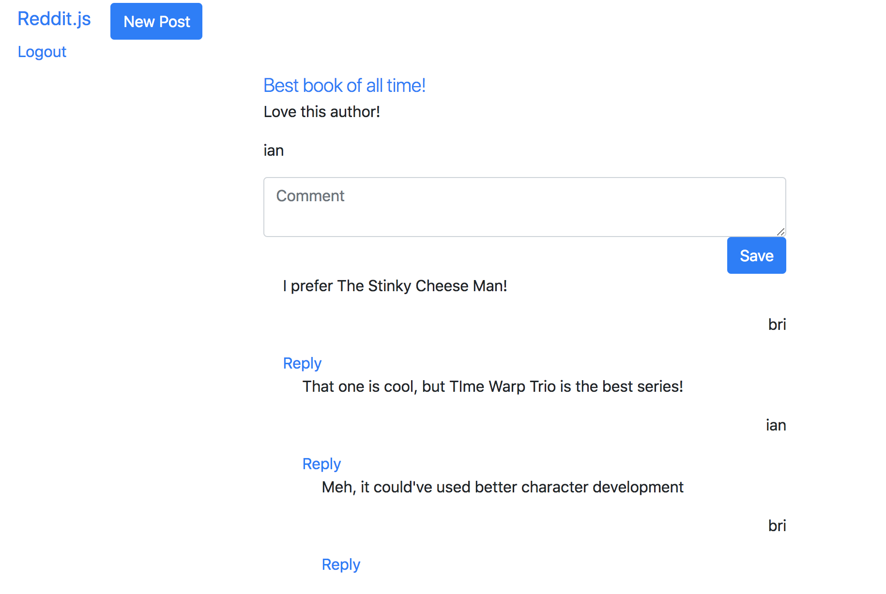

So last lesson we were thinking through how to put comments inside other comments. Now we are going to actually do it!

1. Create a post
1. Show all posts
1. Show one post
1. Comment on posts
1. Create subreddits
1. Sign up and Login
1. Associate posts and comments with their author
1. **Make comments on comments**
    1. Optimize our how we populate.
    1. Make comments embedded inside comments.
    1. Test that comments on comments are working.
1. Vote a post up or down

# Optimize our how we populate

We know we're going to be embedding comments into comments. This means we're going to have to nest `populate` calls for comments for as deep as a comment chain can go! Our current implementation can't scale for that, so before we embark on embedding comments, we need to make sure we can handle them by optimizing how we use `populate`.

## Populate util

We're going to be using our optimization in a lot of places, so we should make it a `util` so that it can be easily accessible through multiple places

> [info]
> Any time you have the same functionality used in multiple areas of a project, it's best to make a `util` folder where you can store all your functions for repeated use.

<!-- -->

> [action]
> Create a `util` folder, and create an `autopopulate.js` file in it
>
> In `autopopulate.js`, place the following code:
>
```js
module.exports = (field) => function (next) {
  this.populate(field);
  next();
};
```

Great! Because this function recursively calls itself, we can now populate fields every time we load a model! Let's make some changes so that our `posts` and `comments` take advantage of this functionality.

>[action]
> Update `/models/post.js` and `/models/comment.js` to use your new `util`. We also need to update the schema in `/models/comment.js` to include a new `comments` property so that comments can support comments of their own:
>
> `/models/post.js`
>
```js
// models/post.js
const { Schema, model } = require('mongoose');
const Populate = require('../util/autopopulate');
>
const postSchema = new Schema({
...
});
// Always populate the author field
postSchema
  .pre('findOne', Populate('author'))
  .pre('find', Populate('author'));
>
module.exports = model('Post', postSchema);
```
>
> `/models/comment.js`
>
```js
const { Schema, model } = require('mongoose');
const Populate = require('../util/autopopulate');
>
const commentSchema = new Schema({
  content: { type: String, required: true },
  author : { type: Schema.Types.ObjectId, ref: 'User', required: true },
  comments: [{ type: Schema.Types.ObjectId, ref: 'Comment' }],
}, { timestamps: true });
>
// Always populate the author field
commentSchema
  .pre('findOne', Populate('author'))
  .pre('find', Populate('author'))
  .pre('findOne', Populate('comments'))
  .pre('find', Populate('comments'));
>
module.exports = model('Comment', commentSchema);
```

Finally, let's update our controllers to simplify their logic to just use the [lean](https://mongoosejs.com/docs/api.html#query_Query-lean) method.

> [action]
> Simplify your `/posts/show/` and `/subreddit/show/` methods in `/controllers/post.js`
>
```js
// SHOW
app.get('/posts/:id', (req, res) => {
  const currentUser = req.user;
  Post.findById(req.params.id).populate('comments').lean()
    .then((post) => res.render('posts-show', { post, currentUser }))
    .catch((err) => {
      console.log(err.message);
    });
});
>
// SUBREDDIT
app.get('/n/:subreddit', (req, res) => {
  const { user } = req;
  Post.find({ subreddit: req.params.subreddit }).lean()
    .then((posts) => res.render('posts-index', { posts, user }))
    .catch((err) => {
      console.log(err);
    });
});
```

Notice it was only a one line change for each, but it's a lot simpler now! One more refactor to go:

> [action]
> Update `/comments/create` in `/controllers/comments` to the following:
>
```js
const Post = require('../models/post');
const Comment = require('../models/comment');
>
module.exports = (app) => {
  // CREATE Comment
  app.post('/posts/:postId/comments', (req, res) => {
    const comment = new Comment(req.body);
    comment.author = req.user._id;
    comment
      .save()
      .then(() => Promise.all([
        Post.findById(req.params.postId),
      ]))
      .then(([post]) => {
        post.comments.unshift(comment);
        return Promise.all([
          post.save(),
        ]);
      })
      .then(() => res.redirect(`/posts/${req.params.postId}`))
      .catch((err) => {
        console.log(err);
      });
  });
};
```

<!-- -->

>[challenge]
>
Refactor all the code blocks above to be async/await.

Now would be a good point to refresh your screen and make sure the `authors` on your `comments` and `posts` are still showing correctly. Notice also we are now redirecting users back to the post's page instead of root. Makes a lot more sense to go back to where you originated the request to reply from, doesn't it?

We did a lot of changes here, so let's commit what we have so far:

## Now Commit

```bash
$ git add .
$ git commit -m 'refactored populate code'
$ git push
```

You have now successfully **investigated how to use the `populate` method in Mongoose for advanced associations**. Congrats!

## Credit
All credit to Dacio Romero (a Make School student!) for creating this elegant solution! He even wrote a [plugin](https://github.com/DacioRomero/mongoose-populate) to do exactly what we wrote above for our `util`!

# Embedding Comments Into Comments

Now that we have `autopopulate`, we can make it so a user can comment on a comment to create a nice hierarchical tree of nested comments.

Again, utilize the user experience as a starting point. A user who wants to make a comment on a comment can click a "reply" link that opens up a form displaying the specific comment and a textarea, as well as a Reply button.

>[action]
> Add this snippet to `/views/posts-show` within the `each` block for `comments`:
>
```html
{{#each post.comments}}
    <p>{{this.content}}</p>
    <p class="text-right">{{this.author.username}}</p>
    <a href="/posts/{{../post._id}}/comments/{{this._id}}/replies/new">Reply</a>
{{/each}}
  ...
```

Let's make a new `replies.js` file in our `controllers` folder. Within, we'll need access to both the `Post` and `Comment` models. At the end, we'll have two freshly implemented routes: `NEW` and `CREATE`.

>[action]
> create `/controllers/replies` and include the following code:
>
```js
const Post = require('../models/post');
const User = require('../models/user');
const Comment = require('../models/comment');
>
module.exports = (app) => {
  // NEW REPLY
  app.get('/posts/:postId/comments/:commentId/replies/new', (req, res) => {
    const currentUser = req.user;
    let post;
    Post.findById(req.params.postId).lean()
      .then((p) => {
        post = p;
        return Comment.findById(req.params.commentId).lean();
      })
      .then((comment) => {
        res.render('replies-new', { post, comment, currentUser });
      })
      .catch((err) => {
        console.log(err.message);
      });
  });
>
  // CREATE REPLY
  app.post('/posts/:postId/comments/:commentId/replies', (req, res) => {
    console.log(req.body);
  });
};
```
> Remember to `require` your new controller in `server.js`
>
```js
require('./controllers/posts')(app);
require('./controllers/comments.js')(app);
require('./controllers/auth.js')(app);
require('./controllers/replies.js')(app);
```

Next, create your `replies-new` template and have the content sit in the middle 6 columns of the 12 column grid:

>[action]
> Create `/views/replies-new` in your `/views` folder and include the following code:
>
```html
<div class="row">
  <div class="col-sm-6 col-sm-offset-3">
    <form action="/posts/{{post._id}}/comments/{{comment._id}}/replies" method="post">
      <div class="form-group">
        <textarea name="content" class="form-control" id="reply-content" placeholder="Reply"></textarea>
      </div>
>
      <div class='text-right'>
        <button type="submit" class="btn btn-primary">Reply</button>
      </div>
    </form>
  </div>
</div>
```

Refresh the page and click the `Reply` button on a comment. We can see that our template and form is there, but what happens when we submit it? We made the `create` route and left a `console.log(req.body)`, so if you submit that form, you should see the console log the content of the form submission. Do you see it?

The next step is to write our `/replies/create` route logic.

>[action]
> Update the `/create` method in `/controllers/replies` to the following:
>
```js
// CREATE REPLY
app.post('/posts/:postId/comments/:commentId/replies', (req, res) => {
  // TURN REPLY INTO A COMMENT OBJECT
  const reply = new Comment(req.body);
  reply.author = req.user._id;
  // LOOKUP THE PARENT POST
  Post.findById(req.params.postId)
    .then((post) => {
      // FIND THE CHILD COMMENT
      Promise.all([
        reply.save(),
        Comment.findById(req.params.commentId),
      ])
        .then(([reply, comment]) => {
          // ADD THE REPLY
          comment.comments.unshift(reply._id);
          return Promise.all([
            comment.save(),
          ]);
        })
        .then(() => res.redirect(`/posts/${req.params.postId}`))
        .catch(console.error);
      // SAVE THE CHANGE TO THE PARENT DOCUMENT
      return post.save();
    });
});
```

When you submit the reply form, what occurs? Can you confirm (in the database) that a nested embedded comment document is created?

Finally, let's set up our `post-show` template to show these sub comments as well once they are created. If we just try to manually write in our comments and their comments, we won't be able to represent the whole tree. We'll need to use a **Partial Template** to make a recursive representation of all the comments and their comments.

> [action]
> In `/views/posts-show`, replace your `{{#each post.comments}}` code block with the following:
>
```html
{{#each post.comments}}
  {{> comment comment=this postId=../post._id}}
{{/each}}
```

We've got our view set up to use our `partial` comments view, so now let's create that `partial`.

>[action]
> Create a new folder in `views` called `partials`, then create a file in there called `comment.handlebars`. Inside that file, place the following code:
>
```html
<div class="col-xs-12 comment-indent">
    <p>{{comment.content}}</p>
    <p class="text-right">{{comment.author.username}}</p>
    <a href="/posts/{{postId}}/comments/{{comment._id}}/replies/new">Reply</a>
    {{#each comment.comments}}
        {{> comment comment=this postId=../postId}}
    {{/each}}
</div>
```

The code inside this `partial` template calls itself so it loops until every comment is displayed.

Finally, let's give each comment a bit of an indent by creating a style for the class `.comment-indent`. Let's put this in a general stylesheet in case we want to add more styles later.

>[action]
> Create a `public` folder and create a `css` folder within it. Within the `css` folder, create an `all.css` file and place the following code in it:
>
```css
.comment-indent {
  margin-left: 20px;
}
```
>
> Remember we need to now link the style sheet in `/views/layouts/main.handlebars` so that we can view it:
>
```html
<head>
    ...
    <link rel="stylesheet" href="/css/all.css">
</head>
```

<!-- -->

>[challenge]
>
Refactor all the code blocks above to be async/await.

# Product So Far

Refresh and try out your new nested comments!!



Now that we have a `css` folder, what other styles would you add? Add some more styling to spruce up your Reddit!

## Credit
Credit again to Dacio Romero, who's `/controllers/replies/post` method was adapted to this tutorial, as well as his `partials` template!

# Now Commit

```bash
$ git add .
$ git commit -m 'Implemented nested comments'
$ git push
```

# Stretch Challenge

>[challenge]
> Notice right now you *can* reply to a comment if you are *not* logged in. Update your code to figure out how to only allow *logged in* users to reply to comments
