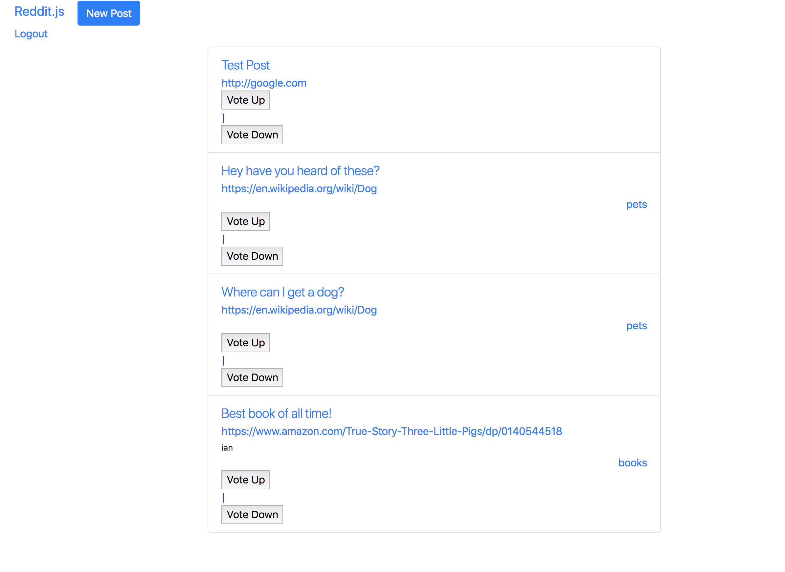

Alright, we've almost got our Reddit clone complete! We're on to the final piece: Voting!

To vote on something, you can usually can vote up and down. "Liking" in Facebook is like voting up, and there is no down. In Reddit however, we can vote things up and down. A few things make it quite tricky:

* When you submit a form with HTML, the whole page refreshes --- but we don't want that.
* People should only vote once either way.
* People generally want to be able to change their votes.

Let's start with how to vote up, and then see how we can vote down.

1. Create a post
1. Show all posts
1. Show one post
1. Comment on posts
1. Create subreddits
1. Sign up and Login
1. Associate posts and comments with their author
1. Make comments on comments
1. **Vote a post up or down**
    1. Make vote form
    1. Add jQuery AJAX scripts
    1. Write vote up and vote down routes
    1. Add new attributes to `Post` model
    1. Update DOM with response

# Voting Plan

Let's make a plan by doing what we always do and look very carefully at what the user will be able to see and do with our app.

* Users should be able to click on up and down arrows to vote a post up or down.
* The page should not refresh, and there should be some indication that you voted up.
* Once you've voted up or down once, you can't vote up or down again.
* Ideally, a user could reverse their vote down by voting up to get back to no votes, and then vote up or vise versa, but let's leave this until the end.

# Submitting a Form via AJAX

Start by adding "vote up" and "vote down" form to our post. Remember, this form, needs to be submitted via `AJAX` without refreshing the page! For that we're going to need to use `jQuery` and specifically `AJAX requests` to handle them without refreshing. We'll accomplish this with two specific `HTML` attributes:

**Classes (Not Ids)** - We'll add two forms, tag them with the class `vote-up` and `vote-down`. We'll use these classes as our selectors to fire off the AJAX request to vote up or down.

> [info]
> We use classes here because IDs must be unique, but classes can repeat in one html template. In this case, there will be many posts on the `/posts/index` page, so we must use a class instead of an ID.

**Data Attribute** - Each of these posts is unique even if there are many on the page. How do we know which one we are voting on? How do we communicate this to the server? In order to solve this problem, we'll be using the `data-id` attribute and render the post's `_id` attribute in each form. Then we can pull that id into the `/posts/:id/vote-up` or `/posts/:id/vote-down` path when we submit the form.

For now, we'll keep voting on posts to only the home page.

> [action]
> Update the `posts-index` view to include the voting forms:
>
```html
<li class="list-group-item">
  <div class="lead">{{post.title}}</div>
  <a href="{{post.url}}" target="_blank">{{post.url}}<a>
  <div><small>{{this.author.username}}</small></div>
  <div class="text-right">
    <a href="/n/{{post.subreddit}}">{{post.subreddit}}<a>
  </div>
>
  <form class="vote-up" data-id="{{this._id}}">
    <button type="submit">Vote Up</button>
  </form>
  |
  <form class="vote-down" data-id="{{this._id}}">
    <button type="submit">Vote Down</button>
  </form>
</li>
```

# Adding the AJAX

We're going to add an AJAX request in a new file `public/js/posts.js` (Remember you already have a `posts.js` file! Be careful as you are navigating and updating your files.). We already included jQuery into this project when we added Bootstrap, so all our jQuery functions should work splendidly. But we need to add a few things first.

>[action]
> First we need to update `server.js` to look for static files in our new `public` folder. Add this line to `server.js`:
>
```js
...
app.use(express.static('public'));
...
```
>
> Next, let's add our new script to our `<body>` tag in `layouts/main.handlebars` where all our other `scripts` currently live. **Make sure to put it below our `jQuery` script!**
>
```html
<body>
  ...
  <script src="https://code.jquery.com/jquery-3.3.1.min.js" integrity="sha256-FgpCb/KJQlLNfOu91ta32o/NMZxltwRo8QtmkMRdAu8="
        crossorigin="anonymous"></script>
  <script rel="script" src="/js/posts.js"></script>
  ...
</body>
```
>
> Finally, create a `js` folder in your `public` folder. Then create a `posts.js` file within the `js` folder. Now copy the following code into our newly created `public/js/posts.js`:
>
```js
$(document).ready(function() {
  $('.vote-up').submit(function(e) {
    e.preventDefault();
    const postId = $(this).data('id');
    $.ajax({
      type: 'PUT',
      url: 'posts/' + postId + '/vote-up',
      success: function(data) {
        console.log('voted up!');
      },
      error: function(err) {
        console.log(err.messsage);
      }
    });
  });

  $('.vote-down').submit(function(e) {
    e.preventDefault();

    const postId = $(this).data('id');
    $.ajax({
      type: 'PUT',
      url: 'posts/' + postId + '/vote-down',
      success: function(data) {
        console.log('voted down!');
      },
      error: function(err) {
        console.log(err.messsage);
      }
    });
  });
});
```

Now refresh your browser tab, open your Developer Tools and check the Network tab (you may need to turn recording on via `cmd+R`). If we click the vote up or down buttons, we should be able to see each request flying out to your server. Click on one and see what error is coming back. You can even preview the response. Route not found! Great! Let's set those up!

# Writing the Vote-Up/Down Routes

We want to track who voted on what, and we want to know what the total score of votes are.

> [action]
> Update the `Post` model to have three new attributes: `upVotes`, `downVotes`, and `voteScore`:
>
```js
...
upVotes : [{ type: Schema.Types.ObjectId, ref: 'User' }],
downVotes : [{ type: Schema.Types.ObjectId, ref: 'User' }],
voteScore : { type: Number },
...
```
>
> In the `posts` controller, update the `create` method to initialize these three new attributes:
>
```js
...
const post = new Post(req.body);
post.author = req.user._id;
post.upVotes = [];
post.downVotes = [];
post.voteScore = 0;
...
```

Now that we are submitting to the routes, we have to write them. Let's put them in the bottom of the `controllers/posts.js` file.

Reminder: we're using `PUT` because we are _editing_ an existing resource.

> [action]
> Add these voting routes to the `posts` controller:
>
```js
app.put('/posts/:id/vote-up', (req, res) => {
  Post.findById(req.params.id).then(post => {
    post.upVotes.push(req.user._id);
    post.voteScore += 1;
    post.save();

    return res.status(200);
  }).catch(err => {
    console.log(err);
  })
});

app.put('/posts/:id/vote-down', (req, res) => {
  Post.findById(req.params.id).then(post => {
    post.downVotes.push(req.user._id);
    post.voteScore -= 1;
    post.save();

    return res.status(200);
  }).catch(err => {
    console.log(err);
  });
});
```

>[challenge]
>
Refactor the code blocks above to be async/await.

# Product So Far

Create a new post and see if you can vote up or down on your new post. Check the console logs to make sure the votes are being tracked appropriately.

If you made it this far, that means that you were able to successfully **implement a large scale application using Express, Handlebars, and MongoDB/Mongoose.**

**CONGRATS!!** You've built a clone of Reddit!



As you go through this BEW course, think about how you can tie the concepts you learned here – particularly auth and testing – and see how you can apply them in the course.

# Feedback and Review - 2 minutes

**We promise this won't take longer than 2 minutes!**

Please take a moment to rate your understanding of learning outcomes from this tutorial, and how we can improve it via our [tutorial feedback form](https://goo.gl/forms/3IC9rSVBUx63pdC33)

# Now Commit

```bash
$ git add .
$ git commit -m 'Users can now vote on posts'
$ git push
```

# Stretch Challenges

If you're looking for more, check out the following:
>[challenge]
>
1. We only allow voting on the home and subreddit screens currently. Allow it on when viewing a single post.
1. Turn the Vote Up/Vote Down buttons into arrows using CSS and/or JS
1. Have the vote buttons color change after they've been clicked, and ensure the change is retained during the session (i.e. if you Vote Up, the button should be colored red and should stay that way until the vote changes).
